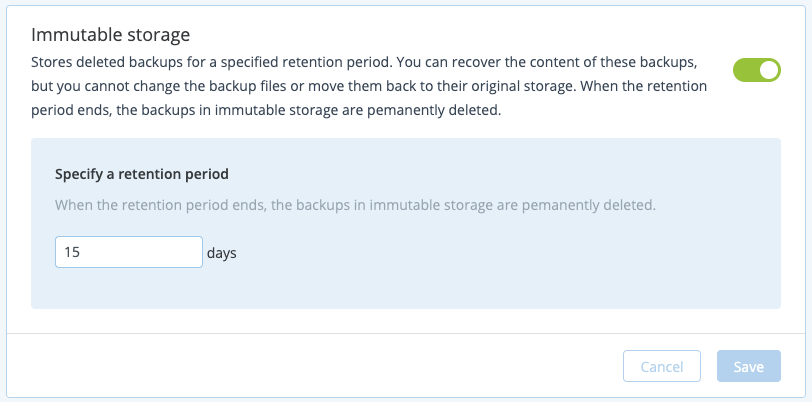
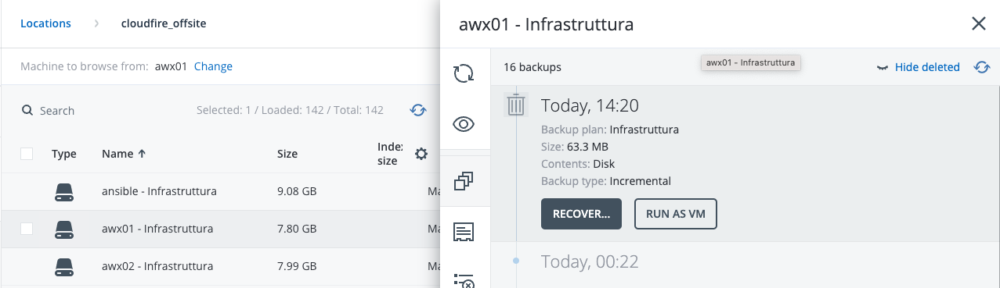

## Introduzione

L’immutabilità dello storage di backup fa si che i vostri backup cancellati rimangano salvati per il periodo di tempo impostato nella policy di retention.

Potete recuperare il contenuto di questi backup ma non sarà possibile modificare i file di backup e riportarli al loro backup storage originale.

Quando la retention finisce i backup cancellati verranno completamente eliminati.

## Guida su come abilitare il servizio

Una volta effettuato l’accesso alla dashboard spostatevi sotto il pannello **Settings → Security** e cliccate sullo switch di fianco alla voce **Immutable Storage.**

Specificate i giorni di retention che preferite e poi cliccate su **Save.**

Accedete alla dashboard dei backup e fare partire un backup per abilitare definitivamente la feature.

Una volta fatto se eliminirete i backup li vedrete nella sezione **Backup Storage** selezionando la macchina corrispondente e selezionando **Show deleted.**

