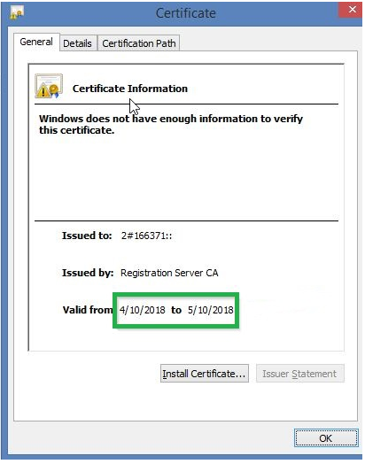
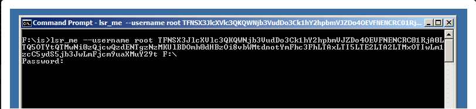

- [Come installare il tool IS/LSR](#come-installare-il-tool-islsr)
-   [Installazione Windows](#installazione-windows)
-   [Installazione Linux](#installazione-linux)
-   [Aggiornare il tool IS/LSR:](#aggiornare-il-tool-islsr)
- [Come eseguire l'upload dal device fisico contenente il primo back-up](#come-eseguire-lupload-dal-device-fisico-contenente-il-primo-back-up)
-   [Back-up del formato archieve3](#back-up-del-formato-archieve3)
- [Come procedere quando l'upload è terminato:](#come-procedere-quando-lupload-terminato)
- [Come scaricare un back-up per effettuare un Large Scale Recovery](#come-scaricare-un-back-up-per-effettuare-un-large-scale-recovery)

  

Il servizio di Physical Data Shipping è un servizio utilizzato per realizzare dei back-up di grandi dimensioni, verso il cloud, dove non sono presenti connettività ad alte prestazioni. Viene spesso utilizzato quando deve essere eseguito il primo back-up o un full back-up. Questo servizio consiste nell'eseguire il back-up su un disco in locale e poi eseguire l'upload, in altra location dove le prestazioni della linea sono migliori. Facendo così verranno poi eseguiti solo i back-up incrementali che impatteranno meno sulle prestazioni della linea internet.

Il servizio di Large Scale Recovery  invece viene utilizzato per consegnare al cliente una copia di tutti i suoi back-up presenti in cloud. Questo viene fatto copiando i back-up su un hard-disk e consegnato al cliente finale. In modo che il cliente possa in autonomia recuperare i dati ed avere una copia dei back-up anche in locale.

Entrambi i servizi sono disponibili per Windows e per tutti i sistemi Linux supportati da Acronis Data Cloud. Per i sistemi MAC invece è disponibile solo per il back-up di file e/o cartelle.

  

## Come installare il tool IS/LSR

### [Installazione Windows](./physical-data-shipping-and-large-scale-recovery-initial-seeding-acronis-cyber-protect-cloud/tool-islsr-installazione-windows.md)

### [**Installazione Linux**](./physical-data-shipping-and-large-scale-recovery-initial-seeding-acronis-cyber-protect-cloud/tool-islsr-installazione-linux.md)

Per verificare l'ultima versione installata eseguire il comando:

```
is_tool --version
```

### Aggiornare il tool IS/LSR:

1. Scaricare l'aggiornamento
2. Estrarre l'archiovio
3. Installare il nuovo pacchetto msi/rpm.

## Come eseguire l'upload dal device fisico contenente il primo back-up

### Back-up del formato archieve3

Se avete creato il primo back-up con una versione di Acronis 7.7 o superiore seguire i seguenti passaggi:

1. Collegare il disco o il device su cui è stato realizzato il primo back-up alla macchina con installato il tool IS/LSR. In Windows è possibile trovarlo a questo indirizzo: *C:\\Program Files\\Common Files\\Acronis\\InitialSeedingTool*
2. Scaricare il certificato di Acronis della macchina back-uppata sulla macchina con il tool IS/LSR installato:
1.   Sulla macchina back-uppata il certificato si può trovare nelle seguenti locations:
  
  1.   **Windows:** %allusersprofile%\\Acronis\\BackupAndRecovery\\OnlineBackup\\Default
  
  2.   **Linux:** /var/lib/Acronis/BackupAndRecovery/OnlineBackup/Default
  
  3.   **MacOS:** /Library/Application Support/Acronis/BackupAndRecovery/OnlineBackup/Default  
    
      
    Assicurarsi che il certificato sia ancora valido. Se così non fosse contattare il nostro supporto tecnico.  
      
3. Aprire il prompt dei comandi come amministratore in Windows o il Terminale come root in Linux ed entrare all'interno della cartella del tool IS/LSR.
4. Eseguite questo comando per eseguire l'upload del back-up:

```
archive_io_ctl --astor <storage_address> --cert <path_to_certificate> --put <full_path_to_the_backup> --dst /1/<name_of_backup_file> --show-progress --infinite-timeouts
```

> [!INFO]
> ATTENZIONE! Il nome del back-up è key-sensitive  
> ESEMPIO:
> C:\\Program Files\\Common Files\\Acronis\\InitialSeedingTool>archive\_io\_ctl --astor [baasgw01.cloudfire.it:44445](http://baasgw01.cloudfire.it:44445) --cert C:\\contoso.crt --put "C:\\Folder\\Server-8C2B1C67-CE89-4400-B871-A4D636198792-BD6029CE-41DF-4B70-88D3-748AAF10B62CA.tibx" --dst "/1/Server-8C2B1C67-CE89-4400-B871-A4D636198792-BD6029CE-41DF-4B70-88D3-748AAF10B62CA.tibx" --show-progress --infinite-timeouts

Assicuratevi di utilizzare l'estesione *.tibx* (minuscolo) nell'indicazione della destinazione, esempio: **\--dst "/1/Server-8C2B1C67-CE89-4400-B871-A4D636198792-BD6029CE-41DF-4B70-88D3-748AAF10B62CA.tibx.** se per qualsiasi motivo è usato .TIBX o .Tibx, lo Storage interpreterà l'archivio come **NON** associato al Physical Data Shipping.

Se dovessero verificarsi degli errori durante l'upload potete far proseguire l'upload eseguendo questo comando:

```
archive_io_ctl --astor <storage_address> --cert <path_to_certificate> --put <full_path_to_the_backup> --dst /1/<backup_name_only> --show-progress --infinite-timeouts --continue
```

## Come procedere quando l'upload è terminato:

Una volta terminato l'upload i back-up seguiranno lo schedule impostato nel job creato con l'opzione ***"Phisical Data Shipping".***

Finché non verrà completato l'upload dal device contenente il primo back-up il job non partirà e manderà un alert.

Per eseguire questa operazione è necessario creare un job ad-hoc per ogni macchina.

## Come scaricare un back-up per effettuare un Large Scale Recovery

Il tool LSR scarica tutti gli archivi creati per una specifica macchina (identificate dal loro token). Non è possibile scaricare un singolo od uno specifico archivio.

I tipi di back-up supportati per questa procedura sono i seguenti:

- Entire machine backup
- Disks/volumes backup
- Files/folders backup
- Office365 backup

1. Segnarsi il Token della macchina. Il token della macchina si può trovare navigando all'interno della Backup management console, selezionando la macchina desiderata e cliccando su "**Details".**
2. Aprire il prompt dei comandi come amministratore in Windows o il Terminale come root in Linux ed entrare all'interno della cartella del tool IS/LSR. In Windows: *C:\\Program Files\\Common Files\\Acronis\\InitialSeedingTool*  
3. Eseguire il seguente comando:
```
lsr_me --username <administrator_login> <token> <path>
```
Dove:
1.   <administrato\_login>: che indica l'username con privilegi sufficienti per operare sulla macchina o sui volumi/cartelle della macchina.
2.   <token>: token della macchina indicato al punto 1.  
3.   <path>: percorso di destinazione del download.  
  Esempio:  
  
4.   Se è tutto corretto vi chiederà la password dell'utente inserito al punto a.

Una volta terminato il download avrete scaricato tutti i back-up della macchina desiderata.

> [!INFO]
> I log del tool IS/LSR sono collezionati all'interno del seguente percorso: %allusersprofile%\\Acronis\\InitialSeedingTool\\Logs