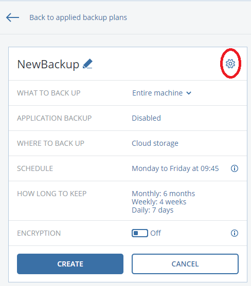
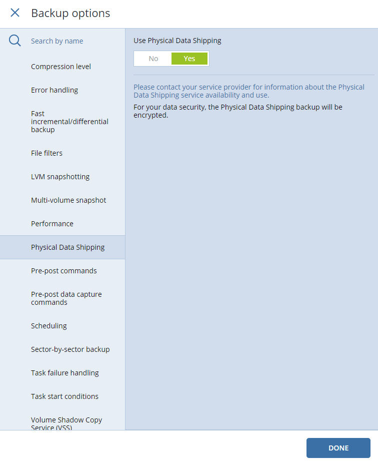
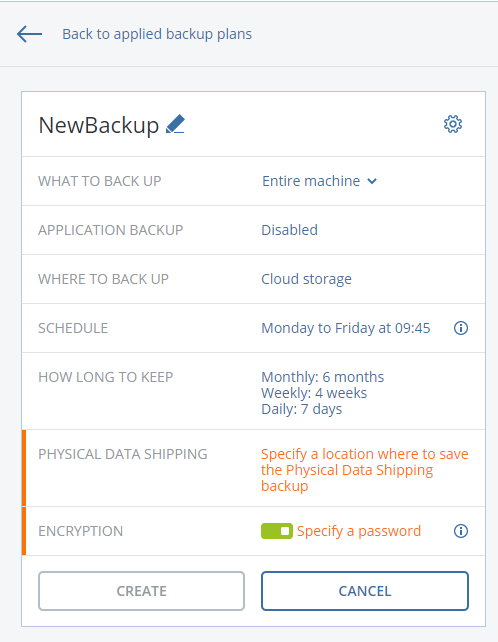

Generalmente l'utilizzo del physical data shipping avviene nei casi in cui la banda internet della sede dell'oggetto del backup è limitata e quindi risulta problematico (troppo lungo, e passibile di interruzioni) un backup iniziale in cloud, spesso di grosse dimensioni.

Vi è quindi la necessità di configurare un job ad hoc con questa funzionalità.

Nella creazione del job, dopo aver definito i parametri base, entrare nelle opzioni del backup tramite l'icona ingranaggio.

Qui scorrete fino alla sezione Physical Data Shipping ( Consegna fisica dei dati ), abilitatela e confermate.

  

  

Saranno apparse due nuove opzioni nel job in questione.

L'encryption, dato il trasporto/spedizione di un supporto di memoria con tutti i dati di uno o più host della produzione del cliente, è abilitata i automatico e richiede di specificare una password (da ricordarsi nel momento dell'effettivo upload di quel backup iniziale).

Il campo sovrastante invece indica la posizione in cui deve essere fatto questo primo backup: solitamente un NAS o un disco esterno.

Confermando tutte le specifiche si può effettuare questo backup, che al primo giro è a tutti gli effetti un backup locale.

Attenzione! Non eliminare questo job una volta terminata la prima parte e inviato il supporto.

Lato gestore dovrà essere effettuato l'upload in cloud di questo backup con l'utilizzo del tool IS/LSR : tutte le info per l'operazione sono indicate nel dettaglio qui → [Physical Data Shipping and Large Scale Recovery (Initial Seeding)](../physical-data-shipping-and-large-scale-recovery-initial-seeding-acronis-cyber-protect-cloud.md)

A upload terminato la normale schedulazione del job con initial seeding potrà iniziare, portando gli incrementali nella stessa backup chain del primo backup su disco.