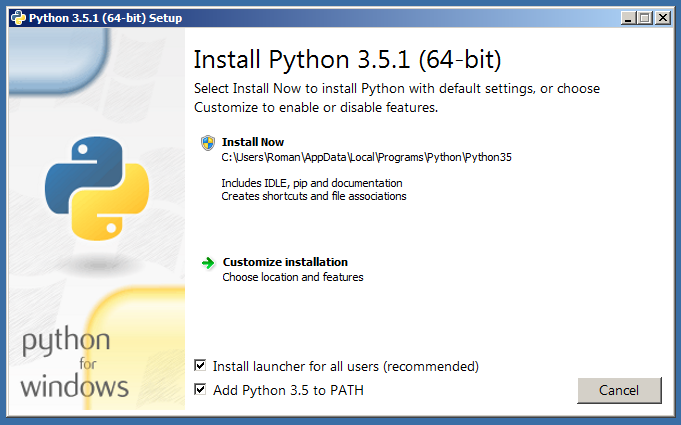
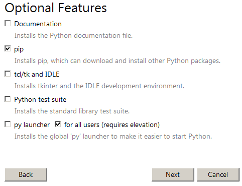
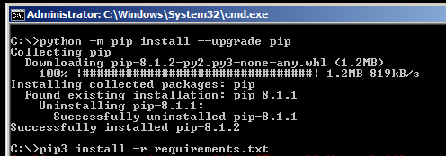

Requisito necessario: Windows 64bit

1. Scaricare [python3.5 installer](https://www.python.org/downloads/release/python-353/). Per semplicità, selezionare l'opzione **Install launcher for all users** e **Add Python 3.5 to PATH:**  

2. Assicurarsi di installare il pip tool:  

3. Dopo aver completato l'installazione aprire il prompt dei comandi come amministratore.
4. Scaricare l'archivio [Requirements](https://kb.acronis.com/system/files/content/2018/06/56070/requirements132.zip), estrarre **requirements.txt** e **fes-0.1.3.tar.gz** e copiarli nella cartella corrente.
5. Nel prompt dei comandi eseguire i seguenti comandi:
```
python -m pip install --upgrade pip
pip3 install -r requirements.txt 
pip install --upgrade pyOpenSSL
```

6. Scaricare [IS/LSR tool](https://dl.acronis.com/u/kb/IS_LSR_Tool_Build3.1.132_Windows.zip) e spacchettarlo.
7. Installare il tool ed eseguire l'msi package.