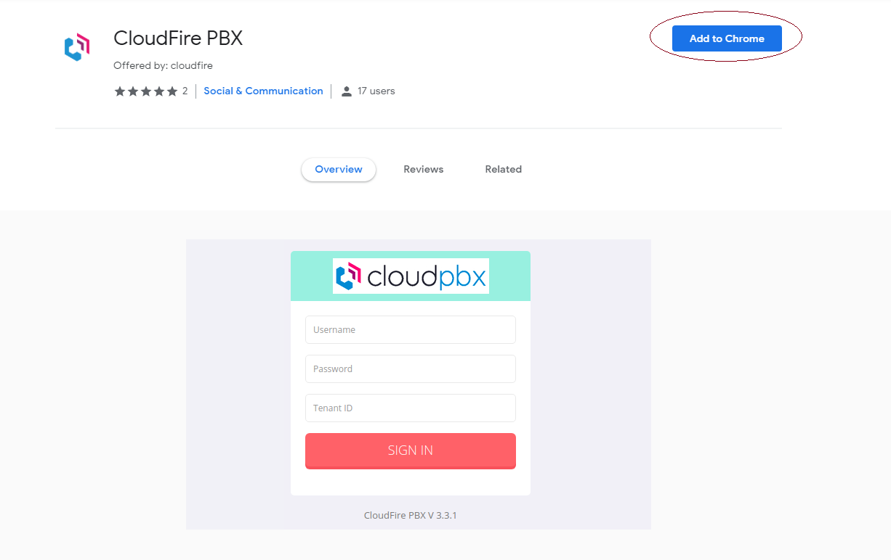
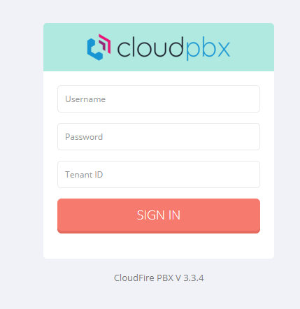
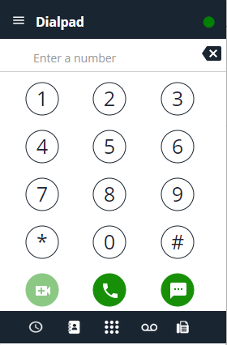

## Introduzione

E' possibile utilizzare l'app di chrome "CloudfirePBX" in alternativa ad altri gestori SIP software.

## Prerequisiti

Dovrete avere sotto mano il numero della vostra estensione, la password WEB relativa e l'identificativo del vostro tenant.

L'app è specifica del browser chrome.

## Guida passo-passo

- Recatevi su "chrome web store" e cercate CloudFire PBX, oppure sfruttate il seguente link: [https://chrome.google.com/webstore/detail/cloudfire-pbx/jgboaockenaolafkcklcdckkpemgobpo](https://chrome.google.com/webstore/detail/cloudfire-pbx/jgboaockenaolafkcklcdckkpemgobpo)
- Nella pagina dell'app cliccare "Add to Chrome" e in seguito confermare cliccando "Add extention":

- Cliccare sulla nuova icona apparsa in alto a destra (la cornetta logo del cloudPBX) per portarsi nella sezione login:  

  

- Cliccare sulla nuova icona apparsa in alto a destra (la cornetta logo del cloudpbx) per portarsi nella sezione login (verificare eventuali pop-up e autorizzazioni per l'utilizzo del microfono da parte dell'estensione)
- Inserire l'interno/estensione nel campo "Username"Nel campo "Password" inserite la password web (diversa dalla password SIP) che trovate nella configurazione dell'extension.Nel campo "Tenant ID" inserite l'identificativo univoco del vostro tenant (comune a tutti gli interni di un azienda).
- Cliccando sull'icona della cornetta potrete comporre i numeri ed effettuare chiamate.

  

  

  

  

> [!NOTE]
> **Sommario**
> 
> 
> 
> - [Introduzione](#introduzione)
> - [Prerequisiti](#prerequisiti)
> - [Guida passo-passo](#guida-passo-passo)
> * * *
> **Articoli collegati**
> 
> 
> - Page:
> [Estendere volume Guest OS (Linux) senza riavviare](/wiki/spaces/KB/pages/2001076225/Estendere+volume+Guest+OS+Linux+senza+riavviare)
> - Page:
> [Impossibile chiamare o ricevere chiamate](/wiki/spaces/KB/pages/1966256951/Impossibile+chiamare+o+ricevere+chiamate)
> - Page:
> [Portale Extension - Profile](/wiki/spaces/KB/pages/1966256865/Portale+Extension+-+Profile)
> - Page:
> [Portale Extension - Voicemail](/wiki/spaces/KB/pages/1966256807/Portale+Extension+-+Voicemail)
> - Page:
> [Accesso Portale Extension](/wiki/spaces/KB/pages/1966256750/Accesso+Portale+Extension)