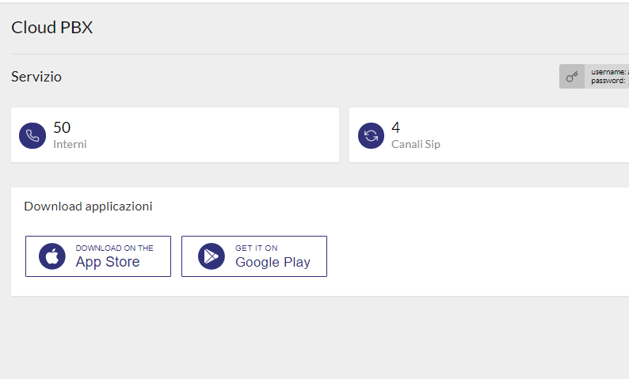
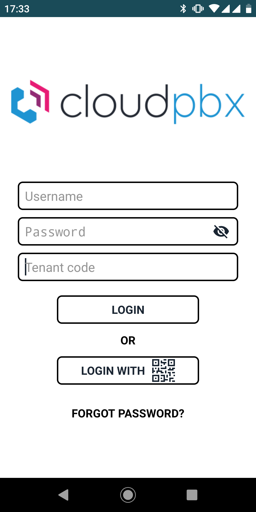
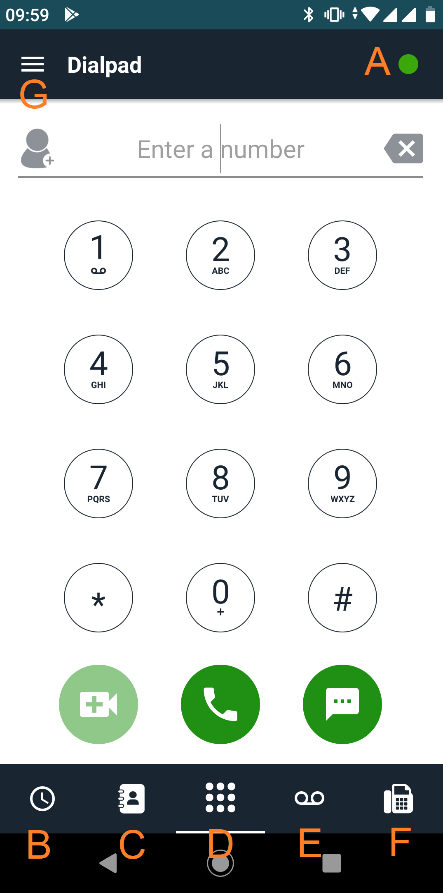
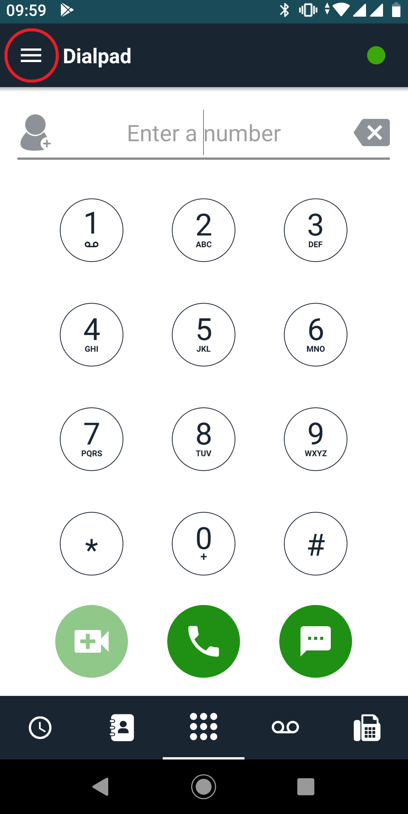
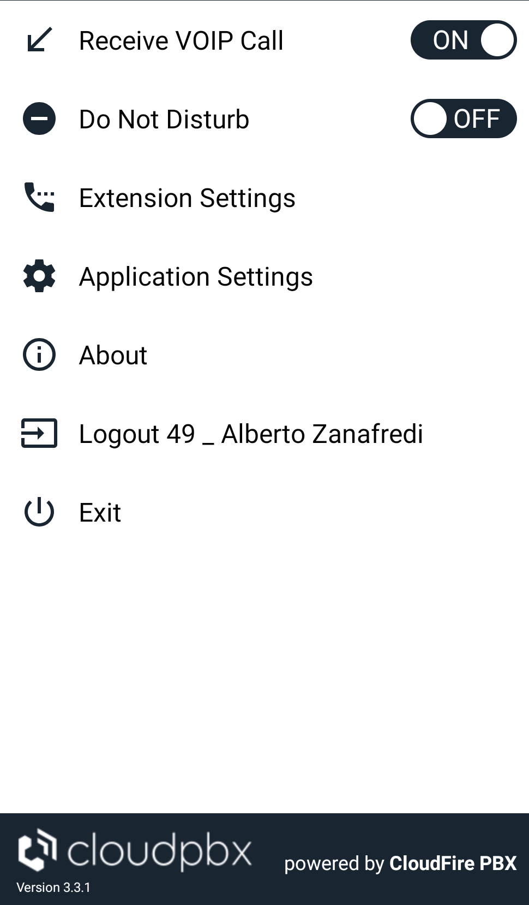
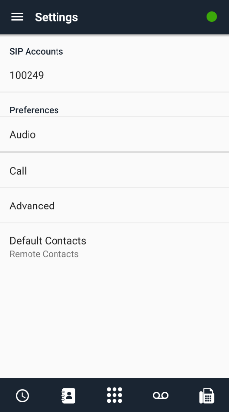
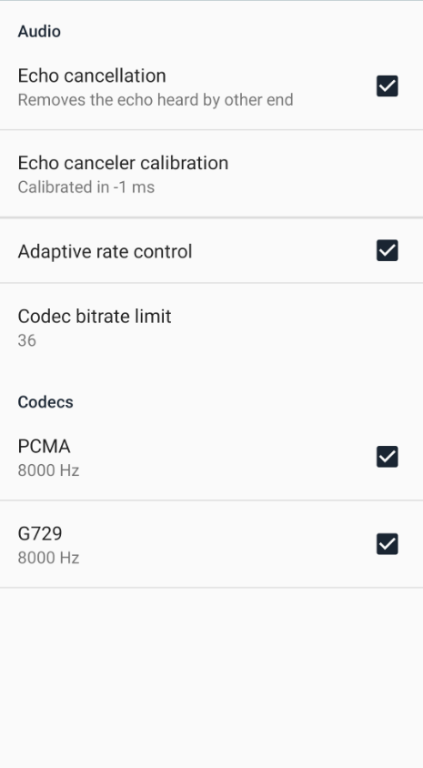
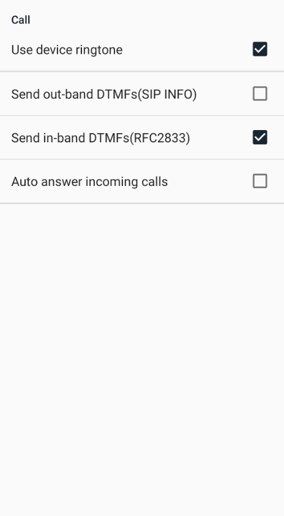
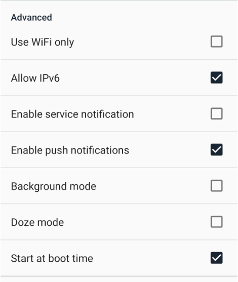

## Introduzione

Con l'attivazione del servizio Cloud PBX avrete la possibilità di scaricare e di attivare l'applicazione per Android e IOS che vi permette di registrare la vostra Extension del Cloud PBX sui vostri smartphone. Così facendo avrete la possibilità di ricevere ed effettuare chiamate attraverso il vostro Cloud PBX anche in mobilità. 

## Prerequisiti

Per poter attivare l'App vi basterà avere un extension attiva e funzionante e reperire le seguenti credenziali:

1. **Extension Number**
2. **Web Password**
3. **Tenant ID.**

## Guida passo-passo

### Primo Accesso

Come prima cosa dovete scaricare l'applicazione dal Play Store Android o dal App Store Apple cercando:

**CloudFire PBX**

Alternativamente potete scaricare le App direttamente dalla dashboard del CloudPBX su Cortex:

Una volta scaricata e avviata l'APP vi verrà chiesto il login, qui potete procedere in 2 modi:

1. Reperite i seguenti valori dalla schermata [**Portale Tenant → Extension**](../how-to-cloud-pbx/portale-tenant-cloud-pbx/service-2-2/extension-2-2.md) e compilate i campi**:**
1.   **Username:** numero identificativo dell'extension.
2.   **Password:** Web Password.
3.   **Tenant code:** Tenant ID.
2. C'è anche la possibilità di effettuare il login tramite **QR-Code**, per poterlo fare verificate quanto segue:
1.   Entrate nel pagina di configurazione dell'extension: [**Portale Tenant → Service → Extension**](../how-to-cloud-pbx/portale-tenant-cloud-pbx/service-2-2/extension-2-2.md)**.**
2.   Cliccate sul tasto
   in corrispondenza dell'extension per cui state configurando l'app.
3.   Verificate che l'opzione **QR Login** sia abilitata.
4.   Ora eseguite l'accesso al [**Portale Extension**](../how-to-cloud-pbx/portale-extension/accesso-portale-extension.md)**.**
5.   Una volta eseguito l'accesso, nella dashboard, dovrebbe comparirvi il **QR-Code** per effettuare il login
6.   Riprendete il vostro Smartphone e cliccate su 
  , puntate la fotocamera in modo da inquadrare il **QRCode,** sulla dashboard ed il login è effettuato.

Una volta effettuato il login, l'applicazione è attiva e funzionante, per cui potrete effettuare e ricevere chiamate.

Di seguito la spiegazione dei vari tasti e menù:

- **A:** questo piccolo punto indica lo stato di registrazione della vostra extension:
-   **verde:** extension correttamente registrata.
-   **rosso:** extension non registrata.
- **B:** elenco delle chiamate perse, effettuate e ricevute.
- **C:** elenco dei contatti. Se al primo avvio dell'applicazione avete dato il permesso, alla stessa, di accedere ai vostri contatti, potrete vedere sia i contatti salvati sul vostro smartphone che i contatti della rubrica condivisa del CLoud PBX
- **D:** Tastierino numerico dove poter comporre le numerazioni.
- **E:** registro delle **Voicemail** lasciate all'extension registrata.
- **F:** funzionalità Fax (ancora in fase di test).
- **G:** menù di configurazione dell'applicazione.

### Impostazioni App

Una volta eseguito il primo accesso l'applicazione è già completamente funzionante. Ma accedendo al menù di configurazione potete modificare i vari settaggi.

  

- **Receive Voip Call:** questa opzione vi permette di registrare o meno la vostra extension. 
- **Do Not Disturb;** questa opzione vi permette di attivare o meno il funzionalità **Non disturbare.**
- **Extension settings:** questa opzione vi rimanderà ad un altra schermata dove potrete gestire le vari opzioni dell'extension (come deviazioni e altro), è la trasposizione della dashboard: [**Portale Extension → Extension Settings**](../how-to-cloud-pbx/portale-extension/portale-extension-extension-settings.md)**.** 
- **Application Settings:** passate al punto successivo per l'approfondimento di questo menù.
- **About:** informazioni generali sull'app e il servizio Cloud PBX.
- **Logout:** esegue il logout dell'extension dall'applicazione.
- **Exit:** chiude l'applicazione ma l'extension rimane registrata.

### Application Settings

In questo menù si possono modificare i vari settaggi dell'applicazione, come per esempio le notifiche e alcune altre opzioni

- **SIP Account**: cliccando su questa opzione si possono visualizzare i parametri SIP dell'extension registrata sull'APP. 

> [!WARNING]
> Modificare i parametri in questo menù con attenzione in quanto potrebbero causare de-registrazioni dell'extension non desiderate.

- **Audio:** cliccando su questa voce si accede al menù di configurazione dell'audio dell'APP.

> [!WARNING]
> Anche per queste opzioni è consigliato modificare i parametri con attenzioni per evitare dei problemi di qualità audio.

- **Call:** cliccando su questa voce si accede al menù di configurazione delle chiamate.
-   **Use device ringtone:** se abilitato, all'arrivo di una chiamata, il telefono squillerà utilizzando la suoneria di default del telefono, se disabilitato verrà utilizzata la suoneria di default dell'app.
-   **Send in-band DTMFs (SIP Info) / Send in-band DTMFs(RFC2833):** con queste 2 opzioni potete segliere lo standard di invio dei DTMF, per un corretto funzionamento queste opzioni devono essere congruenti con l'impostazione dell'extension stessa: [**Portale Tenant → Service → Extension**](../how-to-cloud-pbx/portale-tenant-cloud-pbx/service-2-2/extension-2-2.md)**.**
-   **Auto answer incoming calls:** abilita la possibilità di rispondere in automatico alle chiamate in arrivo.

- **Advanced:** cliccando su questa voce si accede al menù di configurazione avanzata dell'applicazione (notifiche ed altro):
-   **Use WiFi only:** abilitando questa opzione, l'applicazione funzionerà solo se lo smartphone è collegato ad una rete WiFi.
-   **Allow IPv6:** abilitando questa opzione viene consentito anche il traffico IPv6 dell'applicazione.
-   **Enable Service notification:** abilitando questa opzione, l'applicazione, invierà al telefono tutte le notifiche di servizio (come per esempio quando si registra o meno l'extension)
-   **Enable push notification:** abilitando questa opzione consentite all'applicazione di inviarvi le notifiche push. Le **Push Notification** sono quelle che permettono di notificarvi l'arrivo di una chiamata anche quando l'applicazione non è aperta. Se volete che vi arrivino le chiamate in ogni momento assicuratevi di aver abilitato questa opzione.
-   **Background mode:** con questa opzione, l'applicazione non viene mai chiusa del tutto ma rimane in background. Attenzione che tenderà a consumare più risorse dello smartphone.
-   **Doze mode:** con questa opzione abilitate la modalità silenzioso per l'app, questa funzione è subordinata alla configurazione dello smartphone.
-   **Start at boot time:** questa opzione fa si che l'applicazione venga avviata in automatico all'avvio dello smartphone.

- **Default contact:** cliccando su questa voce potete scegliere quali contatti vengono visualizzati di default quando cliccate sul tasto 

  

  

  

> [!NOTE]
> **Sommario**
> 
> 
> 
> - [Introduzione](#introduzione)
> - [Prerequisiti](#prerequisiti)
> - [Guida passo-passo](#guida-passo-passo)
> -   [Primo Accesso](#primo-accesso)
> -   [Impostazioni App](#impostazioni-app)
> -   [Application Settings](#application-settings)
> * * *
> **Articoli collegati**
> 
> 
> - Page:
> [Estendere volume Guest OS (Linux) senza riavviare](/wiki/spaces/KB/pages/2001076225/Estendere+volume+Guest+OS+Linux+senza+riavviare)
> - Page:
> [Impossibile chiamare o ricevere chiamate](/wiki/spaces/KB/pages/1966256951/Impossibile+chiamare+o+ricevere+chiamate)
> - Page:
> [Portale Extension - Profile](/wiki/spaces/KB/pages/1966256865/Portale+Extension+-+Profile)
> - Page:
> [Portale Extension - Voicemail](/wiki/spaces/KB/pages/1966256807/Portale+Extension+-+Voicemail)
> - Page:
> [Accesso Portale Extension](/wiki/spaces/KB/pages/1966256750/Accesso+Portale+Extension)