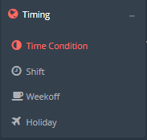
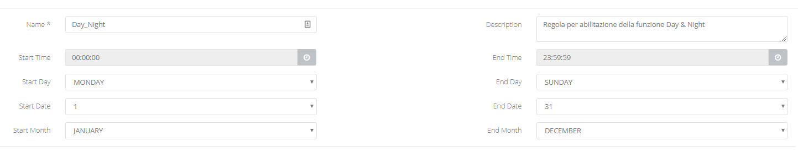
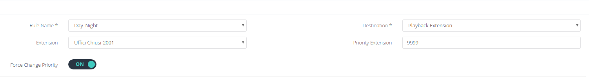
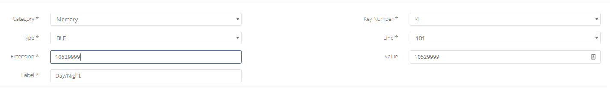
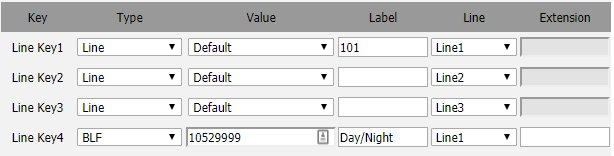
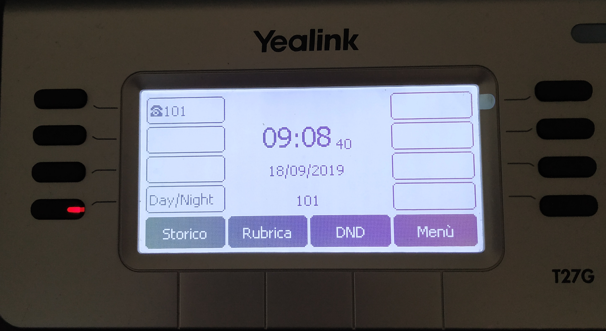

## Introduzione

A volte è possibile che un cliente chieda la possibilità di gestire manualmente l'instradamento delle chiamate destinate ad un DID attraverso l'uso di un tasto del telefono. L'esempio più lampante potrebbe essere la richiesta di impostare il messaggio di chiusura a piacimento in quanto gli uffici del cliente non hanno degli orari fissi ma aprono e chiudono in base al personale presente.

Questa funzionalità conosciuta come **Call Flow Control** o **Day & Night** vi permetterà di creare un codice, alla composizione del quale, potrete impostare l'instradamento delle chiamate, destinate ad un particolare DID, verso una destinazione specifica.

## Guida passo-passo

### Configurazione Priority Extension

- Accedere al **Portale Tenant** e spostatevi nel sotto menù **Timing → Time Condition**

- Cliccate su 
e compilate i campi come segue:

> [!INFO]
> Essendo una regola che verrà ad attivarsi manualmente, come vedete, copre tutto il periodo dell'anno.

- Ora spostatevi nel sotto menù **Call Routing → DID Routing** ed cliccate sul bottone 
 in corrispondenza del DID a cui volete applicare la regola.
- Cliccate sul pulsante 
 e assegnate al DID la nuova regola appena creata compilando i campi come segue:

> [!NOTE]
> Ovviamente la destination decidetela in base alle vostre esigenze. In questo esempio, se questa regola viene attivata, la chiamata destinata a questo particolare DID, verrà instradata verso il **Playback** "Uffici chiusi" che fa riferimento ad un messaggio audio che indica che gli uffici sono al momento chiusi.

> [!WARNING]
> Assicuratevi di inserire un valore nel campo **Priority Extension** ed utilizzate un valore con non vada in conflitto con il numero utilizzato per identificare **Extension, Ring Group, Code etc.**

### Configurazione come BLF

Per una maggiore facilità e gestione della funzionalità noi consigliamo di configurare questo codice come BLF, in quanto molto più semplice da utilizzare (in quanto basta premere il BLF per attivare e disattivare l'opzione) ed inoltre il BLF andrà ad indicare lo stato in cui è la regola:

- **Verde o spento:** la regola è disattivata.
- **Rosso Lampeggiante:** la regola è attiva.

Se i vostri telefoni sono in **Auto Provisioning,** spostatevi nel sotto menù **Config → Device** e cliccate sul bottone 

 in corrispondenza del device su cui volete configurare il BLF e create una nuova key inserendo come valore dell'extension: ***<TenantID><PriorityExtension>***

Se invece avete dei telefoni non in **Auto Provisioning** assicuratevi che il BLF componga l'extension: <TenantID><PriorityExtension>. Nel nostro esempio 10529999.

**Esempio con Yealink:**

**Display di uno Yealink con l'opzione abilitata:**

  

  

> [!NOTE]
> **Sommario**
> 
> 
> 
> - [Introduzione](#introduzione)
> - [Guida passo-passo](#guida-passo-passo)
> -   [Configurazione Priority Extension](#configurazione-priority-extension)
> -   [Configurazione come BLF](#configurazione-come-blf)
> * * *
> **Articoli collegati**
> 
> 
> - Page:
> [Portale Extension - Opzioni e Funzionalità](/wiki/spaces/KB/pages/1966256717/Portale+Extension+-+Opzioni+e+Funzionalit)
> - Page:
> [Funzionalità Call Flow Control - Day/Night](/wiki/spaces/KB/pages/1966256564/Funzionalit+Call+Flow+Control+-+Day+Night)
> - Page:
> [Autoprovisioning](/wiki/spaces/KB/pages/1966255946/Autoprovisioning)
> - Page:
> [BLF Call-pickup](/wiki/spaces/KB/pages/1966255734/BLF+Call-pickup)
> - Page:
> [Device - Autoprovisioning (2) (2)](/wiki/spaces/KB/pages/1966255283/Device+-+Autoprovisioning+2+2)