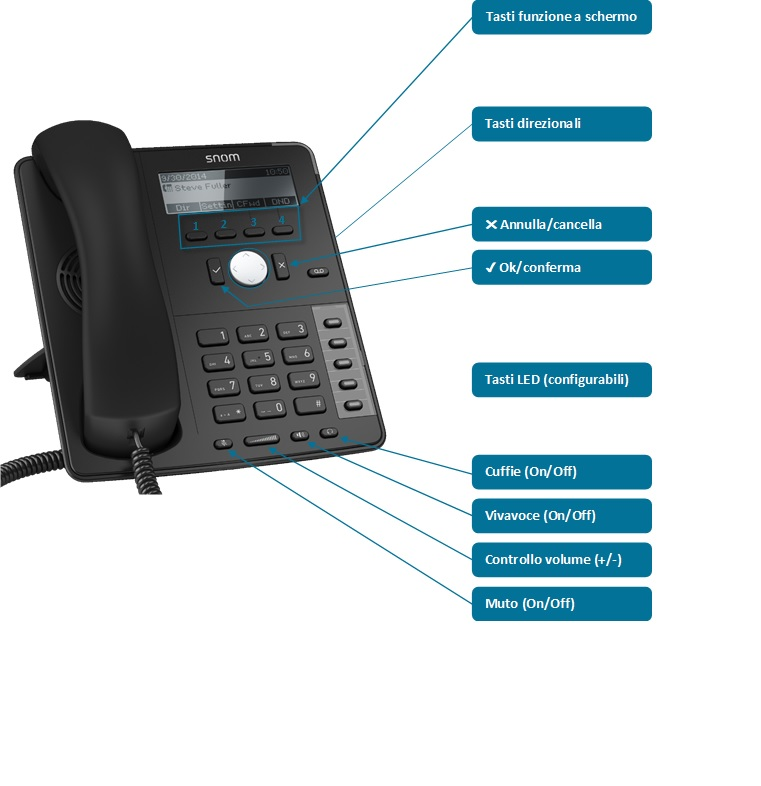

## Introduzione

In questa guida verranno illustrate le funzioni principali del telefono IP SNOM D715.

## Prerequisiti

Una volta che l'extension sarà correttamente registrata, il telefono sarà abilitato per fare e ricevere chiamate e di seguito le funzioni elencate.

## Guida alle funzionalità

### Panoramica del telefono

### Alzare o abbassare il volume

- **In standby:**
-    Premere il tasto **controllo volume +** per alzare il volume della suoneria.
-    Premere il tasto **controllo volume -** per abbassare il volume della suoneria.
-  **In chiamata:**
-   Premere il tasto **controllo volume +** per alzare il volume di cornetta/cuffie/altoparlante.
-   Premere il tasto **controllo volume -** per abbassare il volume di cornetta/cuffie/altoparlante.

### Utilizzare la funzione muto

- **In chiamata:**
-   Premere il tasto **muto** (questo si illuminerà di **rosso** ) per interrompere la trasmissione di audio dal microfono.
-   Premere nuovamente il tasto **muto** (questo si spegnerà) per riattivare la trasmissione di audio dal microfono.

### Utilizzare la funzione vivavoce

- **In standby:**
-   Premere il tasto **vivavoce** (questo si illuminerà  di **verde** ) per avviare una nuova chiamata mediante altoparlante. Verrà  richiesta la composizione del numero, premere il tasto  **✔**  per avviare la chiamata.
-   Premere nuovamente il tasto **vivavoce** (questo si spegnerà ) per terminare la chiamata.
- **In chiamata:**
-   Premere il tasto **vivavoce** (questo si illuminerà  di **verde** ) per passare l'audio all'altoparlante.
-   Premere nuovamente il tasto **vivavoce** (questo si spegnerà) per passare nuovamente l’audio a cornetta/cuffie.

### Utilizzare le cuffie (solo con cuffie compatibili)

- **In standby/chiamata:**

1. Premere il tasto **cuffie** (questo si illuminerà  di **verde** ) per passare l'audio alle cuffie.
2. Premere nuovamente il tasto **cuffie** (questo si spegnerà ) per passare nuovamente l'audio alla cornetta.

### Mettere una chiamata in attesa

- **In chiamata:**
-   Premere il tasto **funzione 2 (attes)**  per mettere la chiamata in attesa.
-   Premere nuovamente il tasto **funzione 2 (retrie)**  per riprendere la chiamata in attesa.

### Utilizzare i registri chiamate

- **In standby:**
-   **Accedere ai registri chiamate:**
  
  -   Premere il tasto **direzionale ↑** per accedere al menu del registro chiamate.
  
  -   Premere il tasto **direzionale ←** per accedere al registro chiamate entranti.
  
  -   Premere il tasto **direzionale →** per accedere al registro chiamate uscenti.
  
  -   Premere il tasto **direzionale ↓** per accedere al registro chiamate perse.
-   **All’interno dei registri chiamate:**
  
  -   Utilizzare i tasti **direzionali ↑** e  **↓** per navigare nel registro chiamate.
  
  -   Premere il tasto **✔** per avviare una chiamata verso il numero selezionato

### Utilizzare la rubrica locale

- **In standby:**
-   **Accedere alla rubrica locale:**
  
  -   Premere il tasto **funzione 1 (Rubric)** per accedere alla rubrica locale del telefono.
-   **Aggiungere un nuovo contatto nella rubrica locale:**
  
  -   **Da uno dei registri chiamate:**
    
    -   Accedere ad uno dei registri chiamate e posizionarsi sul numero che si intende aggiungere alla rubrica.
    
    -   Premere il tasto **funzione 1 (Dettag)** per accedere al dettaglio della chiamata.
    
    -   Premere il tasto **funzione 1 (Aggiung)** per salvare il numero come contatto della rubrica locale.
  
  -   **Dalla rubrica:**
    
    -   Accedere alla rubrica locale del telefono.
    
    -   Premere il tasto **funzione 1 (Aggiun)** per entrare nel menu di inserimento del contatto.
    
    -   Definire numero telefonico, nome e cognome del contatto:
      
      -   Utilizzare il tasto **funzione 1** per modificare la modalità  di inserimento.
      
      -   Utilizzare il tasto **funzione 2** per cancellare il testo inserito.
      
      -   Utilizzare il tasto  **✔** per confermare l'inserimento dei dati.
      
      -   Utilizzare il tasto **✖** per uscire dalla modalità di inserimento del contatto.
-   **Modificare un contatto nella rubrica locale:**
  
  -   Accedere alla rubrica locale del telefono e posizionarsi sul contatto che si intende modificare.
  
  -   Premere il tasto **funzione 3 (Modifi)** .
  
  -   Posizionarsi sull’elemento che si intende modificare e premere il tasto **funzione 1 (Modify)** .
  
  -   Modificare o inserire i nuovi dettagli dell'elemento utilizzando il tastierino numerico:
    
    -   Utilizzare il tasto **funzione 1** per modificare la modalità di inserimento del testo.
    
    -   Utilizzare il tasto **funzione 2** per cancellare il testo inserito.
    
    -   Utilizzare il tasto **funzione 3 (Salva)** per salvare le modifiche.
    
    -   Utilizzare il tasto **✖** per uscire dalla modalità di modifica senza salvare i cambiamenti.
-   **Eliminare un contatto nella rubrica locale:**
  
  -   Accedere alla rubrica locale del telefono e posizionarsi sul contatto che si intende eliminare.
  
  -   Premere il tasto **funzione 4 (Cancel)**
  
  -   Premere il tasto **✔** per confermare l’eliminazione, o il tasto **✖** per annullarla.

### Rispondere alle chiamate destinate ad altri interni (solo all'interno del gruppo di risposta)

- **In standby:**
-   Comporre **\*88** \+ **numero interno** \+ **✔** per rispondere alla chiamata destinata ad un interno specifico che sta squillando.  
  **ES:** **\*88+12+✔** per rispondere alla chiamata che sta squillando sull'interno 12.

### Trasferire una chiamata ad un altro telefono

- **Trasferimento immediato:**  
Per trasferire direttamente la chiamata, senza parlare con il destinatario:
-   Durante una chiamata premere il tasto **funzione 1 (Transf)**.
-   Comporre il numero di telefono o l’interno del destinatario e premere il tasto **✔**
- **Trasferimento con attesa:**  
Per trasferire la chiamata, parlando con il destinatario prima del trasferimento effettivo:
-   Durante una chiamata premere il tasto **funzione 2 (Attes)**, la chiamata verrà messa in attesa.
-   Comporre il numero o l'interno del destinatario e premere il tasto **✔** per avviare la chiamata.
-   Una volta in contatto col destinatario, premere il tasto **funzione 1 (Transf)** e poi il tasto **✔** per trasferire la chiamata attualmente in attesa.
-   Nel caso il destinatario non risponda, o se si desidera annullare il trasferimento, premere il tasto **✖** poi il tasto **funzione 2 (retrie)** per riprendere la chiamata in attesa.
