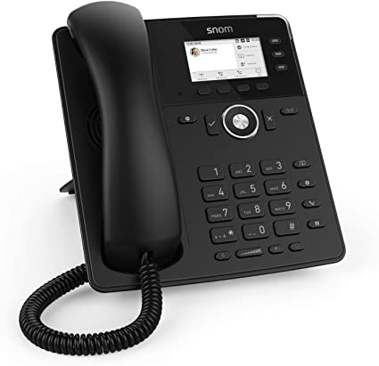

## Introduzione

In questa guida illustreremo le funzioni del telefono IP **SNOM D717**.

### Prerequisiti

Una volta che l’estensione sarà correttamente registrata su **3CX** o **Cloudfire PBX**, il telefono sarà abilitato per fare e ricevere chiamate e le funzioni qui di seguito elencate.

## Guida alle funzionalità

### Alzare e abbassare il volume

- **In standby:**
-   Premere il tasto **controllo volume +** per alzare il volume della suoneria;
-   Premere il tasto **controllo volume -** per abbassare il volume della suoneria;
- **In chiamata:**
-   Premere il tasto **controllo volume +** per alzare il volume della cornetta/cuffie/altoparlante;
-   Premere il tasto **controllo volume -** per abbassare il volume della cornetta/cuffie/altoparlante;

### Utilizzare la funzione muto

- **In chiamata/standby:**
-   Premere il tasto **muto** (questo si illuminerà di **rosso**) per interrompere la trasmissione di audio dal microfono;
-   Premere nuovamente il tasto **muto** (questo si spegnerà) per riattivare la trasmissione di audio dal microfono.

### Utilizzare la funzione vivavoce

- **In standby:**
-   Premere il tasto **vivavoce** (questo si illuminerà di **verde**) per avviare una nuova chiamata mediante altoparlante. Dovrete comporre il numero e premere il tasto  **✔**  per avviare la chiamata;
-   Premere nuovamente il tasto **vivavoce** (il cui led si spegnerà) per terminare la chiamata;
- **In chiamata:**
-   Premere il tasto **vivavoce** (questo si illuminerà di **verde**) per passare l’audio all’altoparlante;
-   Premere nuovamente il tasto **vivavoce** (il cui led si spegnerà) per passare l’audio alle cuffie/cornetta;

### Utilizzare le cuffie

> [!WARNING]
> Utilizzare solo cuffie compatibili (e.g. Jabra, Sennheiser, Planatronics).

- **In standby o chiamata:**
-   Attivare le cuffie premendo il tasto **cuffie** (che si illuminerà di **verde**);
-   Premere di nuovo il tasto **cuffie** per passare alla cornetta.

### Mettere una chiamata in attesa

- **In chiamata:**
-   Premere il tasto **funzione 2** (**attesa**) per mettere la chiamata in attesa;
-   Premere nuovamente il tasto **funzione 2** (**retrieve**) per riprendere la chiamata.

### Attivare la funzione DND (Do Not Disturb)

- **In standby:**
-   Premere il tasto **DND** (questo si illuminerà di **rosso**) per attivare la modalità DND;
-   Premere nuovamente il tasto **DND** per disattivare la modalità DND;

### Accedere alla Voicemail

- **In standby:**
-   Premere il tasto **Voicemail** (questo si illuminerà di rosso) per accedere alla segreteria telefonica;
-   Inserite il vostro **PIN** per accedere ai messaggi;
-   Premere nuovamente il tasto **Voicemail** per uscire.