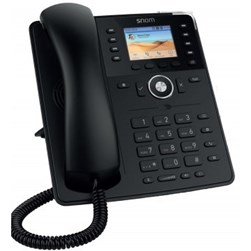

Con questa guida andiamo a conoscere le funzionalità dei telefoni IP modelli D735.

**CARATTERISTICHE CHIAMATA DI BASE**

**Esecuzione di una chiamata**

È possibile scegliere tra diversi dispositivi audio.

1) Ricevitore  
\- Sollevare il ricevitore, digitare il numero e premere 

.  
\- Digitare il numero e sollevare il ricevitore.

2) Headset  
\- Digitare il numero e premere 

.

3) Altoparlante / Microfono  
\- Premere il tasto altoparlante 

 per accendere l’altoparlante o il microfono.Digitare il numero desiderato e premere 

.

A questo punto è possibile selezionare il numero dal registro chiamate:  
\- Selezionare 'Liste' e scegliere il registro corrispondente. Premere 

per aprire il registro desiderato.  
\- Selezionare il numero desiderato e confermare con 

.

Per chiamare un numero dalla rubrica telefonica procedere come segue:  
\- Premere il tasto della rubrica.  
\- Inserire le lettere iniziali del nome o altre lettere se necessario. Si possono utilizzare anche i tasti freccia.  
\- Premere 

per scegliere il numero corrispondente.  

**Ricezione di una chiamata**

Esistono diverse modalità per rispondere ad una chiamata:  
\- Per rispondere con il ricevitore è sufficiente sollevarlo.  
\- Per rispondere con le cuffie premere 

.  
\- Per rispondere con l'altoparlante/microfono premere il tasto dell’altoparlante 

 per accendere il microfono/altoparlante e rispondere alla chiamata.

  

**Gestire le chiamate in attesa**

1\. Premere il tasto di attesa 

 per mettere in attesa la conversazione attiva. Le chiamate in attesa sono visualizzate in tre modi: tramite il testo sullo schermo, il LED della linea che lampeggia lentamente di verde/rosso (se i primi quattro tasti funzione programmabili non sono occupati) e il LED del messaggio di chiamata verde/rosso. Ora si può inoltrare la chiamata in attesa oppure eseguire o mettere in attesa altre chiamate.  
2\. Premendo il tasto di attesa 

 o il tasto di linea corrispondente, si accetta la chiamata in attesa. Se il partecipante in attesa riaggancia durante tale procedimento, il collegamento si interrompe.

  

**Avviso di chiamata e chiamata inoltrata**

Se durante una chiamata ne arriva un’altra, essa viene visualizzata sul display tramite il simbolo di un ricevitore che squilla e viene segnalata tramite un doppio tono di avviso di chiamata.

\- È possibile accettare la chiamata in arrivo e mettere la conversazione attiva automaticamente in attesa.  
\- È possibile rifiutare la chiamata in arrivo con 

. Il chiamante sente il segnale di occupato.  
\- È possibile anche inoltrare la chiamata in arrivo senza preavviso.

  

**Inoltro di chiamata con richiesta**

\- Premere il tasto **Hold** 

.  
\- Selezionare il numero dell’altra connessione.  
\- Confermare con 

.

Se si accetta la chiamata, annunciare la chiamata inoltrata.  
\- Premere il tasto **transfer** 

.

  

**Inoltro di chiamata senza richiesta**

\- Premere il tasto **transfer** 

.  
\- Selezionare il numero a cui la chiamata deve essere inoltrata.  
\- Confermare con 

 .