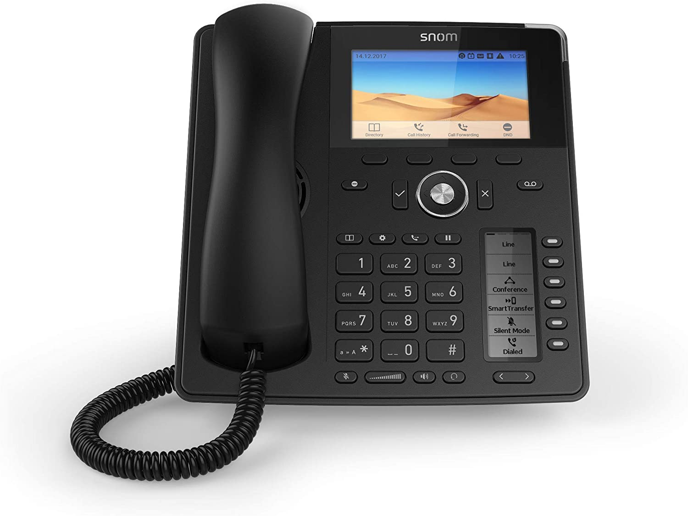

## Introduzione

In questa guida verranno illustrate le funzioni principali del telefono IP **SNOM D785**.

### Prerequisiti

Una volta che l’estensione sarà correttamente registrata su **3CX** o **Cloudfire PBX**, il telefono sarà abilitato per fare e ricevere chiamate e le funzioni qui di seguito elencate.

## Guida alle funzionalità

### Panoramica del telefono

Alzare o abbassare il volume:

- **In standby:**
-   Premere il tasto controllo volume + per alzare il volume della suoneria;
-   Premere il tasto controllo volume - per abbassare il volume della suoneria.
- **In chiamata:**
-   Premere il tasto controllo volume + per alzare il volume della cornetta o delle cuffie;
-   Premere il tasto controllo volume - per alzare il volume della cornetta o delle cuffie.
- **Funzione muto:**
-   *In chiamata:* il tasto muto si illuminerà di rosso quando la funzione è attiva - per attivarla o disattivarla, basterà cliccare il tasto **muto**.
- **Funzione vivavoce:**
-   *In chiamata:* il tasto vivavoce si illuminerà di verde quando la funzione è attiva - per attivarla o disattivarla, basterà cliccare il tasto **vivavoce**.

### Utilizzare le cuffie

> [!WARNING]
> Utilizzare solo cuffie compatibili (e.g. Jabra, Sennheiser, Planatronics).

- **In standby/chiamata:**
1.   Attivare la funzione **cuffie** premendo il corretto tasto (che si illuminerà di verde);
2.   Premere di nuovo il tasto **cuffie** per passare alla cornetta.

### Tasti Led

- **MWI (Message Waiting Indicator):** Il led si accende quando c'è un messaggio in segreteria; per ascoltarlo, cliccare il pulsante;
- **Attiva DND (Do Not Disturb):** Chi chiama sentirà il segnale *occupato*;
- **Directory;**
- **Opzioni;**
- **Trasferisci;**
- **In attesa.**

I tasti led sulla sinistra dello schermo secondario possono essere personalizzati tramite il menù **Opzioni → Preferenze → Display Secondario** per un accesso rapido e personalizzato a varie opzioni (ognuna con relativo colore et icona). Si possono creare fino a 4 pagine di comandi personalizzati, tra le quali si può scorrere cliccando il tasto **<** o il tasto **\>**.

### Utilizzare la rubrica locale

- **In standby:**
-   **Accedere alla rubrica locale:** premere il tasto rubrica;
- **Aggiungere un nuovo contatto nella rubrica locale:**
-   **Da un registro chiamate:**
  
  -   Accedere ad uno dei registri chiamate e posizionarsi sul numero che si vuole aggiungere;
  
  -   Premere il tasto ✓ per entrare nei dettagli della chiamata;
  
  -   Premere il tasto ✓ per salvare il numero come contatto nella rubrica locale.
-   **Dalla rubrica:**
  
  -   Accedere alla rubrica locale del telefono;
  
  -   Premere il tasto ✓ per entrare nel menù dell’inserimento contatto;
  
  -   Definire numero telefonico, nome e cognome del contatto:
    
  
    -   Utilizzare il tasto ✓ per modificare la modalità di inserimento;
    
  
    -   Utilizzare il tasto ✓ per confermare l’inserimento;
    
  
    -   Utilizzare il tasto **✖** per uscire dalla modalità inserimento del contatto.

### Trasferire una chiamata ad un altro telefono

- **Trasferimento immediato:**
-   Per trasferire la chiamata senza parlare con il destinatario, premere il tasto **trasferisci** e comporre il numero di telefono o l’interno del destinatario e premere ✓;
- **Trasferimento con attesa:**
-   Per trasferire la chiamata parlando con il destinatario prima del trasferimento effettivo:
  
  -   Durante una chiamata premere il tasto **attesa**;
  
  -   Comporre il numero o l’interno del destinatario e premere ✓ per confermare;
  
  -   Una volta confermato con il destinatario, premere il tasto **trasferisci** seguito da ✓ per avviare la chiamata;
  
  -   Nel caso di mancata risposta o se si desidera annullare il trasferimento premere il tasto **✖** seguito dal tasto **attesa** per riprendere la chiamata in attesa.