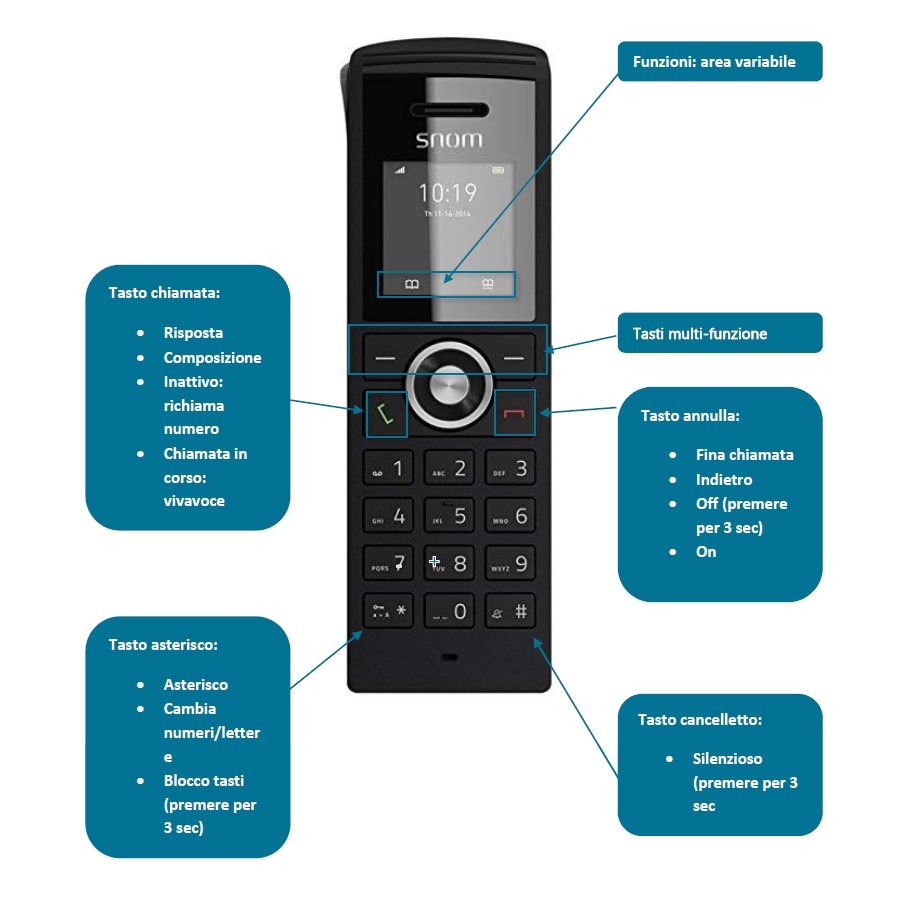

- [Panoramica del telefono:](#panoramica-del-telefono)
- [Trasferire una chiamata:](#trasferire-una-chiamata)
- [Visualizzare elenco chiamare:](#visualizzare-elenco-chiamare)
- [Riprendere chiamata in attesa:](#riprendere-chiamata-in-attesa)

  

## Panoramica del telefono:

  

## Trasferire una chiamata:

1. Premere il tasto multi-funzione in corrispondenza della funzione **"Hold"**, in modo da mettere in attesa l'interlocutore.
2. Comporre il numero dell'interno a cui dovete traferire la chiamata e premere il **"Tasto chiamata"**.
3. Se l'interno desiderato risponde, annunciare l'interlocutore e premere il tasto multi-funzione in corrispondenza della funzione **"Transfer"**  

## Visualizzare elenco chiamare:

1. Premendo il **"Tasto chiamata"** verrà visualizzato l'elenco di tutte le chiamate, a fianco ad ogni chiamata è presente un'icona che indica il tipo di chiamata:
1.   Freccia verso l'alto: chiamata eseguita
2.   Freccia verso il basso: chiamata ricevuta
3.   Telefono con freccia verso destra: chiamata persa

## Riprendere chiamata in attesa:

1. Se l'interlocutore è in attesa e si vuole recuperare la chiamata, premer il tasto multi-funzione in corrispondenza della funzione **"Retrieve"**

  

Articoli collegati

- Page:
[Autoprovisioning](/wiki/spaces/KB/pages/1966255946/Autoprovisioning)
- Page:
[SNOM - Factory Reset](/wiki/spaces/KB/pages/1966256905/SNOM+-+Factory+Reset)
- Page:
[Elenco telefoni supportati](/wiki/spaces/KB/pages/1966256435/Elenco+telefoni+supportati)
- Page:
[SNOM D765 Guida rapida](/wiki/spaces/KB/pages/1966256324/SNOM+D765+Guida+rapida)
- Page:
[SNOM D715 Guida rapida](/wiki/spaces/KB/pages/1966256267/SNOM+D715+Guida+rapida)