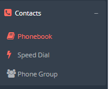
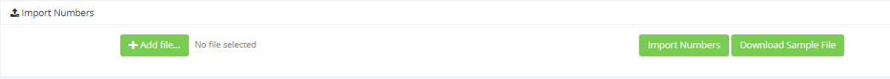

## Introduzione

In questa guida verrà illustrato come importare i propri contatti all'interno della rubrica condivisa del vostro CloudPBX utilizzano un comune file .csv

## Prerequisiti

Per poter importare i contatti necessitate di un file .csv formattato come nell'allegato di questa pagina. I campi obbligatori da compilare sono "First Name", "Last Name" e almeno uno dei seguenti: "extension number", "phone number", "cell number".  
Accertarsi che sia presente un "Phone Group" e il relativo nome prima di compilare il campo all'interno del file .csv

## Guida passo-passo

- Cliccare sul "**Phonebook**" all'interno del menù "**Contacts**"

- Ciccare su "**Import Numbers**" per espandere il menù e cliccare su "**\+ Add file**"

- Selezionare il file .csv contenente i contatti e cliccare su "**Import Numbers**".

## Allegati

## [template_phonebook.csv](./attachments/template_phonebook.csv)

> [!NOTE]
> **Sommario**
> 
> 
> 
> - [Introduzione](#introduzione)
> - [Prerequisiti](#prerequisiti)
> - [Guida passo-passo](#guida-passo-passo)
> - [Allegati](#allegati)
> - 
> 
> * * *
> **Articoli collegati**
> 
> 
> 
> - Page:
> [Portale Extension - Opzioni e Funzionalità](/wiki/spaces/KB/pages/1966256717/Portale+Extension+-+Opzioni+e+Funzionalit)
> - Page:
> [SNOM D765 Guida rapida](/wiki/spaces/KB/pages/1966256324/SNOM+D765+Guida+rapida)
> - Page:
> [SNOM D715 Guida rapida](/wiki/spaces/KB/pages/1966256267/SNOM+D715+Guida+rapida)
> - Page:
> [Importazione Contatti da file .csv](/wiki/spaces/KB/pages/1966256043/Importazione+Contatti+da+file+.csv)
> - Page:
> [Dashboard](/wiki/spaces/KB/pages/1966254983/Dashboard)