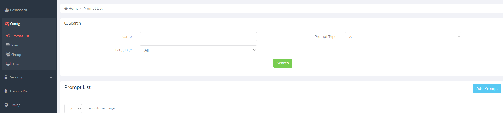
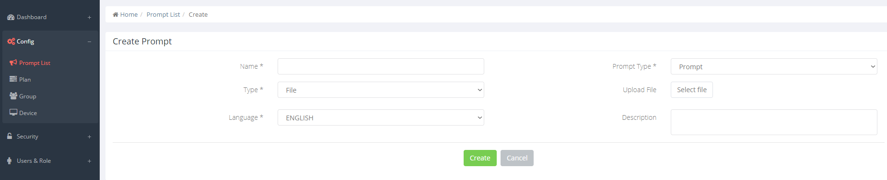
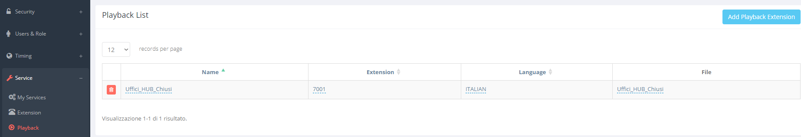
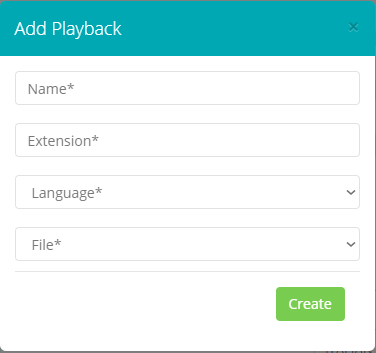
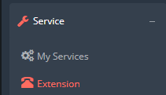
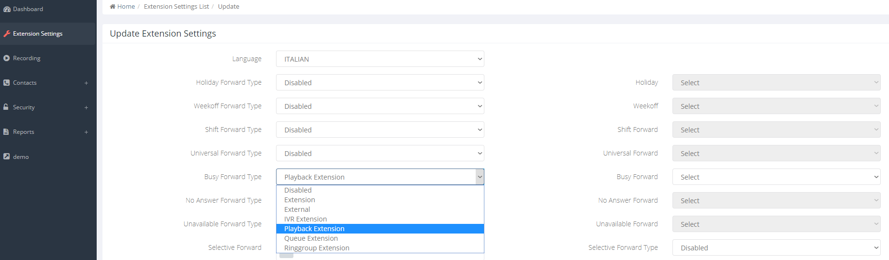
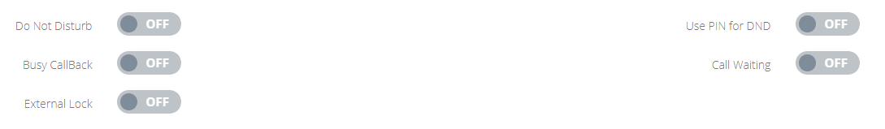

## Introduzione

Questa guida ha lo scopo di informare su come fare nel caso in cui un interno sia occupato ma si voglia comunque gestire le chiamate in ingresso dirette a quello specifico interno informando con un messaggio audio che l' utente è attualmente occupato

Prerequisiti

E' necessario registrare il messaggio audio in formato .wav o .mp3

## Guida passo-passo

- Accedi al pannello di controllo CloudPBX [https://pbx.cloudfire.it](https://pbx.cloudfire.it/) ed effettua login con le tue credenziali.
- Nella sezione "Config" → "Prompt List" Clicca su "Add Prompt" per aggiungere il file audio  
  

  
  
Compila i campi necessari alla creazione del file audio e seleziona il file in formato .wav o .mp3 con il pulsante "Select file"  

  
  
Spostati nella sezione "Service" → "Playback" per associare il file audio a una Playback Extension cliccando su pulsante "Add Playback Extension"  
  

  
  
Compila i campi contrassegnati con \*, avendo cura di selezionare, come "Language" *Italiano*:  

  
  
- Configura la deviazione di chiamata o il messaggio audio appena caricato come destinazione di ciascun interno in caso di occupatoEntra nella sezione "Service" → "Extension" :
  
- Clicca sull' icona 
 per accedere al pannello di gestione dell' internoNella sezione "Extension Settings" è possibile configurare l' azione che scatenerà la riproduzione del messaggio 

- "**Busy Forward Type**" è l'azione legata all'interno occupatoSelezionando "*Playback Extension*" verrà sbloccato il menu "Busy Forward" nel cui menù sarà possibile selezionare il file audioN.B. Occorre anche configurare la funzione "Call Waiting" su **OFF**

> [!INFO]
> N.B. Occorre anche configurare la funzione "Call Waiting" su **OFF**

  

  

> [!NOTE]
> **Sommario**
> 
> 
> 
> - [Introduzione](#introduzione)
> - [Guida passo-passo](#guida-passo-passo)
> -   Filter by label
> * * *
> ##### Filter by label
> 
> There are no items with the selected labels at this time.