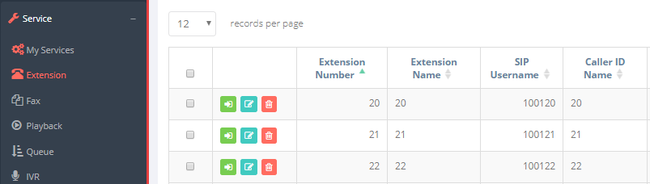
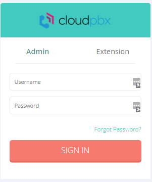
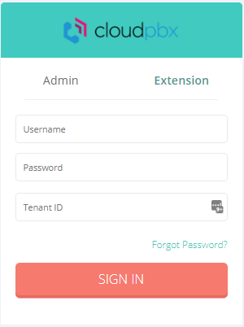

## Introduzione

Il portale extension, è un portale dedicato all'utente finale dove è possibile gestire le varie impostazioni della propria extension.

## Prerequisiti

Aver creato un extension all'interno del **Portale Tenant**.

## Guida passo-passo

Per accedere a questo portale avete 2 possibilità:

- Partendo dal **Portale Tenant,** spostatevi nel sotto-menù **Service → Extension** e cliccate sul pulsante verde di fianco all'extension desiderata.

- Diversamente potete accedervi collegandovi all'url del PBX ([**pbx.cloudfire.it**](http://pbx.cloudfire.it)) o cliccando sul pulsante **Gestisci** all'interno della vostra dashboard del **CloudPBX** all'interno di cortex.In entrambi i casi vi comparirà la seguente schermata di Log-in:  
  

- Una volta qua se cliccate su **Extension,** il form cambierà in questo modo:  

I campi da compilare sono tutti obbligatori e di seguito sono indicati dove reperire i vari valori:

- **Username:** questo è il numero dell'extension.
- **Password:** questa è la **Web Password** che potete modificare all'interno delle impostazioni dell'extension che trovate all'interno del **Portale Tenant → Service → Extension** e cliccando sul pulsante verde di fianco all'extension desiderata
- **Tenant ID:** Identificativo del Tenant che trovate indicato all'interno del **Portale Tenant** indicato in un piccolo specchietto in alto a destra.

  

  

> [!NOTE]
> **Sommario**
> 
> 
> 
> - [Introduzione](#introduzione)
> - [Prerequisiti](#prerequisiti)
> - [Guida passo-passo](#guida-passo-passo)
> * * *
> **Articoli collegati**
> 
> 
> - Page:
> [Estendere volume Guest OS (Linux) senza riavviare](/wiki/spaces/KB/pages/2001076225/Estendere+volume+Guest+OS+Linux+senza+riavviare)
> - Page:
> [Impossibile chiamare o ricevere chiamate](/wiki/spaces/KB/pages/1966256951/Impossibile+chiamare+o+ricevere+chiamate)
> - Page:
> [Portale Extension - Profile](/wiki/spaces/KB/pages/1966256865/Portale+Extension+-+Profile)
> - Page:
> [Portale Extension - Voicemail](/wiki/spaces/KB/pages/1966256807/Portale+Extension+-+Voicemail)
> - Page:
> [Accesso Portale Extension](/wiki/spaces/KB/pages/1966256750/Accesso+Portale+Extension)