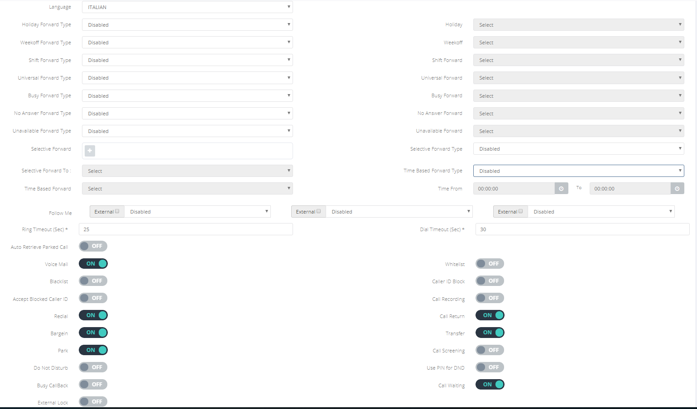

## Introduzione

Questo sotto-menù è il cuore del **Portale Extension,** qui infatti sarà possibile configurare le varie opzioni e funzionalità relative all'extension in questione. Qui infatti potrete abilitare le varie deviazioni di chiamata, i trasferimenti, il DND e molto altro.

## Prerequisiti

Per avere tutte le opzioni disponibili dovrete averle abilitate all'interno del [**Portale Tenant → Config → Plan**](../../how-to-cloud-pbx/portale-tenant-cloud-pbx/config-2-2/plan-2-2.md)**,** selezionando le varie opzioni all'interno del **Plan** applicato all'extension in questione: [**Portale Tenant → Extension**](../../how-to-cloud-pbx/portale-tenant-cloud-pbx/service-2-2/extension-2-2.md).

## Opzioni e descrizione

### Elenco delle Opzioni

### Descrizione delle opzioni

- **Language:** lingua associata all'extension, questa selezione va ad influenzare i messaggi audio associabili all'extension stessa.
- **Holiday Forward Type:** (comando in dismissione) deviazione delle chiamate dirette a questa extension durante la finestra temporale specificata in **Portale Tenat → Timings → Holiday.**
- **Holiday:** Specifico Service verso cui deviare la chiamata in caso di attivazione dell'opzione precedente.
- **Weekoff Forward Type:** (comando in dismissione) deviazione delle chiamate dirette a questa extension durante la finestra temporale specificata in **Portale Tenat → Timings → Weekoff.**
- **Weekoff:** Specifico Service verso cui deviare la chiamata in caso di attivazione dell'opzione precedente.
- **Shif Forward Type:** deviazione delle chiamate dirette a questa extension fuori dalla finestra temporale specificata in [**Portale Tenant → Timings → Shift**](../../how-to-cloud-pbx/portale-tenant-cloud-pbx/timing/shift-2-2.md)**.**
- **Shift Forward:** Specifico Service verso cui deviare la chiamata in caso di attivazione dell'opzione precedente.
- **Universal Forward Type:** deviazione perenne delle chiamate dirette a questa extension.
- **Universal Forward:** Specifico Service verso cui deviare la chiamata in caso di attivazione dell'opzione precedente.
- **Busy Forward Type:** deviazione delle chiamate dirette a questa extension nel caso in cui l'extension risultasse occupata.
- **Busy Forward:** specifico Service verso cui deviare la chiamata in caso di attivazione dell'opzione precedente.
- **No Answer Forward Type:** deviazione delle chiamate dirette a questa extension in caso in cui l'extension non risponda alla chiamata (superamento del **Ring Timeout**).
- **No Answer Forward:** specifico Service verso cui deviare la chiamata in caso di attivazione dell'opzione precedente.
- **Unavailable Forward Type:** deviazione delle chiamate dirette a questa extension in caso in cui l'extension risulti non disponibile (generalmente quando l'extension non risulta registrata)
- **Unavailable Forward:** specifico Service verso cui deviare la chiamata in caso di attivazione dell'opzione precedente.
- **Selective Forward:** deviazione delle chiamate dirette a questa extension provenienti dal numero qui inserito.
- **Selective Forward Type:** specificare il tipo di service verso cui instradare le chiamate in caso di inserimento di un numero telefonico nel punto precedente.
- **Selective Forward To:** specifico Service verso cui deviare la chiamata in caso di attivazione dell'opzione precedente.
- **Time Based Forward Type:** deviazione delle chiamate dirette a questa extension in cui la chiamata arrivi una specifica finestra temporale.
- **Time Based Forward:** specifico Service verso cui deviare la chiamata in caso di attivazione dell'opzione precedente.
-   **Time From / To:** finestra temporale da utilizzare se attivati le 2 opzioni precedenti.
- **Follow me:** di seguito sono presenti 3 text box in cui è possibile inserire un altra extension o un numero esterno dove verrà instradata la chiamata in arrivo in aggiunta all'extension in oggetto. La text box più a sinistra ha priorità rispetto a quella al centro e di conseguenza quella al centro avrà più priorità rispetto a quella a destra.  

- **Ring Timeout:** timeout in secondi entro cui l'extension continuerà a suonare quando una chiamata arriverà a quest'extension. Al superamento dei questo time-out la chiamata verrà considerata non risposta.
- **Dial Timeout:** timeout in secondi entro cui questa extension manterrà aperta una chiamata in uscita prima di considerarla non risposta.
- **Auto Retrieve Parked Calls:** Opzione che se abilitata riprende in automatico le chiamate "parcheggiate".
- **Parked Retrieve Timeout:** timeout in secondi scaduto il quale viene ripresa la chiamata parcheggiata in automatico.
- **Voicemail:** opzione che abilita la voicemail per questa extension.
- **Whitelist:** con questa opzione l'utente può specificare diversi numeri e solo le chiamate provenienti da questi numeri vengono instradate verso l'extension. Tutte le altre vengono rifiutate.
- **Blacklist:** con questa opzione l'utente può specificare diversi numeri e tutte le chiamate provenienti da questi vengono rifiutate mentre le chiamate da altri numeri vengono accetate.
- **Caller ID Black:** di default il numero e il nome dell'extension vengono mostrate nelle chiamate in uscita. Se questa opzione viene abilitata il numero e il nome vengono nascosti.
- **Accept Blocked Called ID:** se questa opzione viene abilitata, viene accettata ogni tipo di chiamata con ogni Caller ID, anche quelle con il numero o nome nascosti.
- **Call Recording:** questa opzione abilita la possibilità di registrare le chiamate, per registrare le chiamate si necessita di comporre un particolare codice: [**Portale Extension → Opzioni e Funzionalità**](../portale-extension/portale-extension-opzioni-e-funzionalit.md)
- **Redial:** se questa opzione viene abilitata è possibile, tramite codice opportuno ([**Portale Extension → Opzioni e Funzionalità**](../portale-extension/portale-extension-opzioni-e-funzionalit.md)), richiamare l'ultimo numero composto.
- **Call Return:** se questa opzione viene abilitata è possibile, tramite codice opportuno ([**Portale Extension → Opzioni e Funzionalità**](../portale-extension/portale-extension-opzioni-e-funzionalit.md)), richiamare l'ultimo numero da cui si è ricevuta una chiamata, che sia stata risposta o meno.
- **Bargein:** se questa opzione viene abilitata è possibile, tramite codice opportuno ([**Portale Extension → Opzioni e Funzionalità**](../portale-extension/portale-extension-opzioni-e-funzionalit.md)), spiare le chiamate destinate ad un'altra extension.
- **Transfer:** se questa opzione viene abilitata l'extension può trasferire le chiamate correnti ad un'altra extension o ad un numero esterno.
- **Park:** se questa opzione viene abilitata l'extension può parcheggiare le chiamate. In poche parole mettere in attesa l'attuale interlocutore, effettuare una seconda chiamata e in seguito riprendere la precedente chimata.
- **Call Screening:** se abilitato e l'utente dell'extension risponde ad una chiamata, sentirà un messaggio che annuncia il nome o il numero del chiamante, in base alle selezioni delle opzioni che compaiono all'abilitazione di questa:
-   **Screen Read:** in base alla scelta verrà annunciato il nome o il numero del chiamante.
-   **Screen To:** selezionare se applicare lo screening solo alle chiamate esterne o se a tutte.
- **Do Not Disturb:** se questa opzione viene abilitata l'extension sarà in modalità "non disturbare" e tutte le chiamate destinate ad essa verranno rifiutate, ma potrà comunque effettuare chiamate in uscita.
- **Use PIN for DND:** se viene abilitata questa opzione sarà richiesto il PIN ([**Portale Tenant → Extension**](../../how-to-cloud-pbx/portale-tenant-cloud-pbx/service-2-2/extension-2-2.md)) per abilitare la modalità "non disturbare".
- **Busy Callback:** se questa opzione viene abilitata l'utente di questa extrension può iniziare un **Busy Callback.**
- **Call Waiting:** con questa opzione è possibile abilitare o disabilitare l'avviso di chiamata per questa extension. In poche parole se l'extension, mentre è in coversazione con qualcuno, riceve un'altra chiamata, non viene inviato il segnale di occupato, ma la chiamata rimane "sotto" a quella già in corso, e volendo è possibile switchare tra una e l'altra.
- **External Lock:** abilita la possibilità di bloccare certe numerazioni direttamente dal telefono

  

> [!NOTE]
> **Sommario**
> 
> 
> 
> - [Introduzione](#introduzione)
> - [Prerequisiti](#prerequisiti)
> - [Opzioni e descrizione](#opzioni-e-descrizione)
> -   [Elenco delle Opzioni](#elenco-delle-opzioni)
> -   [Descrizione delle opzioni](#descrizione-delle-opzioni)
> * * *
> **Articoli collegati**
> 
> 
> - Page:
> [Estendere volume Guest OS (Linux) senza riavviare](/wiki/spaces/KB/pages/2001076225/Estendere+volume+Guest+OS+Linux+senza+riavviare)
> - Page:
> [Impossibile chiamare o ricevere chiamate](/wiki/spaces/KB/pages/1966256951/Impossibile+chiamare+o+ricevere+chiamate)
> - Page:
> [Portale Extension - Profile](/wiki/spaces/KB/pages/1966256865/Portale+Extension+-+Profile)
> - Page:
> [Portale Extension - Voicemail](/wiki/spaces/KB/pages/1966256807/Portale+Extension+-+Voicemail)
> - Page:
> [Accesso Portale Extension](/wiki/spaces/KB/pages/1966256750/Accesso+Portale+Extension)