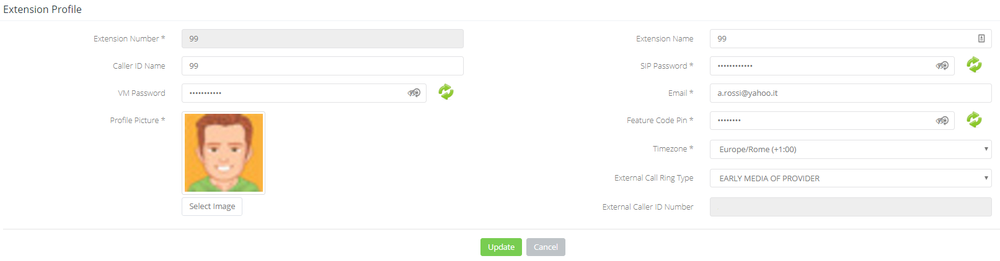

## Introduzione

Una volta effettuato l'accesso al **Portale Extension** per l'extension desiderata, avrete la possibilità di accedere al suo profilo cliccando sull'icona in altro a destra della schermata:

  

Cliccando appunto su **Profile** potrete accedere alla gestione di alcune opzioni impostate in fase di creazione dell'extension stessa.

## Descrizione dei vari Campi

I campi in grigio non sono modificabili se non accedendo al [**Portale Tenant → Extension**](../../how-to-cloud-pbx/portale-tenant-cloud-pbx/service-2-2/extension-2-2.md)

- **Extension Number:** numero dell'extension
- **Extension Name:** Nome dell'extension
- **Caller ID Name:** Nome che viene presentato nelle chiamate in uscita.
- **SIP Password:** Password della registrazione SIP.

> [!WARNING]
> **ATTENZIONE!**
> Modificare il parametro **Registrazione SIP** potrebbe causare la de-registrazione dell'apparato telefonico inibendo la possibilità di fare e ricevere chiamate.

- **VM Password:** Password di accesso alla Voicemail dell'extrension.
- **Email:** email associata all'extension (recapito di default delle voicemail se abilitato ml'invio delle voicemail ad indirizzo email).
- **Profile Picture:** Immagine dell'utente dell'extension
- **Feature Code PIN:** PIN che richiesto per l'attivazione di alcuni particolari Feature Codes.
- **Timezone:** fusorario, importante che rimanga sincronizzato con quello del PBX per evitare problemi di sincronia con le regole temporali.
- **External Call Ring Type:** parametro che gestisce il tipo di Ring sulle chiamate in uscita. **MODIFICARE CON ATTENZIONE!**
- **External Caller ID Number:** numerazione che viene presentata dall'extension quando effettua una chiamata verso l'esterno.

  

  

> [!NOTE]
> **Sommario**
> 
> 
> 
> - [Introduzione](#introduzione)
> - [Descrizione dei vari Campi](#descrizione-dei-vari-campi)
> * * *
> **Articoli collegati**
> 
> 
> - Page:
> [Estendere volume Guest OS (Linux) senza riavviare](/wiki/spaces/KB/pages/2001076225/Estendere+volume+Guest+OS+Linux+senza+riavviare)
> - Page:
> [Impossibile chiamare o ricevere chiamate](/wiki/spaces/KB/pages/1966256951/Impossibile+chiamare+o+ricevere+chiamate)
> - Page:
> [Portale Extension - Profile](/wiki/spaces/KB/pages/1966256865/Portale+Extension+-+Profile)
> - Page:
> [Portale Extension - Voicemail](/wiki/spaces/KB/pages/1966256807/Portale+Extension+-+Voicemail)
> - Page:
> [Accesso Portale Extension](/wiki/spaces/KB/pages/1966256750/Accesso+Portale+Extension)