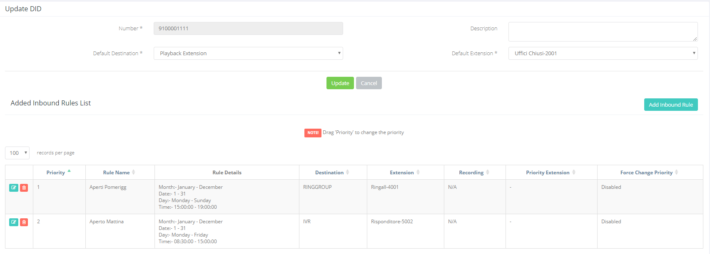
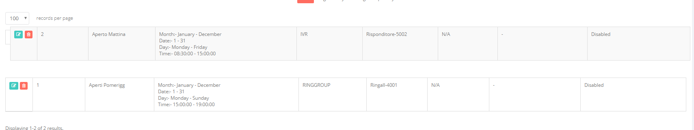
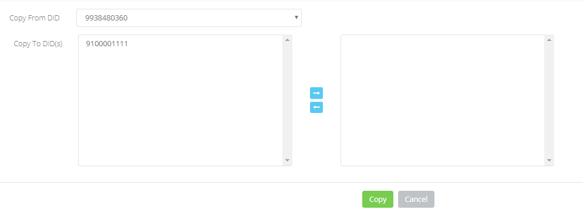
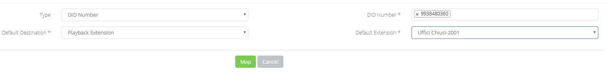

## Introduzione

In questo sotto-menù avrete modo di gestire l'instradamento delle chiamate indirizzate verso le vostre numerazioni telefoniche.

## Prerequisiti

L'elenco delle numerazioni verrà popolato dal sistema una volta completata la portabilità delle numerazioni, quindi una volta che il servizio sarà attivo sul portale Cortex, qui troverete l'elenco delle vostre numerazioni.

## Guida passo-passo

Cliccando sul pulsante **EDIT** avrete modo di modificare le regole di instradamento delle chiamate dirette a quella particolare numerazione.

  

In questa pagina potrete modificare le impostazioni di default della numerazione compilando i seguenti campi:

- **Description:** campo non obbligatorio dove potete inserire una descrizione per la numerazione
- **Default Destination: Service** a cui verranno indirizzate le chiamate, destinate alla numerazione, se la chiamata arriva in un orario non compreso nelle regole specificate nella sezione sottostante: **"Added Inbound Rules List"**.
- **Default Extension: Extension Number** del **Service** inserito nel punto precedente.

Nella sezione successiva, **Added inbund Rules List**, potete vedere le regole temporali applicate alla numerazione, con indicato a quale **Service** instradare la chiamata e la **Priority.** 

Cliccando sul pulsante **ADD INBOUND RULE** è possibile assegnare nuove regole temporali alla numerazione.

> [!INFO]
> Per assegnare nuove regole dovono essere create nella sezione **Timing → Time Condition,** cliccate [qui](../../portale-tenant-cloud-pbx/timing/time-condition-2-2.md) per la guida su come creare/gestire le **Time Condition**

Una volta configurate la **Default Destination** e le **Inbound Rules,** le chiamate verso al numerazione che stiamo modificando, seguiranno questo flusso:

Prendendo per esempio lo screen-shot sopra possiamo vedere che:

1. Se una chiamata arriva alle ore **10:00** la chiamata verrà inviata al **IVR "Risponditore-5002"**
2. Se una chiamata arriva alle **16:30** la chiamata verrà inviata al **RingGroup "Ringall-4001"**
3. Se una chiamata arriva **23:00** la chiamata verrà inviata al **Playback "Uffici Chiusi-2001"**

Se dovete modificare la **Priority** di una regola vi basterà tenere cliccato sul valore della priority e trascinare questa regola nella posizione che preferite:

Cliccando il pulsante **COPY DID CONFIGURATION** è possibile copiare la configurazione di una numerazione ed applicarla ad altre numerazioni semplicemente selezionando la numerazione da copiare e spostando dalla colonna di sinistra a quella di destra le numerazioni a cui applicarla

Infine cliccando sul pulsante **MAP EXTENSION** è possibile selezionare una o più numerazioni e configurarvi la stessa **default destination.**

  

  

> [!NOTE]
> **Sommario**
> 
> 
> 
> - [Introduzione](#introduzione)
> - [Prerequisiti](#prerequisiti)
> - [Guida passo-passo](#guida-passo-passo)
> * * *
> **Articoli collegati**
> 
> 
> - Page:
> [Fax to Mail & Mail to Fax](/wiki/spaces/KB/pages/1966257180/Fax+to+Mail+Mail+to+Fax)
> - Page:
> [Chiamate esterne da Ring Group o IVR non funzionanti](/wiki/spaces/KB/pages/1966256989/Chiamate+esterne+da+Ring+Group+o+IVR+non+funzionanti)
> - Page:
> [Impossibile chiamare o ricevere chiamate](/wiki/spaces/KB/pages/1966256951/Impossibile+chiamare+o+ricevere+chiamate)
> - Page:
> [Portale Extension - Extension Settings](/wiki/spaces/KB/pages/1966256663/Portale+Extension+-+Extension+Settings)
> - Page:
> [Deviazioni di chiamata](/wiki/spaces/KB/pages/1966255812/Deviazioni+di+chiamata)