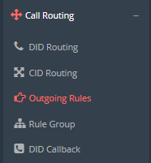

## Introduzione

In questo sotto-menù verranno elencate le regole per l'instradamento delle chiamate in uscita. Non è possibile effettuare delle modifiche alle regole d'instradamento in uscita in quanto queste regole vanno concordate con il supporto tecnico prima dell'attivazione. Queste sono le regole che regolano la **presentazione del numero in uscita** ed eventualmente anche il **Gateway di uscita** in base al numero che viene composto dalle vostre extension.

## Descrizione

Accedendo al sotto-menù **Call Routing → Outgoing Rules**

Potrete vedere una tabella con le regole concordate in fase di installazione. Per ogni regola vedrete il prefisso di composizione che discriminerà la numerazione presentata in uscita.

Accedendo al sotto-menù **Call Routing → Outgoing Rules**

Potrete vedere una tabella con le regole concordate in fase di installazione. Per ogni regola vedrete il prefisso di composizione che discriminerà la numerazione presentata in uscita.

> [!NOTE]
> **Sommario**
> 
> 
> 
> - [Introduzione](#introduzione)
> - [Descrizione](#descrizione)
> * * *
> **Articoli collegati**
> 
> 
> - Page:
> [Chiamate esterne da Ring Group o IVR non funzionanti](/wiki/spaces/KB/pages/1966256989/Chiamate+esterne+da+Ring+Group+o+IVR+non+funzionanti)
> - Page:
> [Portale Extension - Opzioni e Funzionalità](/wiki/spaces/KB/pages/1966256717/Portale+Extension+-+Opzioni+e+Funzionalit)
> - Page:
> [Portale Extension - Extension Settings](/wiki/spaces/KB/pages/1966256663/Portale+Extension+-+Extension+Settings)
> - Page:
> [Dashboard](/wiki/spaces/KB/pages/1966254983/Dashboard)
> - Page:
> [Outgoing Rules](/wiki/spaces/KB/pages/1966254813/Outgoing+Rules)