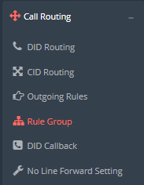
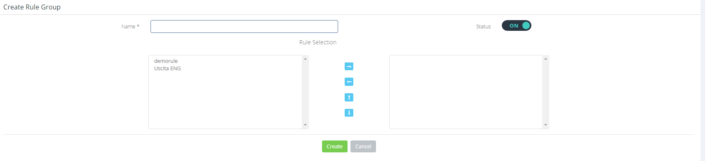
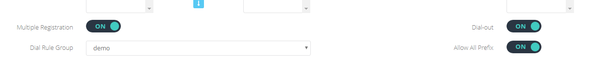

## Introduzione

In questo sotto-menù è possibile creare dei gruppi di [**Outgoing Rules**](../call-routing/outgoing-rules.md)**.** Le **Rule Group** verranno assegnate alle varie **extension** per poter abilitare la possibilità di effettuare chiamate in uscita.

## Prerequisiti

Per poter aggiungere o modificare delle **Rule Group** dovete avere almeno una **Outgoing Rule** configurata.

## Guida passo-passo

**Accedendo al sotto-menù Call Routing → Rule Group**

- Potete raggruppare le **Outgoing Rules** in questi contenitori in modo da assegnare una serie di regole ad ogni extension.
- Cliccando su **ADD RULE GROUP** potete creare una nuova **Rule Group.**

- Assegnate un nome alla regola.Assicuratevi che lo **Status** sia su **ON.**Spostate le **Outgoing Rules,** che desiderate facciano parte della **Rule Group**, dalla colonna di sinistra a quella di destra e cliccate su **Create.**
- Una volta creata la vostra **Rule Group** la potrete assegnare alle **Extension**, dal menù **Portale Tenant → Extension**:  

> [!NOTE]
> **Sommario**
> 
> 
> 
> - [Introduzione](#introduzione)
> - [Prerequisiti](#prerequisiti)
> - [Guida passo-passo](#guida-passo-passo)
> * * *
> **Articoli collegati**
> 
> 
> - Page:
> [Chiamate esterne da Ring Group o IVR non funzionanti](/wiki/spaces/KB/pages/1966256989/Chiamate+esterne+da+Ring+Group+o+IVR+non+funzionanti)
> - Page:
> [Impossibile chiamare o ricevere chiamate](/wiki/spaces/KB/pages/1966256951/Impossibile+chiamare+o+ricevere+chiamate)
> - Page:
> [Portale Extension - Opzioni e Funzionalità](/wiki/spaces/KB/pages/1966256717/Portale+Extension+-+Opzioni+e+Funzionalit)
> - Page:
> [Portale Extension - Extension Settings](/wiki/spaces/KB/pages/1966256663/Portale+Extension+-+Extension+Settings)
> - Page:
> [Deviazioni di chiamata](/wiki/spaces/KB/pages/1966255812/Deviazioni+di+chiamata)