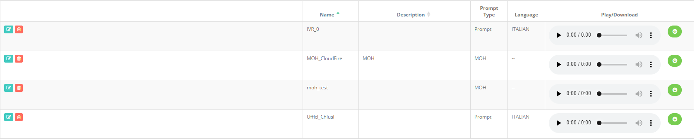
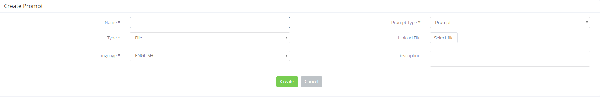

## Introduzione

In questo sotto-menù è possibile gestire i vari messaggi audio che volete utilizzare nel vostro Cloud PBX. 

Una volta caricati i file audio, verranno visualizzati nell'elenco sottostante.

Da questo elenco è possibile ascoltarli, eliminarli oppure scaricarli

## Prerequisiti

Tutti i file che vengono caricati devono essere in formato "**.mp3**" oppure in formato "**.wav**"

## Guida passo-passo

- Cliccare sul Bottone "**Add Prompt**":
- Compilare tutti i campi contrassegnati da asterisco:  

#### Descrizione dei Campi

1. **Name:** nome univoco che verrà utilizzato per richiamare il file audio.
2. **Prompt Type:** indica la tipologia di messaggio audio
1.   **Prompt:** messaggio audio da applicare a Ring Group, Queues, IVR o Playback.
2.   **MOH:** messaggio audio da utilizzare come Music on Hold (musica d'attesa)
3. **Type:** tipologia di media che si vuole utilizzare per la creazione del prompt
1.   **File:** viene specificato un file .mp3 o .wav da caricare.
2.   **Recordings:** è possibile utilizzare un messaggio registrato direttamente da un extension
4. **Language:** lingua a cui applicare il file audio
5. **Description:** descrizione del messaggio audio

  

  

> [!NOTE]
> **Sommario**
> 
> 
> 
> - [Introduzione](#introduzione)
> - [Prerequisiti](#prerequisiti)
> - [Guida passo-passo](#guida-passo-passo)
> -   [Descrizione dei Campi](#descrizione-dei-campi)
> * * *
> **Articoli collegati**
> 
> 
> - Page:
> [Portale Extension - Voicemail](/wiki/spaces/KB/pages/1966256807/Portale+Extension+-+Voicemail)
> - Page:
> [Portale Extension - Opzioni e Funzionalità](/wiki/spaces/KB/pages/1966256717/Portale+Extension+-+Opzioni+e+Funzionalit)
> - Page:
> [Playback (2) (2)](/wiki/spaces/KB/pages/1966255560/Playback+2+2)
> - Page:
> [Prompt List (2) (2)](/wiki/spaces/KB/pages/1966255385/Prompt+List+2+2)
> - Page:
> [Dashboard](/wiki/spaces/KB/pages/1966254983/Dashboard)