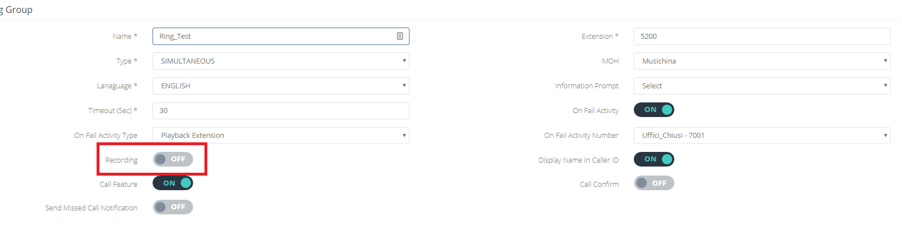
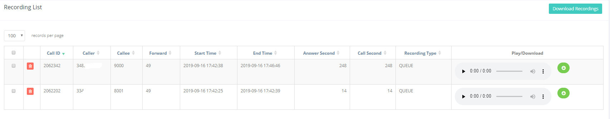

## Introduzione

In questa pagina saranno disponibili le registrazioni delle chiamate destinate ai vari **Service,** come **Ring Group** o **Code.**

## Prerequisiti

Per poter consultare i vari **recordings** dovete avere almeno un **Service** con l'opzione **Recording** abilitata.

## Guida passo-passo

Selezionare il **Service** dove vengono instradate le chiamate che volete registrare. E spostate l'opzione **Recording** su **ON.**

In questo esempio la vedete su un Ring Group:

Una volta abilitato e aggiornato la modifica cliccando su **Update,** ogni chiamata che arriverà su questo **Ring Group** e verrà risposta verrà registrata. E in questo sotto menù sarà possibile vederne i dettagli, eliminarla, ascoltare o scaricare il file audio.

  

  

> [!NOTE]
> **Sommario**
> 
> 
> 
> - [Introduzione](#introduzione)
> - [Prerequisiti](#prerequisiti)
> - [Guida passo-passo](#guida-passo-passo)
> * * *
> **Articoli collegati**
> 
> 
> - Page:
> [Chiamate esterne da Ring Group o IVR non funzionanti](/wiki/spaces/KB/pages/1966256989/Chiamate+esterne+da+Ring+Group+o+IVR+non+funzionanti)
> - Page:
> [Impossibile chiamare o ricevere chiamate](/wiki/spaces/KB/pages/1966256951/Impossibile+chiamare+o+ricevere+chiamate)
> - Page:
> [Portale Extension - Opzioni e Funzionalità](/wiki/spaces/KB/pages/1966256717/Portale+Extension+-+Opzioni+e+Funzionalit)
> - Page:
> [Portale Extension - Extension Settings](/wiki/spaces/KB/pages/1966256663/Portale+Extension+-+Extension+Settings)
> - Page:
> [Deviazioni di chiamata](/wiki/spaces/KB/pages/1966255812/Deviazioni+di+chiamata)