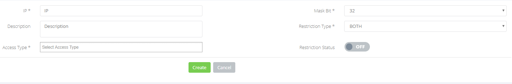
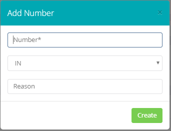

## Introduzione

Questo sotto-menù permette la gestione delle restrizioni relative a numeri di telefono, Reti IP oppure utenti.

## Descrizione delle sezioni

### Access Restriction

In questa sezione è possibile gestire le ACL per negare un accesso o una registrazione SIP proveniente da altre reti.

Cliccando su 

è possibile creare una nuova regola,  

- **IP:**  Indirizzo IP della rete o dell'Host da negare.
- **Mask Bit:** indicare la subnet della rete (in caso di singolo host mantenere il valore 32).
- **Description:** breve descrizione della regola.
- **Restriction Type:** indicare se la restrizione è da applicare all'accesso web, alla registrazione oppure ad entrambi.
- **Restriction Status:** Abilita o disabilita la regola.

### Blacklist Number

In questa sezione è possibile indicare i numeri verso cui le chiamate in uscita sono inibite oppure vengono rifiutate in caso di chiamate in entrata. Cliccando su 

 vi si apre il form da compilare.

- **Number:** Inserire numerazione telefonica, se la numerazione è italiana inserirla **SENZA** il prefisso internazionale. 
- **IN:** scegliere IN se volete bloccare la numerazione in ingresso, OUT se la volete bloccare in uscita, BOTH se la volete bloccare in entrambe le direzioni
- **Reason:** spazio in cui inserire una breve descrizione della regola.

### Whitelist Number

Vedi Blacklist Number per la configurazione, serve a indicare i numeri da aggiungere alla whitelist. In caso di conflitto prevarrà la whitelist.

### Locked User

Mostra le extension bloccate a causa dell’ infrazione delle regole di registrazione. Previene la possibilità che un client compromesso generi traffico fraudolento.

  

  

> [!NOTE]
> **Sommario**
> 
> 
> 
> - [Introduzione](#introduzione)
> - [Descrizione delle sezioni](#descrizione-delle-sezioni)
> -   [Access Restriction](#access-restriction)
> -   [Blacklist Number](#blacklist-number)
> -   [Whitelist Number](#whitelist-number)
> -   [Locked User](#locked-user)
> * * *
> **Articoli collegati**
> 
> 
> - Page:
> [Fax to Mail & Mail to Fax](/wiki/spaces/KB/pages/1966257180/Fax+to+Mail+Mail+to+Fax)
> - Page:
> [Portale Extension - Opzioni e Funzionalità](/wiki/spaces/KB/pages/1966256717/Portale+Extension+-+Opzioni+e+Funzionalit)
> - Page:
> [Dashboard](/wiki/spaces/KB/pages/1966254983/Dashboard)
> - Page:
> [Security](/wiki/spaces/KB/pages/1966254934/Security)
> - Page:
> [Outgoing Rules](/wiki/spaces/KB/pages/1966254813/Outgoing+Rules)