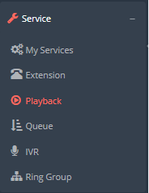
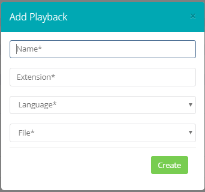

## Introduzione

In questa pagina verrà illustrata l'entità logica "**Playback**", che non è altro che il "contenitore" dei vostri messaggi audio che NON sono musiche d'attesa. Infatti i **Playback** non sono altro che riferimenti ai messaggi audio che possono essere richiamati nelle varie configurazioni del vostro CloudPBX.

## Prerequisiti

Per poter aggiungere un **Playback** dovete aver almeno caricato un messaggio audio salvandolo con l'opzione "Prompt Type" = **prompt.** Per delucidazioni consultare la pagina: [Prompt List](../../portale-tenant-cloud-pbx/config-2-2/prompt-list-2-2.md)

## Guida passo-passo

- Entrare nella sezione **Playback** dal menù **Service.**

- Cliccare su **Add Playback Extension**

#### Campi Playback

- **Name**: nome generico di riferimento del **Playback**
- **Extension:** identificativo numerico del **Playback,** utilizzare un numero a 4 cifre.
- **Language:** indicare la lingua di riferimento del **Playback**.
- **File:** indicare il **Prompt** da associare al **Playback.**

  

  

> [!NOTE]
> **Sommario**
> 
> 
> 
> - [Introduzione](#introduzione)
> - [Prerequisiti](#prerequisiti)
> - [Guida passo-passo](#guida-passo-passo)
> -   [Campi Playback](#campi-playback)
> * * *
> **Articoli collegati**
> 
> 
> - Page:
> [Portale Extension - Voicemail](/wiki/spaces/KB/pages/1966256807/Portale+Extension+-+Voicemail)
> - Page:
> [Portale Extension - Opzioni e Funzionalità](/wiki/spaces/KB/pages/1966256717/Portale+Extension+-+Opzioni+e+Funzionalit)
> - Page:
> [Playback (2) (2)](/wiki/spaces/KB/pages/1966255560/Playback+2+2)
> - Page:
> [Prompt List (2) (2)](/wiki/spaces/KB/pages/1966255385/Prompt+List+2+2)
> - Page:
> [Dashboard](/wiki/spaces/KB/pages/1966254983/Dashboard)