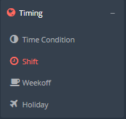
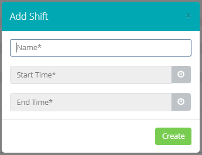

## Introduzione

Questo sotto-menù vi permetterà di gestire delle **finestre temporali giornaliere** che verranno applicate alle **extensions.** 

Una volta che applicherete una di questa regola ad una specifica extension, questa'ultima potrà ricevere ed effettuare chiamate **solo** all'interno della finestra temporale specificata.

## Prerequisiti

Una volta acquistato il servizio "Cloud PBX" su Cortex avrete accesso al "**Portale Tenant**" con le vostre credenziali.

## Guida passo-passo

1. Dal **Portale Tenant** entrate nella sezione **Shift** tramite il menù **Timing → Shift**

- Una volta all'interno della dashboard degli **Shift** potrete vedere le regole già create e modificarle cliccando sul tasto 
 o eliminarle con il tasto 
- Per creare un nuovo **Shift** cliccate sul tasto Shift

Descrizione dei campi:

- **Name:** Campo obbligatorio, inserire nome univoco identificativo della linea.
- **Start time:** orario di inizio della finestra temporale in cui la regola risulterà valida.
- **End Tiime:** orario di fine della finestra temporale in cui la regola risulterà valida.

> [!TIP]
> Queste regole andranno applicate all'**extension** in fase di creazione della stessa, popolando, appunto il campo **Shift.** Per la guida di creazione dell'extension cliccare [qui](../../portale-tenant-cloud-pbx/service-2-2/extension-2-2.md)

  

  

> [!NOTE]
> **Sommario**
> 
> 
> - [Introduzione](#introduzione)
> - [Prerequisiti](#prerequisiti)
> - [Guida passo-passo](#guida-passo-passo)
> -   Filter by label
> * * *
> **Articoli collegati**
> 
> 
> ##### Filter by label
> 
> There are no items with the selected labels at this time.