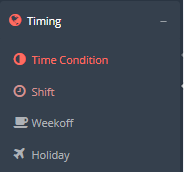
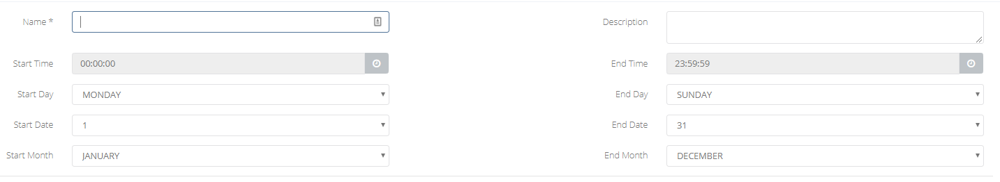
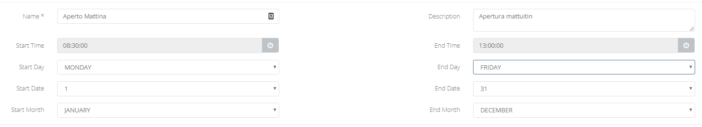
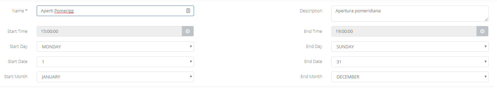
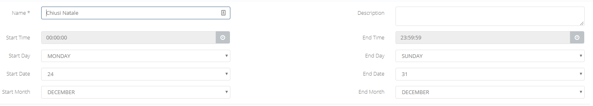
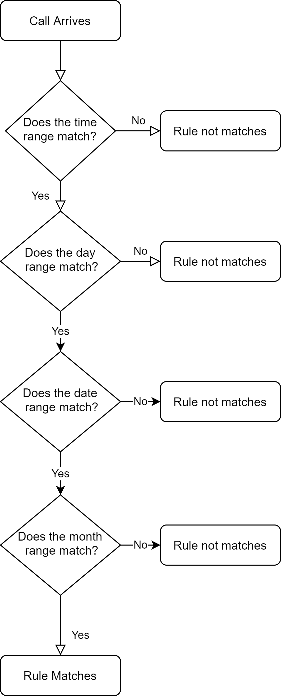

## Introduzione

In questo sotto-menù avete la possibilità di creare le **regole temporali**, che andrete poi ad applicare alle vostre numerazioni per poter gestire l'instradamento delle chiamate in base a particolari finestre temporali.

## Prerequisiti

Una volta acquistato il servizio "Cloud PBX" su Cortex avrete accesso al "**Portale Tenant**" con le vostre credenziali.

## Guida passo-passo

- Dal **Portale Tenant** entrate nella sezione Time Condition tramite il menù **Timing → Time Condition**

- Una volta all'interno della dashboard delle **Time Condition** potrete vedere le regole già create e modificarle cliccando sul tasto Verde o eliminarle con il tasto Rosso
- Per creare una nuova **Time Condition** cliccate su **Add Time Condition** e vi si aprirà il form di gestione della nuova regola:  

Di seguito la descrizione dei vari campi:

- **Name:** campo obbligatorio, inserire un nome univoco per la seguente regola
- **Description:** campo non obbligatorio, inserire un descrizione per la regola
- **Start Time:** orario di inizio della finestra temporale che volete definire.
- **End Time:** orario di fine della finestra temporale che volete definire.
- **Start Day:** giorno della settimana di inizio della finestra temporale che volete definire.
- **End Day:** giorno della settimana di fine della finestra temporale che volete definire.
- **Start Date:** giorno del mese di inizio della finestra temporale che volete definire.
- **End Date:** giorno del mese di fine della finestra temporale che volete definire.
- **Start Month:** mese dell'anno di inizio della finestra temporale che volete definire.
- **End Month:** mese dell'anno di fine della finestra temporale che volete definire.

## Esempi

Di seguito alcuni esempi di **Time Condition** comunemente utilizzati

- Finestre temporali che definiscono la normale apertura degli uffici:  

  

> [!WARNING]
> Come vedete sono state create 2 regole (una per la mattina e una per il pomeriggio)

- Finestra temporale che definisce la chiusura per ferie natalizie:  

## Grafico Gestione dei timing

La decisione se il giorno odierno è compreso nella finestra temporale indicata, viene fatta seguendo gli step del grafico sottostante.

Per questo, se dovete indicare delle finestre temporali che coinvolgono più mesi, è meglio dividere le finestre temporali in base ai mesi che esse devono coprire, per evitare che in alcuni giorni la regola non venga metchata correttamente.

> [!NOTE]
> **Sommario**
> 
> 
> 
> - [Introduzione](#introduzione)
> - [Prerequisiti](#prerequisiti)
> - [Guida passo-passo](#guida-passo-passo)
> - [Esempi](#esempi)
> - [Grafico Gestione dei timing](#grafico-gestione-dei-timing)
> * * *
> **Articoli collegati**
> 
> 
> - Page:
> [Time Condition (2) (2)](/wiki/spaces/KB/pages/1966255040/Time+Condition+2+2)
> - Page:
> [CID Routing](/wiki/spaces/KB/pages/1966254770/CID+Routing)
> - Page:
> [DID Routing](/wiki/spaces/KB/pages/1966254638/DID+Routing)
> - Page:
> [Primi passi - Cloud PBX](/wiki/spaces/KB/pages/1966254385/Primi+passi+-+Cloud+PBX)