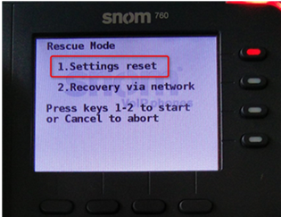

## Introduzione

Piccola guida su come resettare Factory Default il vostro telefono SNOM

## Guida passo-passo

1. Spegnere il dispositivo
2. Premere e tener premuto il tasto **#**  e riaccendere l'apparato.
3. Tenere premuto il tasto **#** finchè non compare la schermata di **Rescue Mode:**
4. Selezionare **1.Settings reset** premendo il tasto numero **1** sul tastierino numerico del telefono.
5. Dopo il riavvio il vostro telefono sarà correttamente resettato.

  

  

> [!NOTE]
> **Sommario**
> 
> 
> 
> - [Introduzione](#introduzione)
> - [Guida passo-passo](#guida-passo-passo)
> * * *
> **Articoli collegati**
> 
> 
> - Page:
> [SNOM - Factory Reset](/wiki/spaces/KB/pages/1966256905/SNOM+-+Factory+Reset)
> - Page:
> [Portale Extension - Opzioni e Funzionalità](/wiki/spaces/KB/pages/1966256717/Portale+Extension+-+Opzioni+e+Funzionalit)
> - Page:
> [Elenco telefoni supportati](/wiki/spaces/KB/pages/1966256435/Elenco+telefoni+supportati)
> - Page:
> [SNOM D765 Guida rapida](/wiki/spaces/KB/pages/1966256324/SNOM+D765+Guida+rapida)
> - Page:
> [SNOM D715 Guida rapida](/wiki/spaces/KB/pages/1966256267/SNOM+D715+Guida+rapida)