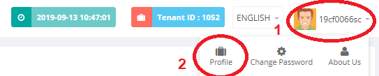
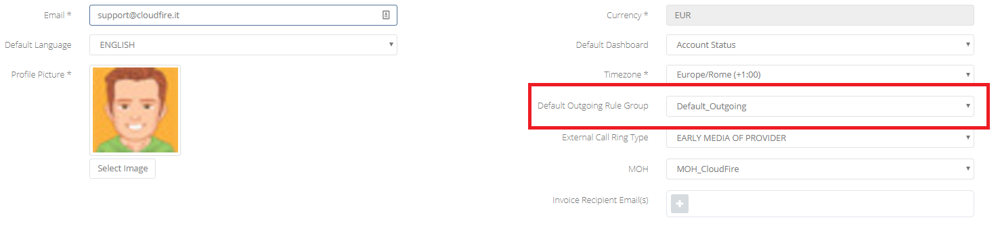

## Problema

Sui vari **Service** del Cloud PBX, come Ring-Group, IVR o anche come **Default Destination** dei DID, è possibile impostare dei numeri di telefono esterni come destinazione. Potrebbe capitare che l'inoltro delle chiamate a questi numeri esterni non funzioni.

  

## Possibili cause e soluzioni

Le possibili cause di questa problematica sono dovute ad un errata configurazione delle Rule Group. Quindi verificate quanto segue:

  

## Guida passo-passo

- Accedete al **Portale Tenant** del Cloud PBX, tramite portale **Cortex** oppure collegandovi all'URL: [https://pbx.cloudfire.it](https://pbx.cloudfire.it) ed inserite le vostre credenziali.  
- Una volta all'interno della dashboard del CloudPBX cliccate sul vostro nome utente (in alto a destra) e in seguito su **Profile:**

- Una volta all'interno della dashboard di gestione del profilo del CloudPBX assicuratevi che nel campo **Default Outgoing Rule Group** sia compilata con la corretta **Rule Group.**

- Compilate il campo con al corretta **Rule Group** e così il problema dovrebbe essere risolto.

  

> [!NOTE]
> **Sommario**
> 
> 
> 
> - [Problema](#problema)
> - [Possibili cause e soluzioni](#possibili-cause-e-soluzioni)
> - [Guida passo-passo](#guida-passo-passo)
> * * *
> **Articoli collegati**
> 
> 
> - Page:
> [Chiamate esterne da Ring Group o IVR non funzionanti](/wiki/spaces/KB/pages/1966256989/Chiamate+esterne+da+Ring+Group+o+IVR+non+funzionanti)
> - Page:
> [Portale Extension - Profile](/wiki/spaces/KB/pages/1966256865/Portale+Extension+-+Profile)
> - Page:
> [Portale Extension - Opzioni e Funzionalità](/wiki/spaces/KB/pages/1966256717/Portale+Extension+-+Opzioni+e+Funzionalit)
> - Page:
> [Portale Extension - Extension Settings](/wiki/spaces/KB/pages/1966256663/Portale+Extension+-+Extension+Settings)
> - Page:
> [Deviazioni di chiamata](/wiki/spaces/KB/pages/1966255812/Deviazioni+di+chiamata)