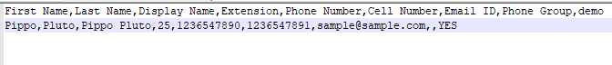

Occasionalmente si possono riscontrare difficoltà nell’importare rubriche su **Cloud PBX** - questa rapida guida mira ad individuare gli errori più comuni ed insegnare come risolverli con pochi accorgimenti.

### Problema - Invalid File Contents

#### Possibili cause e soluzioni

Se compare questo messaggio in fase di importazione significa che la formattazione dei campi è errato.

#### Guida step-by-step

Controllate che la formattazione dei record corrisponda a questo template:

> [!WARNING]
> È possibile lasciare alcuni di questi campi vuoti; basterà segnalarli con **,,**

### Problema - Invalid Record(s)

#### Possibili cause e soluzioni

Se dopo aver cliccato il bottone **Import Numbers** visualizzate questo messaggio, le possibilità sono molte: campi obbligatori non compilati, records già precedentemente inseriti, o errori nella configurazione del tenant.

#### Guida step-by-step

Dopo aver verificato quale sia la causa (o le cause) dell’errore, correggerlo è molto semplice:

- **Campi obbligatori non compilati:** verificate di avere inserito per ogni contatto siano stati inseriti i campi obbligatori (almeno uno fra **extension**, **phone number**, e **cell number**);
- **Contatti doppi:** alcuni dei record che state cercando di importare potrebbero già essere presenti nella rubrica - in tal caso, basterà cancellarli o dalla rubrica esistente o dal file .csv;
- **Nessuna corrispondenza tra il campo e configurazione del Tenant:** ad esempio, come se nel file inseriste il numero di un’extension non presente nel PBX - modificate dunque il file in modo che sia coerente con la vostra configurazione.

- [Problema - Invalid File Contents](#problema-invalid-file-contents)
-   [Possibili cause e soluzioni](#possibili-cause-e-soluzioni)
-   [Guida step-by-step](#guida-step-by-step)
- [Problema - Invalid Record(s)](#problema-invalid-records)
-   [Possibili cause e soluzioni](#possibili-cause-e-soluzioni)
-   [Guida step-by-step](#guida-step-by-step)