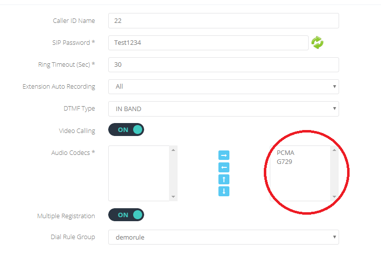

## Problema

E' possibile che alcuni telefoni IP non riescano a chiamare o ricevere chiamate pur essendo correttamente registrati sul CloudPBX.

## Prerequisiti

Accesso alla configurazione del telefono IP.

## Possibili cause

Se i telefoni non sono stati configurati utilizzando l'[auto-provisioning](../../cloud-pbx/how-to-cloud-pbx/portale-tenant-cloud-pbx/config-2-2/device-autoprovisioning-2-2.md) (cliccare sul link per la guida per auto-provisionare i telefoni IP), le possibili cause potrebbero le seguenti:

1. Codec del dispositivo configurati erroneamente.
2. Parametri di registrazione configurati erroneamente.

## Soluzione

### Codec del dispositivo configurati erroneamente

Entrare nella configurazione del telefono IP e verificare di aver abilitato gli stessi codec abilitati nel menù di configurazione della corrispondente extension nel CloudPBX:

### Parametri di registrazione configurati erroneamente

Per alcuni dispositivi (come per esempio le Dect della Gigaset) il CloudPBX, necessita che sia l'**Username** che l'**Authentication Username** vengano specificati nel formato "**TenantID+ExtensionNumber**". 

Esempio qui sotto:

  

> [!WARNING]
> Nel caso tutte e 2 le soluzioni proposte non risolvessero il problema, contattate il nostro supporto tecnico compilando il modulo che trovate nel menù a fianco.

  

  

> [!NOTE]
> **Sommario**
> 
> 
> 
> - [Problema](#problema)
> - [Prerequisiti](#prerequisiti)
> - [Possibili cause](#possibili-cause)
> - [Soluzione](#soluzione)
> -   [Codec del dispositivo configurati erroneamente](#codec-del-dispositivo-configurati-erroneamente)
> -   [Parametri di registrazione configurati erroneamente](#parametri-di-registrazione-configurati-erroneamente)
> * * *
> **Articoli collegati**
> 
> 
> - Page:
> [Estendere volume Guest OS (Linux) senza riavviare](/wiki/spaces/KB/pages/2001076225/Estendere+volume+Guest+OS+Linux+senza+riavviare)
> - Page:
> [Impossibile chiamare o ricevere chiamate](/wiki/spaces/KB/pages/1966256951/Impossibile+chiamare+o+ricevere+chiamate)
> - Page:
> [Portale Extension - Profile](/wiki/spaces/KB/pages/1966256865/Portale+Extension+-+Profile)
> - Page:
> [Portale Extension - Voicemail](/wiki/spaces/KB/pages/1966256807/Portale+Extension+-+Voicemail)
> - Page:
> [Accesso Portale Extension](/wiki/spaces/KB/pages/1966256750/Accesso+Portale+Extension)