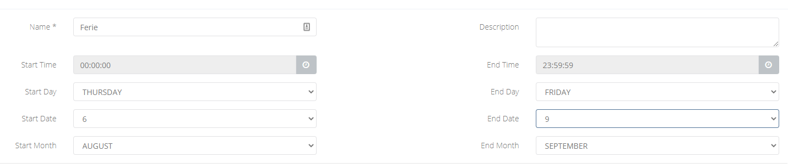
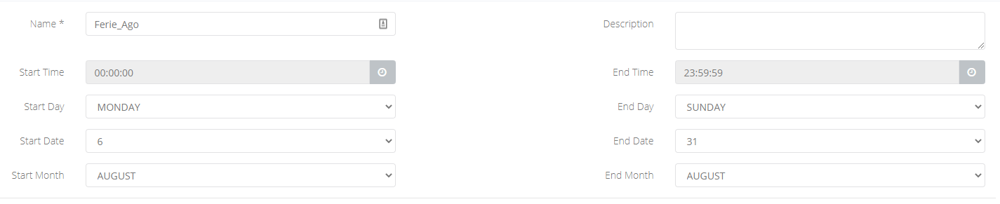
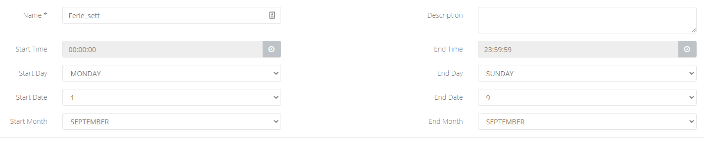

## Problema

Le regole temporali che avete impostato non funzionano correttamente e quindi agli orari e i giorni indicati non vengono rispettate le regole impostate.

## Possibili cause e soluzioni

Spesso il problema è dovuto una completa comprensione di come il PBX interpreta e va a controllare i range impostati nelle time condition. Di seguito un grafico ed un esempio di come procedere in questo caso.

## Diagramma di flusso di decisione delle time condition

## Esempio

ipotizziamo che dobbiate impostare una chiusura estiva al 06 Agosto al 09 Settembre, probabilmente vi verrebbe da impostarla come segue.

Ma se seguiamo il grafico sopra e una chiamata arrivasse il giorno lunedì 17/08 alle 15:00, vedete che il primo check (quello del time) sarebbe rispettato, mentre il secondo no, in quanto la chiamata è arrivata di lunedì.

Per configurare correttamente questa finestra temporale dovete configurare 2 regole distinte 1 per Agosto e 1 per Settembre, come nelle immagini sotto.

Così vedrete che, se per prova, ipotizzate l'arrivo di una chiamata all'interno della finestra temporale voluta, seguendo il grafico sopra almeno una delle 2 regole andrà sempre ad essere metchata.

> [!NOTE]
> **Sommario**
> 
> 
> 
> - [Problema](#problema)
> - [Possibili cause e soluzioni](#possibili-cause-e-soluzioni)
> - [Diagramma di flusso di decisione delle time condition](#diagramma-di-flusso-di-decisione-delle-time-condition)
> - [Esempio](#esempio)
> * * *
> **Articoli collegati**
> 
> 
> - Page:
> [Time Condition (2) (2)](/wiki/spaces/KB/pages/1966255040/Time+Condition+2+2)
> - Page:
> [CID Routing](/wiki/spaces/KB/pages/1966254770/CID+Routing)
> - Page:
> [DID Routing](/wiki/spaces/KB/pages/1966254638/DID+Routing)
> - Page:
> [Primi passi - Cloud PBX](/wiki/spaces/KB/pages/1966254385/Primi+passi+-+Cloud+PBX)