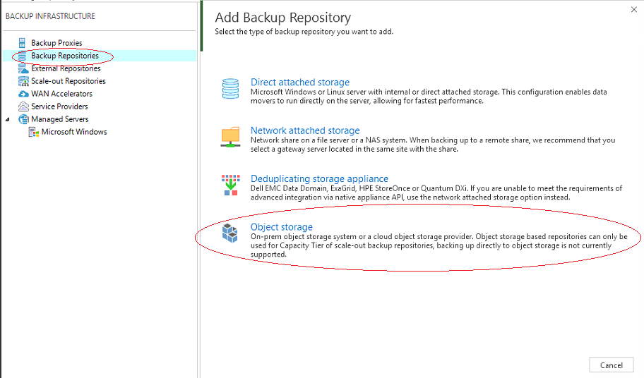
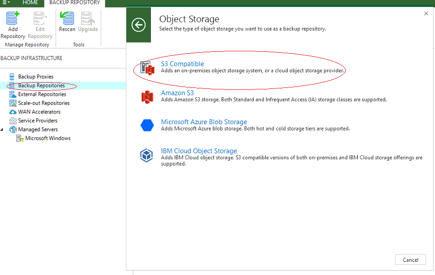
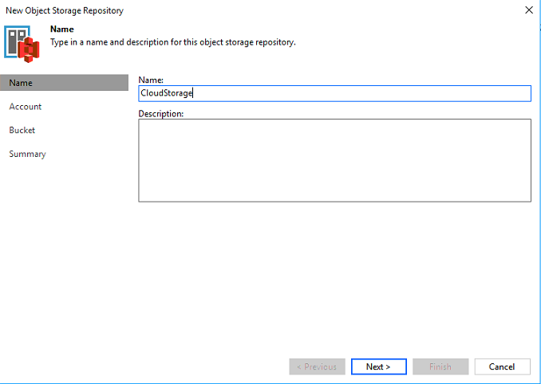
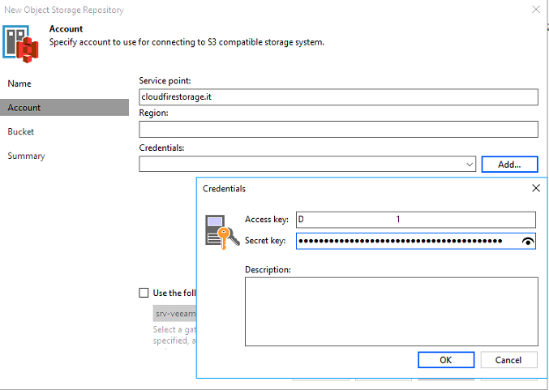
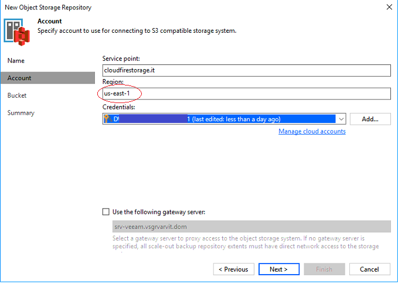
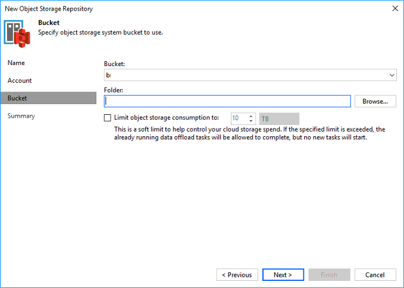
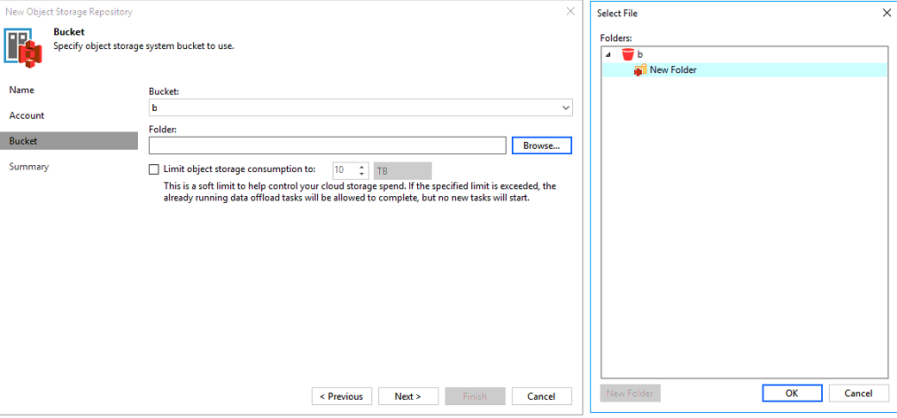
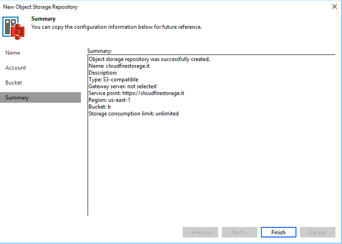
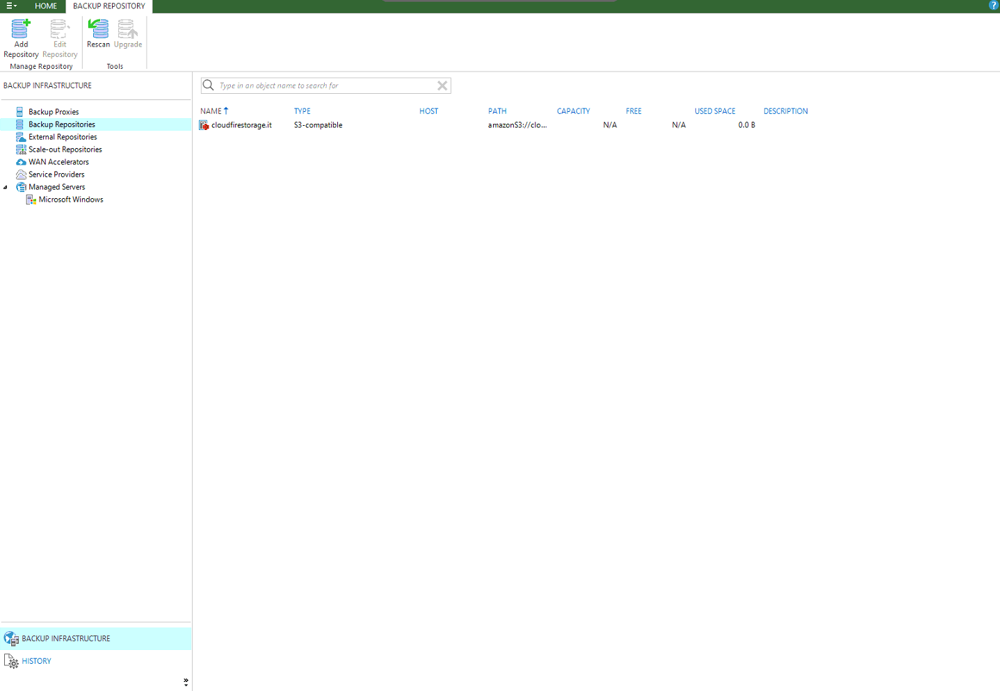

## Introduzione

Il Cloud Storage può essere aggiunto come repository (o external repository) nella console di Veeam a partire dalla versione 9.5 U4.

Di solito tale configurazione viene utilizzata per il tiering degli elementi di backup "datati".

## Prerequisiti

Oltre all'account di Cloud Backup dovrete essere già in possesso di un'infrastruttura Veeam B&R 9.5 U4

## Guida passo-passo

- Portarsi in "Backup Infrastructure" e selezionare "Backup Repositories" (la procedura è analoga per "External Repositories"); cliccare quindi "Object storage".

- Selezionare "S3 Compatible"

- Inserire un nome identificativo all'interno di Veeam.

- Inserire quindi il service point "[cloudfirestorage.it](http://cloudfirestorage.it)" e le vostre ACCESS e SECRET KEYs.

- Mantenere la region di default.

- Procedere a selezionare/creare il bucket.

- Procedere a selezionare/creare la cartella.

- Concludere la creazione della repository.

- Ora la repository verrà visualizzata con tutte le altre repository.

  

  

  

> [!NOTE]
> **Sommario**
> 
> 
> 
> - [Introduzione](#introduzione)
> - [Prerequisiti](#prerequisiti)
> - [Guida passo-passo](#guida-passo-passo)
> -   Filter by label
> * * *
> **Articoli collegati**
> 
> 
> ##### Filter by label
> 
> There are no items with the selected labels at this time.