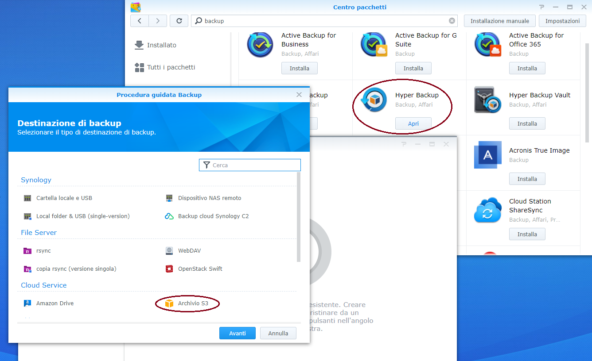
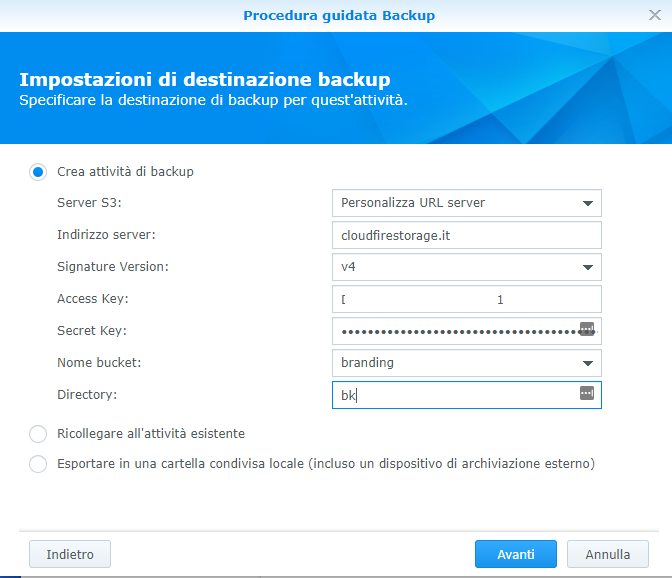
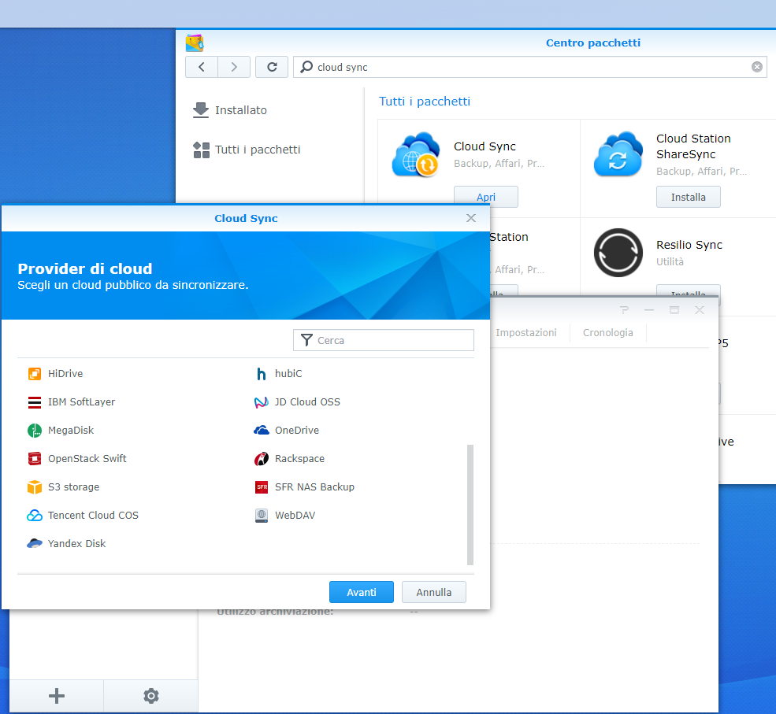
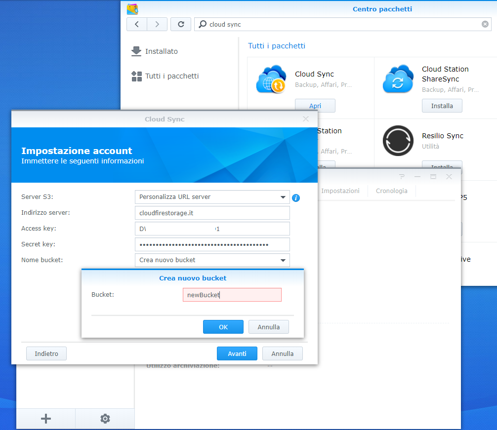
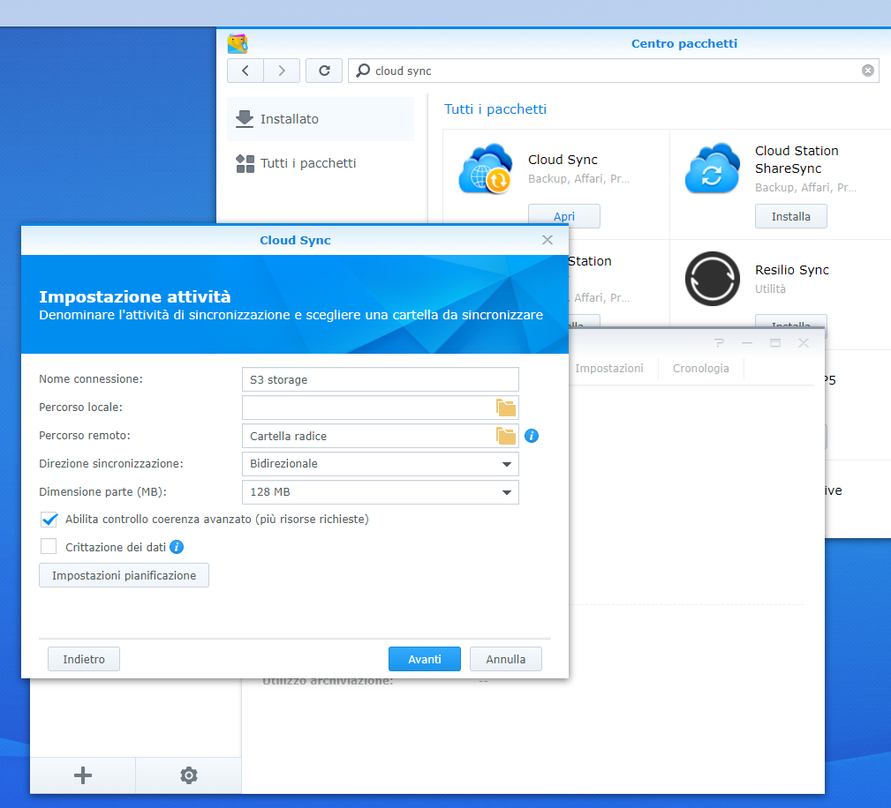

## Introduzione

Diversi software presenti nello store di Synology permettono di utilizzare il Cloud Storage per backup o sincronizzazione dei contenuti del vostro NAS.

## Prerequisiti

Scaricare e installare le App specifiche di backup o di sincronizzazione.

Di seguito l'esempio di "Hyper backup" e di "Cloud Sync"

## Guida passo-passo

### Hyper Backup

- Installare e aprire "Hyper Backup"
- Selezionare "Archivio S3" e cliccare "Avanti

- Inserire i parametri per la connessione come da immagine, specificando **ACCESS** e **SECRET KEYs** in vostro possesso.
- In caso di correttezza dei dati potrete selezionare un bucket esistente (in caso di account non vergine), o crearne uno nuovo.

> [!WARNING]
> Seguendo il Wizard avrete modo di configurare il vostro piano di backup come con vari altri software, specificando sorgente, destinazione e schedulazione.

### Cloud Sync

- Installare e aprire "Cloud Sync"
- Selezionare "S3 storage" e cliccare "Avanti"

- Inserire i parametri per la connessione come da immagine, specificando ACCESS e SECRET KEYs in vostro possesso.
- In caso di correttezza dei dati potrete selezionare un bucket esistente (in caso di account non vergine), o crearne uno nuovo.

> [!WARNING]
> A questo punto proseguendo il Wizard avrete modo di configurare la sincronizzazione dei contenuti, in modo analogo al backup.

> [!NOTE]
> Altri applicativi Synology hanno modalità simili per interagire con i vostri bucket sul Cloud Storage e i parametri principali sono sempre quelli forniti in fase di attivazione.

  

  

> [!NOTE]
> **Sommario**
> 
> 
> 
> - [Introduzione](#introduzione)
> - [Prerequisiti](#prerequisiti)
> - [Guida passo-passo](#guida-passo-passo)
> -   [Hyper Backup](#hyper-backup)
> -   [Cloud Sync](#cloud-sync)
>   
>   -   Filter by label
> * * *
> **Articoli collegati**
> 
> 
> ##### Filter by label
> 
> There are no items with the selected labels at this time.