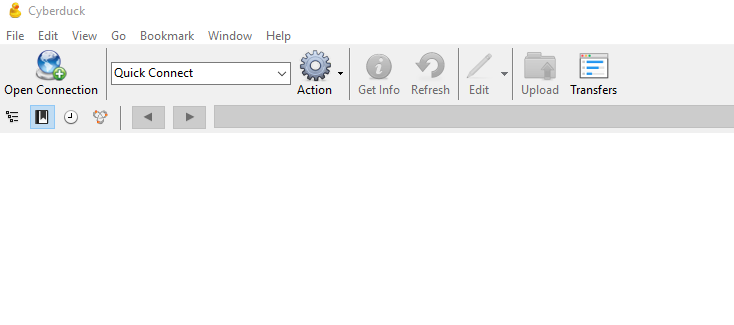
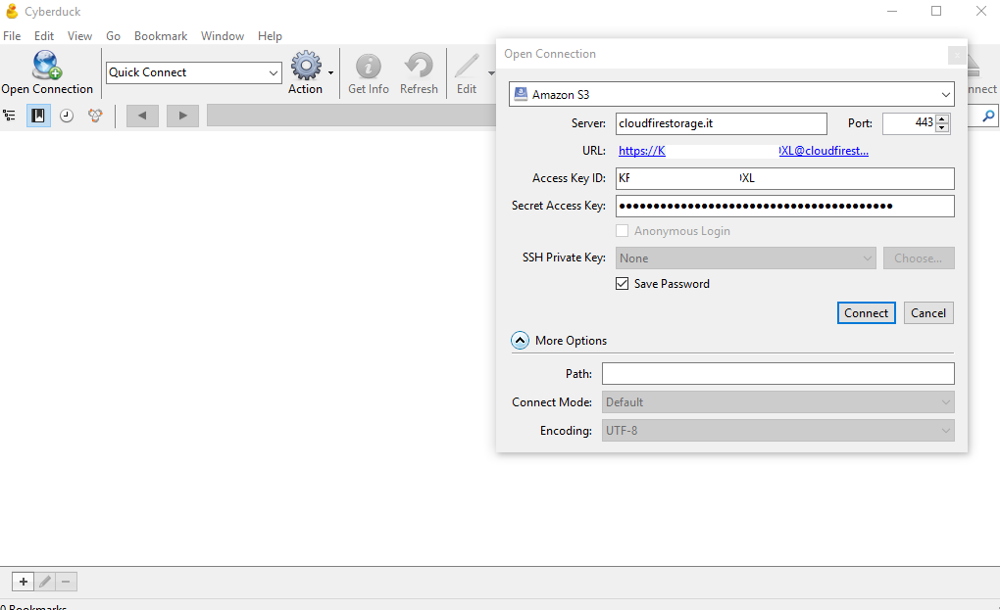
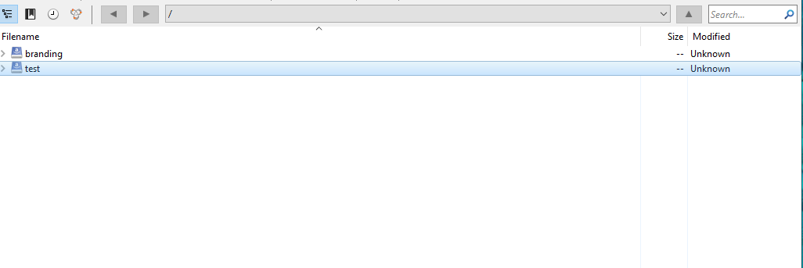
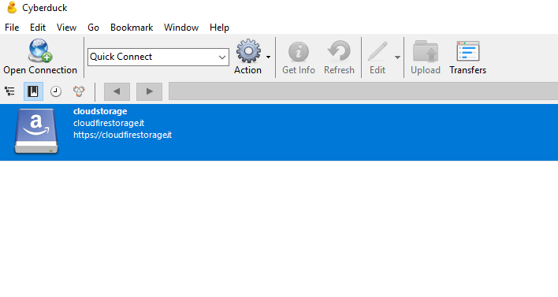

## Introduzione

Di seguito le indicazioni per sfogliare il vostro bucket su Cloud Storage e creare/cancellare contenuti, utilizzando il software Cyberduck.

## Prerequisiti

Scaricare ed installare Cyberduck dal sito ufficiale [https://cyberduck.io/](https://cyberduck.io/) .

## Guida passo-passo

- Nella schermata principale cliccare su "Open Connect"

- Selezionare il profilo "**Amazon S3**" e compilare i campi Server, Access Key ID e Secret Access Key.
- Premere quindi **"Connect**"

- Vi ritroverete a sfogliare il bucket nella directory principale.
- Qui potrete creare e cancellare contenuti.

- Nella schermata principale avrete il bookmark memorizzato per effettuare future connessioni senza dover reinserire le credenziali.

  

> [!NOTE]
> **Sommario**
> 
> 
> 
> - [Introduzione](#introduzione)
> - [Prerequisiti](#prerequisiti)
> - [Guida passo-passo](#guida-passo-passo)
> -   Filter by label
> * * *
> **Articoli collegati**
> 
> 
> ##### Filter by label
> 
> There are no items with the selected labels at this time.