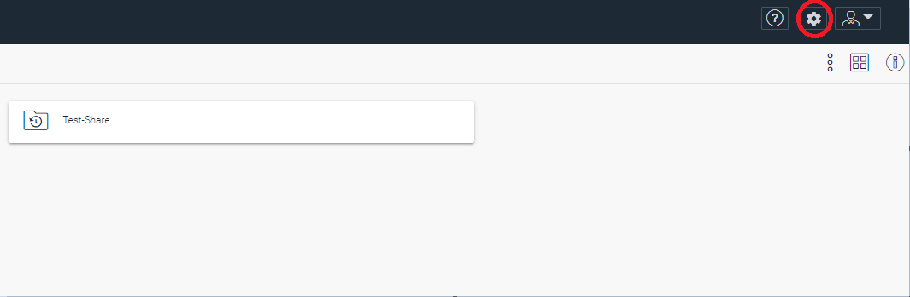
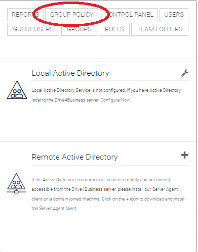
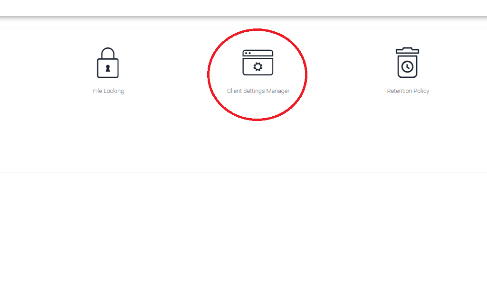
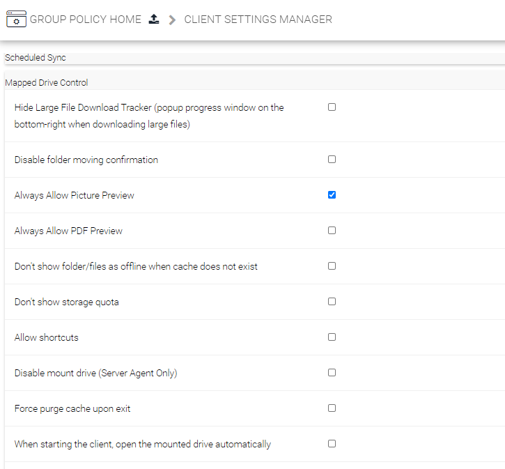

## Introduzione

In questa pagina vi illustreremo come abilitare la possibilità di vedere l'anteprima delle immagini all'interno del client **drive4Business.**

## Guida step-by-step

- Effettuare l'accesso alla web Management Console di **Drive4Business** con un account che abbia privilegi di Tenant Admin.
- Cliccare sull'ingranaggio in alto a destra.  

- Spostarsi nel menù **Group Policy**  

- Selezionare la voce **Client Settings Manager**  

- Nel sotto-menù **Mapped Drive Control,** spuntare la check-box in corrispondenza dell'opzione **Always Allow Picture Preview.**  
  

  

  

> [!NOTE]
> **Sommario**
> 
> 
> 
> - [Introduzione](#introduzione)
> - [Guida step-by-step](#guida-step-by-step)
> * * *
> **Articoli collegati**
> 
> 
> - Page:
> [Reset MAC Client Cache](/wiki/spaces/KB/pages/1966252422/Reset+MAC+Client+Cache)
> - Page:
> [Problemi visualizzazione finestre contestuali Client Windows versione >= 11.2.2963 (2) (2)](/wiki/spaces/KB/pages/1966252404/Problemi+visualizzazione+finestre+contestuali+Client+Windows+versione+11.2.2963+2+2)
> - Page:
> [Icone di file e cartelle non presentano lo stato della sync o presentano una "X" grigia (2) (2)](/wiki/spaces/KB/pages/1966252352/Icone+di+file+e+cartelle+non+presentano+lo+stato+della+sync+o+presentano+una+X+grigia+2+2)
> - Page:
> [Guida Base per gli utenti](/wiki/spaces/KB/pages/1966252158/Guida+Base+per+gli+utenti)
> - Page:
> [Abilitare l'anteprima delle immagini](/wiki/spaces/KB/pages/1966251738/Abilitare+l+anteprima+delle+immagini)