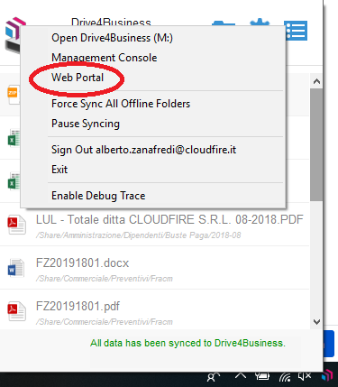
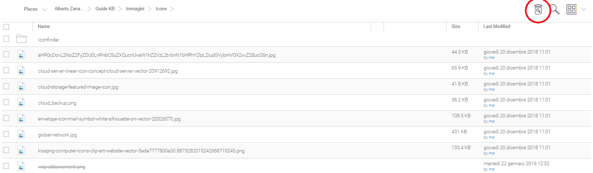

Su Drive 4 Business è sempre possibile recuperare i file eliminati. Collegarsi alla console web:

Entrare nella cartella che volete controllare, e cliccando sull'icona indicato nell'immagine sottostante, verranno visualizzati tutti gli elementi presenti nella cartella. Quelli eliminati verranno visualizzati con una riga sopra il nome.

Passando con il mouse sul file desiderato apparirà l'icona per ripristinare il file.

  

> [!INFO]
> Per evitare problematiche quando si spostano e si copiano file all'interno del Drive 4 Business, evitare di utilizzare il taglia/incolla, ma utilizzare copia/incolla.