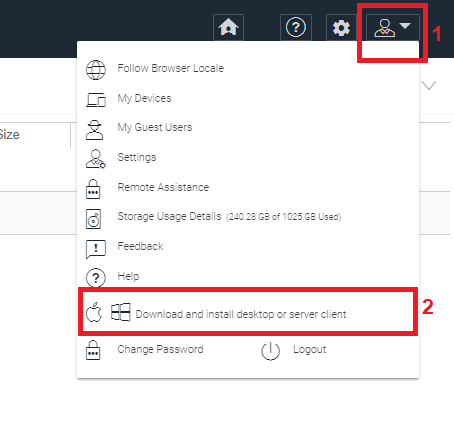
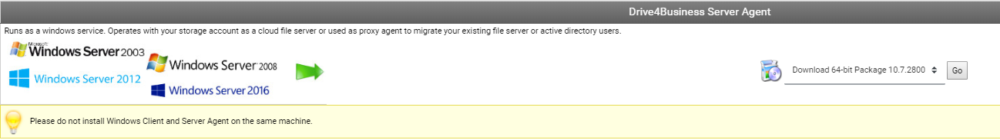
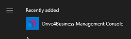
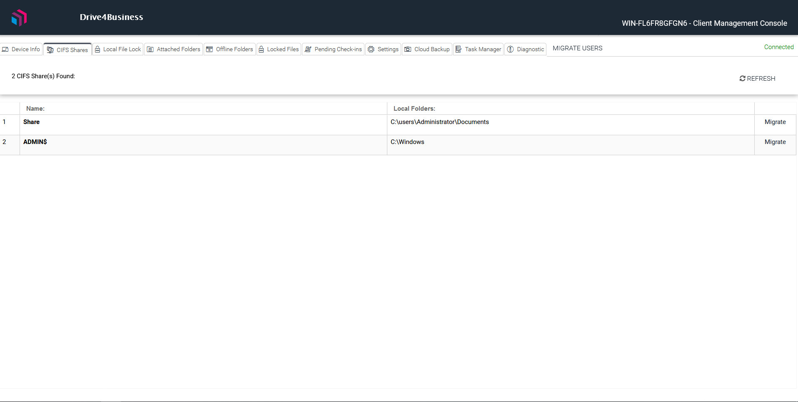
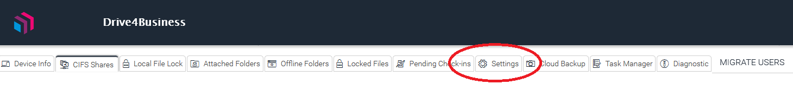
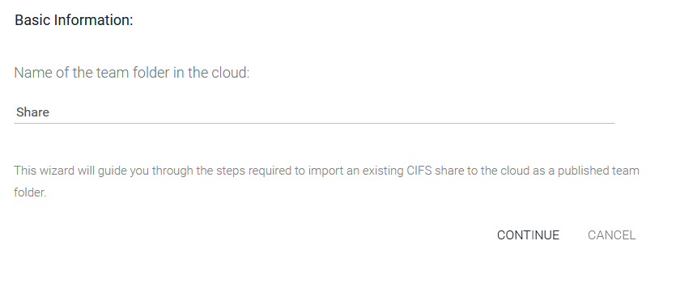
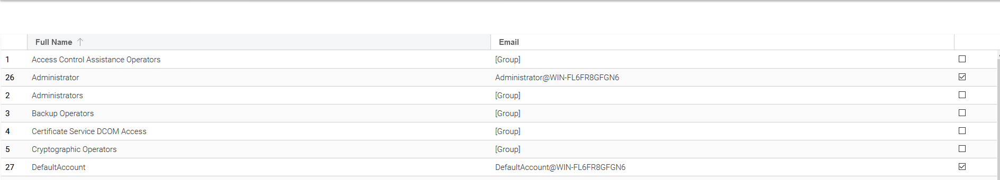
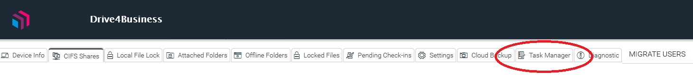
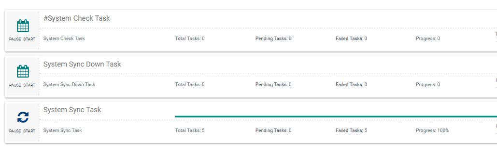

## Introduzione

Oltre alla normale funzionalità di Cloud Drive, Drive 4 Business offre una funzionalità di sincronizzazione totale con il vostro File Server personale. Infatti utilizzando questa funzionalità vi sarà possibile effettuare una copia delle vostre Share di rete locali in Cloud e mantenerle sincronizzate costantemente dandovi la possibilità di lavorare, ovunque voi siate, sui file del vostro File Server come se foste in locale.

  

## Prerequisiti

Questa funzionalità è disponibile solo per File Server Windows e necessita l'installazione, sul server stesso, del **Drive4Business Server Agent**. Di seguito vi illustreremo come configurare il servizio.

## Guida passo-passo

Una volta acquistato il servizio **Drive4Business** su Cortex e attivato, collegatevi al vostro **File Server**, aprite il browser e collegatevi all'URL: [https://drive4business.cloudfire.it/](https://drive4business.cloudfire.it/)

Accedete con le credenziali che avete inserito su Cortex in fase di attivazione del servizio, cliccate sull'icona in alto a destra a forma di omino e, all'apertura del menù, andate nella sezione download.

Una volta all'interno della sezione Download cliccare sul tasto **Go** in corrispondenza del form **Drive4Business Server Agent.**

> [!INFO]
> **ATTENZIONE!** Come indicato nella banda gialla sotto il form di download, assicuratevi di non installare il **Windows Client** e il **Server Agent** sulla stessa macchina

Una volta terminato il download eseguire il file d'installazione ed installare l'**Agent.**

  

> [!WARNING]
> Alla fine dell'installazione molto probabilmente vi verrà chiesto di riavviare la macchina.

Ora che avete installato il **Server Agent,** potete procedere alla migrazione delle vostre Share su Drive. Cercate nel elenco delle applicazioni del vostro File Server **Drive4Business Management Console** e avviatela.

Vi si aprirà una pagina web dove potrete gestire le varie operazioni del vostro **Server Agent.**

> [!INFO]
> Se dovesse chiedervi le credenziali d'accesso utilizzate quelle inserite in fase di attivazione del servizio su Cortex.

In questa pagina visualizzerete tutte le Share di rete del vostro Server.

Prima di procedere alla migrazione dei vostri dati in Cloud è consigliato controllare che i **Settings** siano configurati correttamente:

In questa pagina le opzioni sono molteplici, ma come prima configurazione è raccomandato controllare i seguenti parametri:

- **Bandwidth Control:**
-   **Upload Bandwidth Limit:** controllate di impostare correttamente questo parametro. Trattandosi di prima migrazione, tutti i dati delle Share verranno uploadati utilizzando la vostra connettività. Assicuratevi di non lasciare questo valore a zero (nessun limite) in modo da non saturare la vostra banda in upload.

> [!WARNING]
> ATTENZIONE: il valore da specificare qua è il **Kilo BYTES al secondo.**

- **Number of File Transfer Threads:** questo parametro indica il numero di file che vengono processati alla volta. Anche qua scegliete il valore corretto in base alle risorse del vostro File Server e della connettività a vostra disposizione.
- **Mapped Control Drive:**
-   **Drive Letter:** Assicuratevi di utilizzare una lettera che non vada in conflitto con i volumi già presenti sul server o su eventuali client che utilizzeranno il servizio.

Cliccando sul link **Migrate** di fianco alla share che intendete migrare inizierà il processo di inizializzazione della migrazione.

Il primo Step è quello di selezionare il nome che avrà la share su vostro Drive in Cloud

Di default prenderà lo stesso nome della share sul vostro File Server.

Il secondo step è quello dove dovrete decidere se migrare anche gli utenti che accedono alla Share e i permessi ad essi collegati.

- **Migrate User/Folder Permission:** se flaggate questa checkbox, oltre ai dati presenti nella Share, migrerete anche gli utenti che accedono alla Share e alla sue sotto-cartelle. Questo significa che verranno replicati gli utenti ed i permessi della Share.
- **Proxy Mode:** Abilita la funzionalità di Proxy, in poche parole non migrerete la vostra Share in Cloud ma il Server Agent farà da Proxy per farvi lavorare direttamente sul vostro FS. 
- **Synchronize folder permission automatically:** con questa opzione abiliterete la sincronizzazione automatica dei permessi della vostra Share in Cloud basandosi con quella locale. Questo significa che se voi aggiungerete un utente assicurandogli l'accesso alla Share in Locale, questo utente ed i suoi permessi, verranno replicati anch'essi nella Share in Cloud
-   **Only import user who has access to team folder:** flaggando questa opzione, replicherete solo gli utenti che hanno accesso alla Share.

> [!WARNING]
> **ATTENZIONE:** prima di proseguire vi consigliamo di leggere questa guida dove verrà spiegato il funzionamento corretto della sincronizzazione dei permessi:
> [**Sincronizzazione automatica dei Permessi tramite Server Agent**](./drive4business-ibrido-hybrid-d4b/sincronizzazione-automatica-dei-permessi-tramite-server-agent.md)

Se nel punto precedente avete flaggato "**Migrate User/Folder Permission**" e non "**Only import user who has access to team folder**" vi comparirà una schermata in cui potrete selezionare gli utenti da migrare:

> [!NOTE]
> Nel caso non vi comparisse potrete comunque migrare gli utenti in un secondo momento cliccando sull'apposito bottone **Migrate Users** all'accesso della **Drive4Business Management Console.**

Terminate le operazioni precedenti partirà la migrazione dei dati verso il Cloud. 

Potete controllare lo stato dell'avanzamento cliccando sulla tab **Task Manager:**

Da questa schermata potrete inoltre controllare i log dei vari task: *total, pending e failed* in modo da capire se e perchè qualche task di sincronizzazione è fallito:

> [!INFO]
> I task segnati come failed, non rimaranno falliti in eterno, ma verrà ri-tentata la sincronizzazione al prossimo step indicato in fondo al **System Synk Task.**

> [!TIP]
> Ora che la migrazione sta avvenendo potrete considerare attivo il vostro servizio **Drive 4 Business Ibrido,** e dai vari client installati sui vostri PC comincerete a poter utilizzare la vostra Share replicata in Cloud.

Terminata la migrazione la vostra Share verrà pubblicata su **Drive4Business** come **Team Folder.** E potrete gestire le varie operazioni sul questa cartella accedendo via Web all'URL (inserendo le credenziali di tenant admin): [https://drive4business.cloudfire.it/](https://drive4business.cloudfire.it/)

Oppure dal pulsante **Gestisci** dall'interfaccia di Cortex relativa al cliente a cui avete attivato il servizio **Drive4Business.**

  

  

> [!NOTE]
> **Sommario**
> 
> 
> 
> - [Introduzione](#introduzione)
> - [Prerequisiti](#prerequisiti)
> - [Guida passo-passo](#guida-passo-passo)
> * * *
> **Articoli collegati**
> 
> 
> - Page:
> [Problemi visualizzazione finestre contestuali Client Windows versione >= 11.2.2963 (2) (2)](/wiki/spaces/KB/pages/1966252404/Problemi+visualizzazione+finestre+contestuali+Client+Windows+versione+11.2.2963+2+2)
> - Page:
> [Guida Base per gli utenti](/wiki/spaces/KB/pages/1966252158/Guida+Base+per+gli+utenti)
> - Page:
> [Status dei file](/wiki/spaces/KB/pages/1966251565/Status+dei+file)
> - Page:
> [Sincronizzazione automatica dei Permessi tramite Server Agent](/wiki/spaces/KB/pages/1966251458/Sincronizzazione+automatica+dei+Permessi+tramite+Server+Agent)
> - Page:
> [Drive4Business Ibrido - Hybrid D4B](/wiki/spaces/KB/pages/1966251373/Drive4Business+Ibrido+-+Hybrid+D4B)