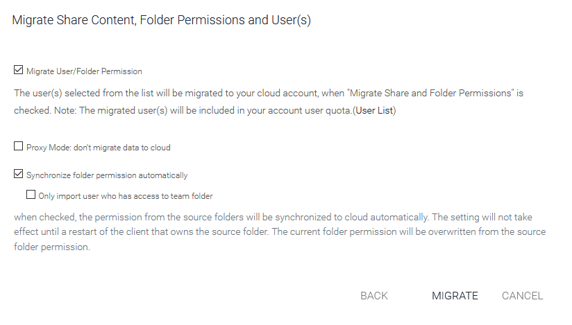
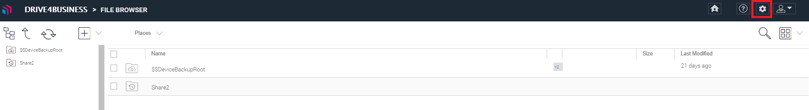
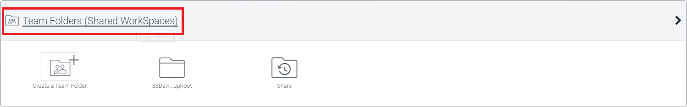
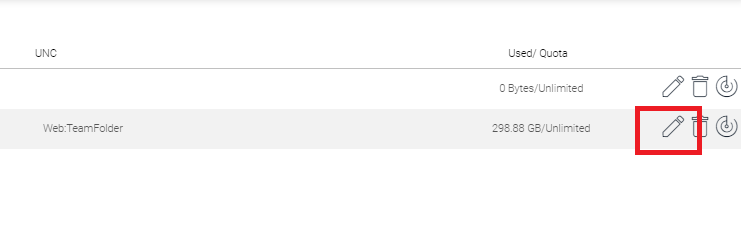
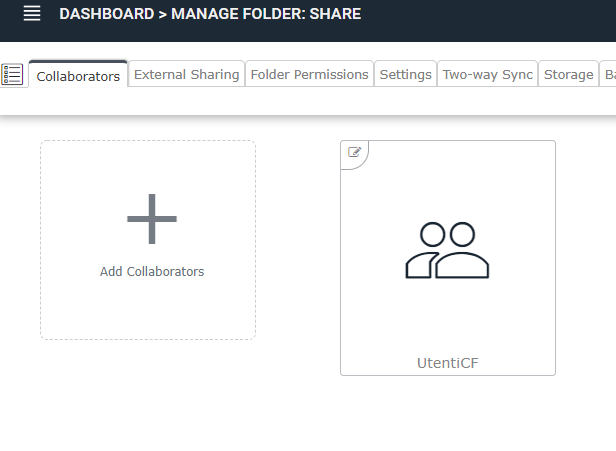
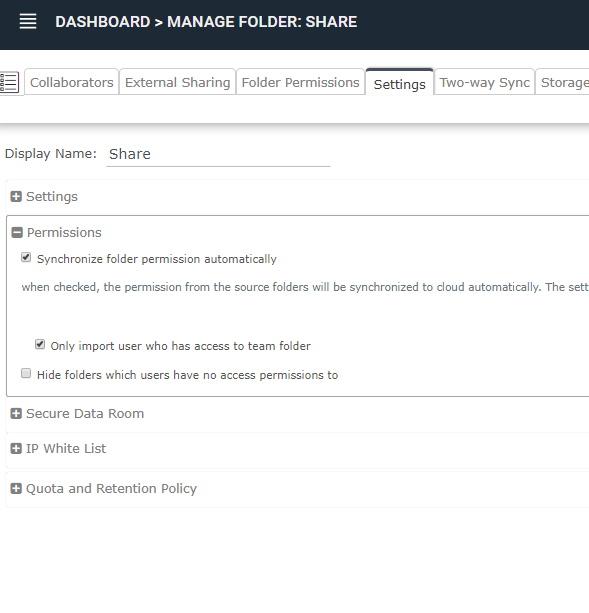

## Introduzione

Come specificato nella guida precedente, tramite la migrazione offerta dal **Server Agent** di **Drive4Business** è possibile replicare la vostra Share locale sul Cloud come **Team Folder.** Questo tipo di funzionalità vi da anche la possibilità di mantenere sincronizzati i permessi delle 2 Share (locale e Cloud). Ora vi illustreremo come.

  

## Guida

Durante la configurazione della migrazione (**Migrate CIFS Shares**), potrete migrare, oltre ai dati, anche gli utenti e i permessi. Potete cliccare anche su **User List** per consultare la lista degli utenti che andranno ad essere migrati. Potrete selezionare gli utenti che andranno ad essere migrati o meno. La cosa importante è che questa opzione **fa riferimento solo alla migrazione iniziale.**

Se invece, in questa fase, selezionate anche l'opzione "**Synchronize folder permission automatically**", dopo la migrazione, se dovessero essere fatte delle modifiche ai permessi sulla Share locale, il **Server Agent,** si occuperà di mantenere i permessi sincronizzati anche in Cloud. Se verrà aggiunto un nuovo utente in locale, sempre il **Server Agent,** si occuperà di replicarlo come **proxied AD users.** Ovviamente migrerà solo quegli utenti nuovi che hanno permessi sulla Share migrata.

E' possibile inoltre, se abilitata l'opzione "**Synchronize folder permission automatically**", abilitare anche un ulteriore opzione "**Only import user who has access to team folder**". Normalmente quando viene effettuata una migrazione di una Share, questa Share diventerà una **Team Folder**, e gli utenti che hanno permessi su questa Share, andranno a diventare i **Collaborators** di quest'ultima. Se abbiamo abilitato l'opzione "**Only import user who has access to team folder**", durante la sincronizzazione dei permessi, il **Server Agent** verificherà che questi utenti (specificati nei permessi della Share locale) sono anche presenti come **Collaborators.** In tal caso, l'utente verrà importato. In caso contrario, l'utente non verrà importato.

Questo perchè, spesso, se si importano delle Share molto grosse, solo alcuni utenti hanno necessità di utilizzare la controparte Cloud. In questo caso bisogna definire gli utenti che necessitano di utilizzare la **Team Folder** nei **Collaborators** e di abilitare "**Only import user who has access to team folder**" nei settings della web console.

  

Ora vi mostreremo come:

- Accedere alla console di **Drive 4 Business** come tenant admin, dall'URL: [https://drive4business.cloudfire.it](https://drive4business.cloudfire.it/) oppure dal pulsante **Gestisci** di Cortex;
- Una volta effettuato l'accesso, cliccare sull'icona a forma di ingranaggio in alto a destra:  
  

- Una volta nella console di gestione, cliccare sul form delle **Team Folders:**  

- Cliccate sulla matita in corrispondenza della **Team Folder** che volete gestire:  

- Ed ora verificate che nelle sezione **Collaborators  s**iano presenti solo gli utenti che volete che utilizzino questa **Team Folder** e che nella sezione **Settings → Permission** sia abilitata l'opzione **Only import user who has access to team folder**  
  

  

> [!NOTE]
> **Sommario**
> 
> 
> 
> - [Introduzione](#introduzione)
> - [Guida](#guida)
> * * *
> **Articoli collegati**
> 
> 
> - Page:
> [Users & Roles](/wiki/spaces/KB/pages/1966254851/Users+Roles)
> - Page:
> [Problemi visualizzazione finestre contestuali Client Windows versione >= 11.2.2963 (2) (2)](/wiki/spaces/KB/pages/1966252404/Problemi+visualizzazione+finestre+contestuali+Client+Windows+versione+11.2.2963+2+2)
> - Page:
> [Icone di file e cartelle non presentano lo stato della sync o presentano una "X" grigia (2) (2)](/wiki/spaces/KB/pages/1966252352/Icone+di+file+e+cartelle+non+presentano+lo+stato+della+sync+o+presentano+una+X+grigia+2+2)
> - Page:
> [Guida Base per gli utenti](/wiki/spaces/KB/pages/1966252158/Guida+Base+per+gli+utenti)
> - Page:
> [Abilitare l'anteprima delle immagini](/wiki/spaces/KB/pages/1966251738/Abilitare+l+anteprima+delle+immagini)