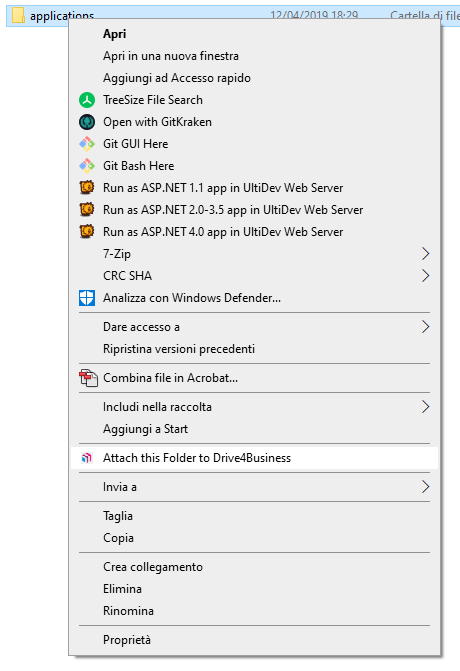

## Introduzione

In questa pagina vi illustreremo il significato delle icone delle cartelle nel pannello web di **Drive4business.**

### Regular Folder

Normale cartella dove i file non hanno il versioning e sono salvati, con il loro formato originale, nello storage di default del tenant.

### Versioned Folder

Cartella in cui i file hanno il versioning. Questa cartella contiene le varie versioni di ogni singolo file in accordo con le policy di retention applicate. Gli utenti possono ritrovare le vecchie versioni dei file e riprendere a modificarli da li. Inoltre questa cartella contiene anche i file eliminati che possono essere recuperati (vedi guida [Controllare File Eliminati](../how-to-drive-4-business/controllare-file-eliminati.md)).

### Attached Local Folder

Una Attached Folder è una cartella che presenta di default il versioning dei file. Queste cartelle sono create da un utente che cliccando col destro su una sua cartella locale seleziona l'opzione **Attach this folder to Drive4Business**

  

> [!INFO]
> Questa operazione fa in modo che la cartella locale rimanga sincronizzata con la sua corrispondente in cloud. Per cui se viene effettuata una modifica ad un file, dentro questa cartella, in locale, verrà aggiornata anche in Cloud e vice-versa.

### Remote Attached or Migrated Folder

Quando viene utilizzato il **Server Agent** (vedi guida [Drive4Business Ibrido - Hybrid D4B](../how-to-drive-4-business/drive4business-ibrido-hybrid-d4b.md)), per migrare una cartella da un Server remoto, il Server Agent agisce da Proxy per mantenere le cartelle sincronizzate. Anche questa cartella presenta il versioning dei file.

  

  

> [!NOTE]
> **Sommario**
> 
> 
> 
> - [Introduzione](#introduzione)
> -   [Regular Folder](#regular-folder)
> -   [Versioned Folder](#versioned-folder)
> -   [Attached Local Folder](#attached-local-folder)
> -   [Remote Attached or Migrated Folder](#remote-attached-or-migrated-folder)
> * * *
> **Articoli collegati**
> 
> 
> - Page:
> [Reset MAC Client Cache](/wiki/spaces/KB/pages/1966252422/Reset+MAC+Client+Cache)
> - Page:
> [Problemi visualizzazione finestre contestuali Client Windows versione >= 11.2.2963 (2) (2)](/wiki/spaces/KB/pages/1966252404/Problemi+visualizzazione+finestre+contestuali+Client+Windows+versione+11.2.2963+2+2)
> - Page:
> [Icone di file e cartelle non presentano lo stato della sync o presentano una "X" grigia (2) (2)](/wiki/spaces/KB/pages/1966252352/Icone+di+file+e+cartelle+non+presentano+lo+stato+della+sync+o+presentano+una+X+grigia+2+2)
> - Page:
> [Guida Base per gli utenti](/wiki/spaces/KB/pages/1966252158/Guida+Base+per+gli+utenti)
> - Page:
> [Abilitare l'anteprima delle immagini](/wiki/spaces/KB/pages/1966251738/Abilitare+l+anteprima+delle+immagini)