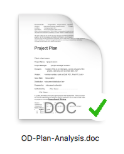
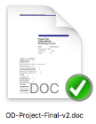
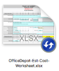

## Introduzione

Una volta installato il client (sia Windows che MAC), i file salvati all'interno del vostro **Cloud Drive,** presenteranno un simbolo su di essi un simbolo che indica lo stato di sincronizzazione dello stesso, questo simbolo è detto **overlay**.

Ora vi illustreremo il significato di questi simboli.

## Guida passo-passo

  

- Questo simbolo indica che il file è correttamente sincronizzato in Cloud ma il contenuto non è disponibile localmente. Questo perchè probabilmente non è stato sincronizzato dal vostro utente ma da un altro, e quindi sulla macchina da cui state verificando non è presente questo file nella cache locale di Drive4Business.

- Questo simbolo indica che il file è correttamente sincronizzato in Cloud ed il contenuto è disponibile localmente. Questo perchè probabilmente è stato sincronizzato dal vostro utente ed è quindi disponibile una copia nella cache di Drive4Business.
- Questo simbolo indica che il file non è ancora stato sincronizzato totalmente. Una volta terminata la sincronizzazione dovrebbe diventare come uno dei 2 simboli indicati negli step precedenti. La durata di questo simbolo cambia in base alla grandezza del file ed alle prestazioni della vostra connettività.

  

  

> [!NOTE]
> **Sommario**
> 
> 
> 
> - [Introduzione](#introduzione)
> - [Guida passo-passo](#guida-passo-passo)
> * * *
> **Articoli collegati**
> 
> 
> - Page:
> [Task Pop-UP](/wiki/spaces/KB/pages/1966252456/Task+Pop-UP)
> - Page:
> [Reset MAC Client Cache](/wiki/spaces/KB/pages/1966252422/Reset+MAC+Client+Cache)
> - Page:
> [Problemi visualizzazione finestre contestuali Client Windows versione >= 11.2.2963 (2) (2)](/wiki/spaces/KB/pages/1966252404/Problemi+visualizzazione+finestre+contestuali+Client+Windows+versione+11.2.2963+2+2)
> - Page:
> [Icone di file e cartelle non presentano lo stato della sync o presentano una "X" grigia (2) (2)](/wiki/spaces/KB/pages/1966252352/Icone+di+file+e+cartelle+non+presentano+lo+stato+della+sync+o+presentano+una+X+grigia+2+2)
> - Page:
> [Guida Base per gli utenti](/wiki/spaces/KB/pages/1966252158/Guida+Base+per+gli+utenti)