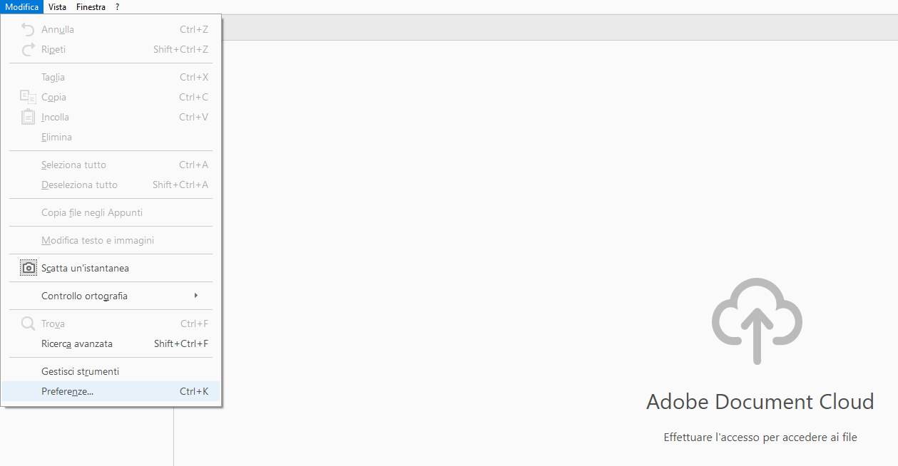
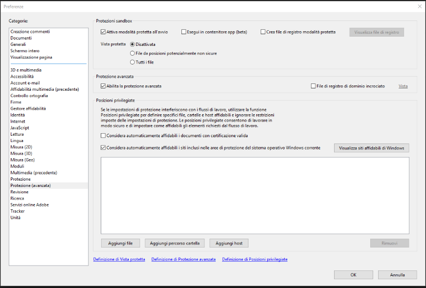

## Problema

Impossibilità ad aprire i file .pdf su Drive 4 Business con Adobe Reader. Messaggio d'errore "**Accesso Negato**".

## Possibili cause e soluzioni

Il problema può essere dovuto ad un aggiornamento del programma Adobe Reader o ad un errata impostazioni di sicurezza dello stesso. Per ovviare a questo problema seguite questa guida passo passo.

## Guida passo-passo

- Apri Adobe Reader senza però aprire nessun file.
- Vai nel menù **Modifica → Preferenze:**
- Entra nel sotto-menù **Protezione (avanzata)**
- Deseleziona la check-box **Esegui in contenitore app.** Clicca Ok.
- Prova a riaprire i file .pdf, ora dovrebbero aprirsi correttamente.

  

  

> [!NOTE]
> **Sommario**
> 
> 
> 
> - [Problema](#problema)
> - [Possibili cause e soluzioni](#possibili-cause-e-soluzioni)
> - [Guida passo-passo](#guida-passo-passo)
> * * *
> **Articoli collegati**
> 
> 
> - Page:
> [File .pdf Accesso Negato](/wiki/spaces/KB/pages/1966252552/File+.pdf+Accesso+Negato)
> - Page:
> [Problemi visualizzazione finestre contestuali Client Windows versione >= 11.2.2963 (2) (2)](/wiki/spaces/KB/pages/1966252404/Problemi+visualizzazione+finestre+contestuali+Client+Windows+versione+11.2.2963+2+2)
> - Page:
> [Status dei file](/wiki/spaces/KB/pages/1966251565/Status+dei+file)
> - Page:
> [Sincronizzazione automatica dei Permessi tramite Server Agent](/wiki/spaces/KB/pages/1966251458/Sincronizzazione+automatica+dei+Permessi+tramite+Server+Agent)
> - Page:
> [Drive4Business Ibrido - Hybrid D4B](/wiki/spaces/KB/pages/1966251373/Drive4Business+Ibrido+-+Hybrid+D4B)