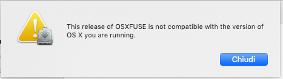
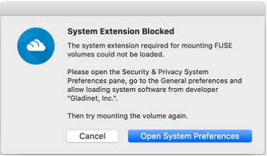
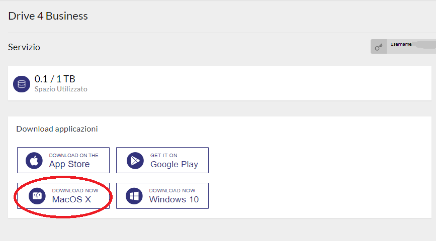
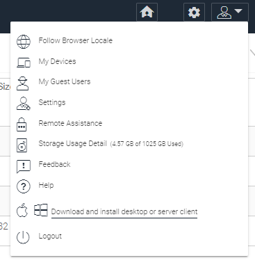
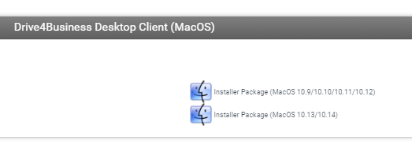

## Problema

Può capitare che nell'installazione del Mac Client per D4B, possano essere riportati degli errori da FUSE. 

- Errore sulla compatibilità:

- Errore su permessi e sicurezza

## Possibili cause e soluzioni

FUSE (Filesystem in Userspace) è un software open source che estende le funzionalità di Mac OS per la gestione dei file, come per esempio il supporto per NTFS e altri file system. Il client Mac di Drive 4 Business di basa su FUSE per montare l'unità Cloud Drive.

Per risolvere i vari problemi vi illustriamo come procedere:

> [!WARNING]
> **Attenzione per gli utilizzatori di Mac OSX 10.14.5**
> Il recente upgrade rilasciato il 13 Maggio 2019, ha aumentato i parametri di sicurezza e quindi potrebbe capitare che vengano segnalati problemi durante l'installazione, come quello indicato sopra.
> Per risolvere la problematica è necessario scaricare l'ultima versione aggiornata del client, che potete trovare qui: [most recent build of the mac client](https://tinyurl.com/y49wkvj6).

## Errore sulla compatibilità

In caso venga segnalato un problema di compatibilità con la versione di FUSE verificare di aver scaricato l'ultima versione del client compatibile con la vostra versione di MacOS.

Dalla Dashboard di Drive 4 Business presente su Cortex è già presente un link con la versione più aggiornata del client:

Se seguite l'accesso direttamente alla dashboard di Drive 4 Business, potrete trovare il link di download qua:

Nella pagina che seguirà assicuratevi di scaricare il client compatibile con la vostra versione di MacOS:

## Errore su permessi e sicurezza

In caso si presenti il problema su permessi o sicurezza verificare e in caso aggiornare la propria versione del client come indicato sopra.

Se l'aggiornamento non risolva la problematica, riprovare ad avviare l'installazione dopo un reboot del vostro MAC.

Se anche questa procedura non risolve la problematica controllate quanto segue:

- Verificate le **System Preferences → Security & Privacy** del vostro MAC, sotto la tab **Privacy**, assicuratevi che tutto ciò che è etichettato come "**Cloud Drive**", "**Gladinet**" e/o "**FUSE**" è abilitato all'esecuzione senza restrizioni

  

Se anche questa soluzione non risolve il problema contattate il nostro supporto tecnico.

  

  

> [!NOTE]
> **Sommario**
> 
> 
> - [Problema](#problema)
> - [Possibili cause e soluzioni](#possibili-cause-e-soluzioni)
> - [Errore sulla compatibilità](#errore-sulla-compatibilit)
> - [Errore su permessi e sicurezza](#errore-su-permessi-e-sicurezza)
> * * *
> **Articoli collegati**
> 
> 
> - Page:
> [Reset MAC Client Cache](/wiki/spaces/KB/pages/1966252422/Reset+MAC+Client+Cache)
> - Page:
> [Problemi visualizzazione finestre contestuali Client Windows versione >= 11.2.2963 (2) (2)](/wiki/spaces/KB/pages/1966252404/Problemi+visualizzazione+finestre+contestuali+Client+Windows+versione+11.2.2963+2+2)
> - Page:
> [Mac Client, errori con FUSE su Mac OSX High Sierra e Mojave](/wiki/spaces/KB/pages/1966252298/Mac+Client+errori+con+FUSE+su+Mac+OSX+High+Sierra+e+Mojave)
> - Page:
> [Status dei file](/wiki/spaces/KB/pages/1966251565/Status+dei+file)
> - Page:
> [Sincronizzazione automatica dei Permessi tramite Server Agent](/wiki/spaces/KB/pages/1966251458/Sincronizzazione+automatica+dei+Permessi+tramite+Server+Agent)