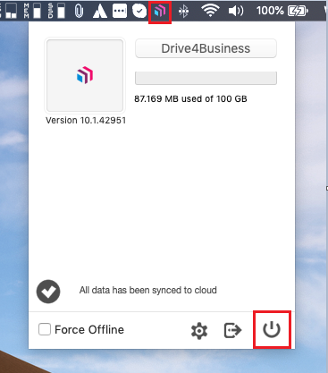
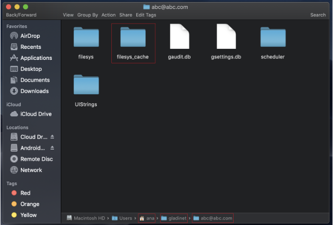

## Problema

A volte potrebbero presentarsi problemi di sincronizzazione dei file utilizzando attraverso il client. E quindi i file non vengono uploadati oppure non vengono visualizzati i file condivisi da altri utenti. 

## Possibili cause e soluzioni

Questo problema potrebbe derivare da discrepanze tra la cache salvata sul MAC dov'è installato il client e i dati presenti in cloud. Per ovviare a questa problematica basta fare un clear della cache del client sul proprio MAC.

## Guida Passo - Passo

- Spegnere il client, per fare questo cliccare sull'icona di Drive4Business sulla menù-bar ed in seguito cliccare sul tasto accensione in basso a destra nella finestra che compare.

- Fatto questo spostarsi utilizzando il Finder nella cartella: **$HOME / gladinet / <login email>** 
- Rinominare la cartella **filesys\_cache** con un altro nome a vostra scelta, come per esempio **filesys\_cacheold.**

- Riavviare il client.  

  

> [!NOTE]
> **Sommario**
> 
> 
> 
> - [Problema](#problema)
> - [Possibili cause e soluzioni](#possibili-cause-e-soluzioni)
> - [Guida Passo - Passo](#guida-passo-passo)
> * * *
> **Articoli collegati**
> 
> 
> - Page:
> [CloudFire PBX - App Android/IOS](/wiki/spaces/KB/pages/1966256458/CloudFire+PBX+-+App+Android+IOS)
> - Page:
> [Reset MAC Client Cache](/wiki/spaces/KB/pages/1966252422/Reset+MAC+Client+Cache)
> - Page:
> [Problemi visualizzazione finestre contestuali Client Windows versione >= 11.2.2963 (2) (2)](/wiki/spaces/KB/pages/1966252404/Problemi+visualizzazione+finestre+contestuali+Client+Windows+versione+11.2.2963+2+2)
> - Page:
> [Icone di file e cartelle non presentano lo stato della sync o presentano una "X" grigia (2) (2)](/wiki/spaces/KB/pages/1966252352/Icone+di+file+e+cartelle+non+presentano+lo+stato+della+sync+o+presentano+una+X+grigia+2+2)
> - Page:
> [Mac Client, errori con FUSE su Mac OSX High Sierra e Mojave](/wiki/spaces/KB/pages/1966252298/Mac+Client+errori+con+FUSE+su+Mac+OSX+High+Sierra+e+Mojave)