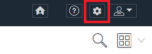
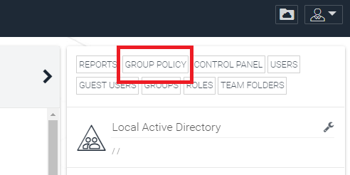
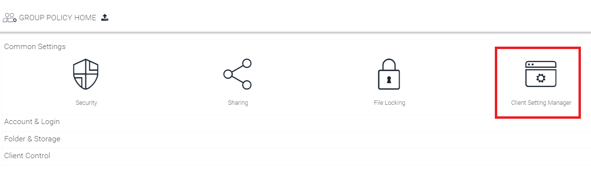
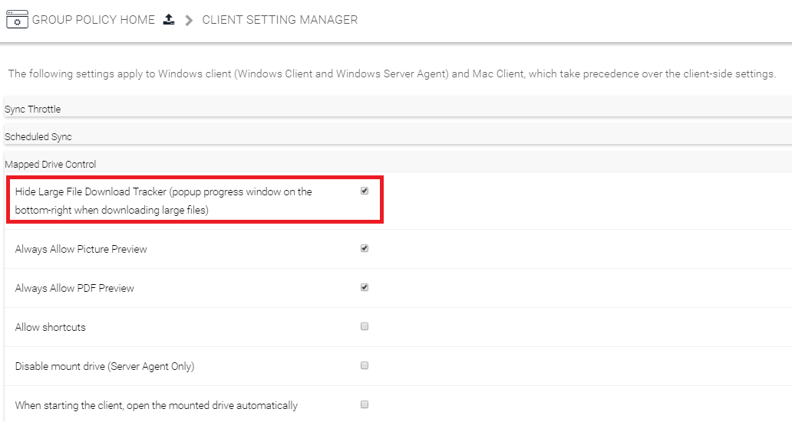

## Problema

Apparizione di un Pop-up, in basso a destra dello schermo, che mostra il progresso di task che però non avete fatto partire volontariamente. In generale fa riferimento a dei download di file.

## Possibili cause e soluzioni

Questo Pop-up fa riferimento al download di file di grosse dimensioni. Questo pop-up, solitamente, compare nel momento in cui, il vostro antivirus (durante una scansione) va ad analizzare il contenuto del vostro Cloud Drive. Quando incontra dei file di grosse dimensioni, scarica i file per analizzarli.

Il download del file non impatta sulle prestazioni del Drive, ma se vi infastidisce vedere il pop-up potete agire in 2 modi.

1. Escludere il vostro Cloud Drive dalle scansioni del vostro antivirus, e questa soluzione cambia in base al prodotto anti-virus che utilizzate
2. Potete evitare che venga visualizzato il Pop-Up, qui di seguito vi mostriamo come fare.

## Eliminazione della notifica

- Collegarsi alla pagina [https://drive4business.cloudfire.it](https://drive4business.cloudfire.it), oppure dal portale Cortex cliccare sul pulsante "Gestisci" nella dashboard di **Drive 4 Business**.
- Effettuare l'accesso con un account che abbia i privilegi di **Tenant Admin.**
- Cliccare sull'icona a forma di ingranaggio in alto a destra:  

- In questa schermata cliccare su **Group Policy:**  

- In questa schermata muoversi nel form **Common Settings,** e cliccare su **Client Setting Manager.**  

- In seguito muoversi nel sotto-menù **Mapped Control Drive,** e selezionare la chebox sull'opzione:  
**Hide Large File Download Tracker (popup progress window on the bottom-right when downloading large files)**  

  

- Riavviate il vostro Client Drive 4 Business.

  

> [!NOTE]
> **Sommario**
> 
> 
> 
> - [Problema](#problema)
> - [Possibili cause e soluzioni](#possibili-cause-e-soluzioni)
> - [Eliminazione della notifica](#eliminazione-della-notifica)
> * * *
> **Articoli collegati**
> 
> 
> - Page:
> [Task Pop-UP](/wiki/spaces/KB/pages/1966252456/Task+Pop-UP)
> - Page:
> [Icone di file e cartelle non presentano lo stato della sync o presentano una "X" grigia (2) (2)](/wiki/spaces/KB/pages/1966252352/Icone+di+file+e+cartelle+non+presentano+lo+stato+della+sync+o+presentano+una+X+grigia+2+2)
> - Page:
> [Guida Base per gli utenti](/wiki/spaces/KB/pages/1966252158/Guida+Base+per+gli+utenti)
> - Page:
> [Status dei file](/wiki/spaces/KB/pages/1966251565/Status+dei+file)