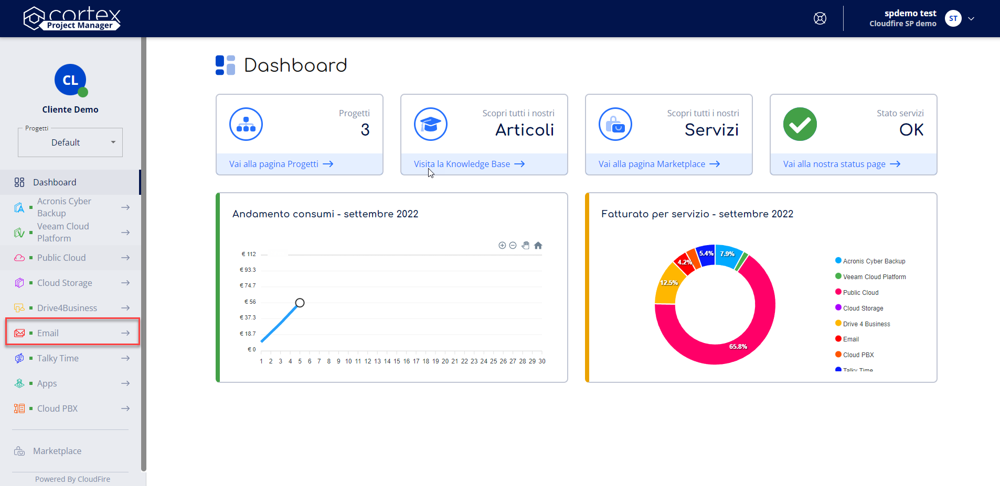
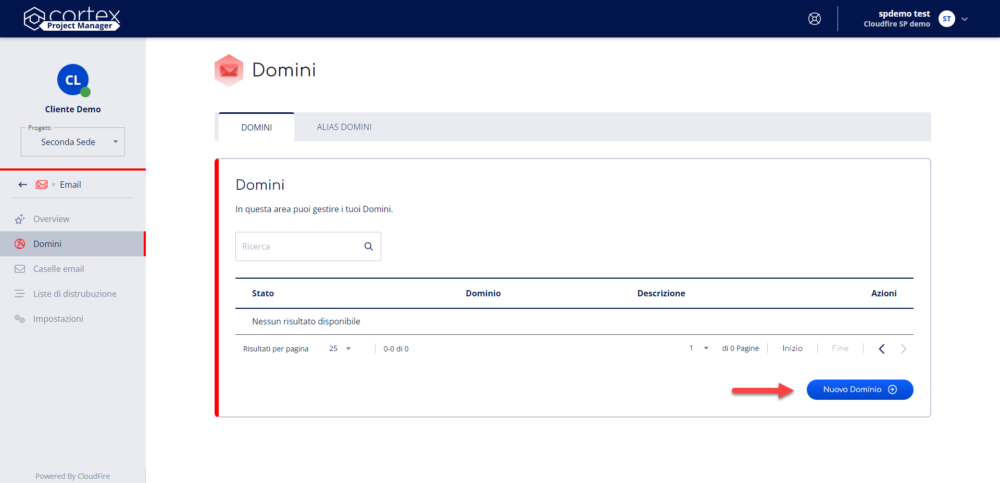

Questa pagina spiega come gestire le funzionalità del servizio **Email** utilizzando il portale Cortex.

# Accedi al servizio Email

Per accedere al servizio Email puoi seguire i seguenti passaggi:

# Attiva il servizio Email

Per attivare il servizio è sufficiente seguire i seguenti passaggi:

1. Premi sul bottone **Attiva ora** posizionato in alto a destra nella pagina Overview del servizio.
2. Si aprirà una finestra che richiede di **attivare il dominio**.

> [!INFO]
> Per attivare il servizio è fondamentale attivare il dominio.

# Disattiva il servizio

Per disattivare il servizio è sufficiente seguire i seguenti passaggi:

1. Accedi al Progetto nel quale vuoi disattivare il servizio, seleziona la voce **Email** nel menu di navigazione ed accedi alla pagina **Impostazioni**.
2. Premi sul bottone **Disattiva** presente nella card Disattiva visibile in pagina
3. Premi sul bottone **Conferma** ed attendi che la procedura di Disattivazione termini con successo.  
Una volta completata visualizzerai Domini, Caselle email, Liste di distribuzione ed i loro Alias in stato **Disattivo**.

> [!WARNING]
> Se disattivi il servizio i Domini, le Caselle email, le Liste di distribuzione e tutti gli Alias collegati verranno disabilitati. Non sarà più possibile ricevere ed inviare email dalle Caselle create. Nessuna casella verrà eliminata.
> **Disattivare il servizio non ne interromperà la fatturazione mensile.**

> [!NOTE]
> Se vuoi interrompere la fatturazione del servizio devi **Eliminarlo**. In questo modo cancellerai tutti i dati al suo interno ed azzererai i relativi consumi.

> [!INFO]
> La procedura di disattivazione può impiegare fino a **2 minuti** per completare le operazioni, in base alla quantità di Domini, Caselle email e Liste di distribuzione presenti. Se trascorso questo tempo il servizio non risulta ancora in stato **Disattivo** ti invitiamo ad aprire un [**Case**](../../../knowledge-base/account-manager/supporto/case.md) al nostro supporto.

# Riattiva il servizio

Per riattivare il servizio è sufficiente seguire i seguenti passaggi:

1. Accedi al Progetto nel quale vuoi riattivare il servizio, seleziona la voce **Email** nel menu di navigazione ed accedi alla pagina **Impostazioni**.
2. Premi sul bottone **Riattiva** presente nella card Riattiva visibile in pagina.
3. Premi sul bottone **Riattiva** ed attendi che la procedura di Riattivazione termini con successo.

> [!INFO]
> La procedura di riattivazione può impiegare fino a **2 minuti** per completare le operazioni, in base alla quantità di Domini, Caselle email e Liste di distribuzione presenti. Se trascorso questo tempo il servizio non risulta ancora in stato **Attivo** ti invitiamo ad aprire un [**Case**](../../../knowledge-base/account-manager/supporto/case.md) al nostro supporto.

# Gestione del servizio

**Sommario**

- [Accedi al servizio Email](#accedi-al-servizio-email)
- [Attiva il servizio Email](#attiva-il-servizio-email)
- [Disattiva il servizio](#disattiva-il-servizio)
- [Riattiva il servizio](#riattiva-il-servizio)
- [Gestione del servizio](#gestione-del-servizio)