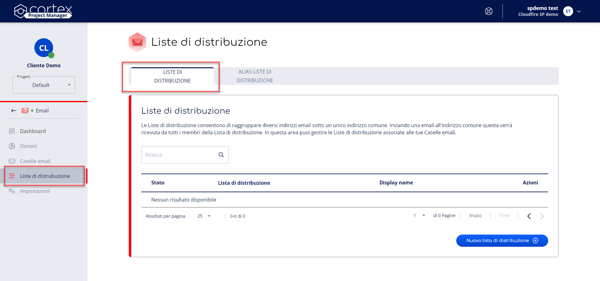
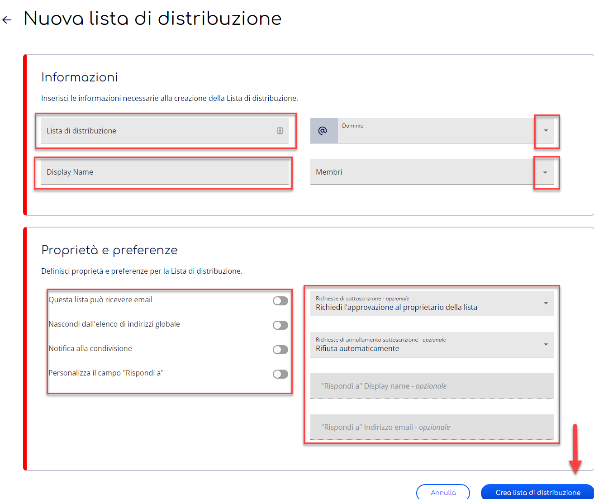
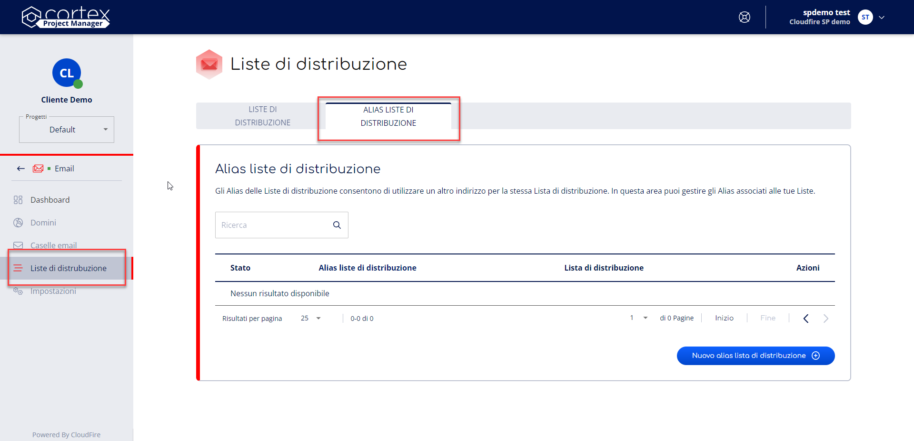
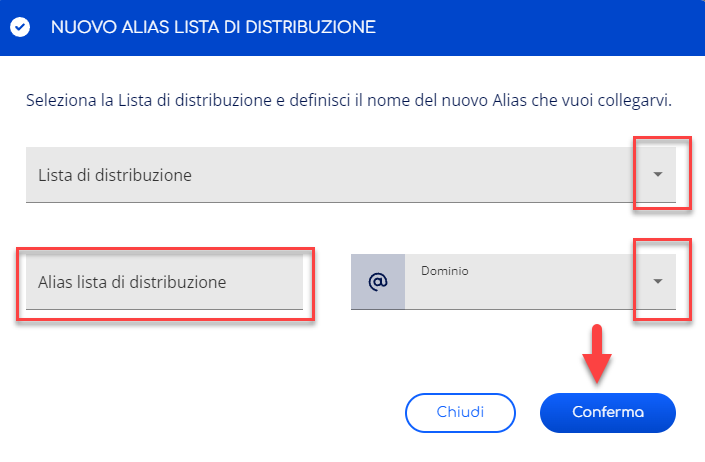

Questa pagina spiega come Creare, Modificare ed Eliminare Liste di distribuzione ed Alias di lista.

- **Creare** una Lista di distribuzione o un Alias di lista permette di selezionarne i membri ed impostarne le preferenze.
- **Modificare** una Lista di distribuzione o un Alias di lista permette di modificarne i parametri.
- **Eliminare** una Lista di distribuzione o un Alias di lista cancella i dati a questi relativi.

# Prerequisiti di creazione

Prima di procedere alla creazione di una Lista di distribuzione verifica i seguenti prerequisiti:

1. **Dominio verificato**: Per creare una Lista di distribuzione o Alias di lista è necessario disporre di un Dominio verificato sul servizio.
2. **Casella email**: Per creare una Lista di distribuzione o Alias di lista è necessario disporre di almeno una Casella email in stato Attivo.

# Liste di distribuzione

Le Liste di distribuzione svolgono la funzione di inviare un messaggio di posta elettronica a più persone. Permettono quindi di poter strutturare e organizzare una rete di mailing interna all’azienda.

## Accedi alla sezione Liste di distribuzione

Per accedere al sezione Liste di distribuzione puoi seguire i seguenti passaggi:

1. Accedi al servizio **Email** dalle voci di menù laterale. Non sai come fare? Segui la nostra [**guida**](https://cloudfireit.atlassian.net/wiki/spaces/KB/pages/1966252629/Gestione+del+servizio+-+Email#Accedi-al-servizio-Email).
2. Seleziona la voce **Liste di distribuzione** dalle voci di menù laterale
3. Seleziona la voce **Liste di distribuzione** dalle tab di navigazione in alto.

## Creazione di una Lista di distribuzione

Per creare una Lista di distribuzione è sufficiente seguire i seguenti passaggi:

1. Accedi alla sezione **Liste di distribuzione**.
2. Premi il bottone **Nuova lista di distribuzione** posto in basso a destra nella pagina.
3. Inserisci il **Nome** della nuova Lista di distribuzione, seleziona il **Dominio** sul quale vuoi crearla, inserisci il **Display Name** e selezionane i **Membri**.
4. Definisci le **Proprietà** e le **Preferenze** per la tua Lista di distribuzione.  
In questa sezione è possibile:
1.   Abilitare la lista alla ricezione di mail, nasconderla dall’elenco degli indirizzi globali, attivare le notifiche alla condivisione, abilitare la modifica del campo “Rispondi a”.
2.   Selezionare una preferenza per le Richieste di sottoscrizione e le Richieste di annullamento sottoscrizione della Lista di distribuzione, scegliendo tra voci Accetta automaticamente, Richiedi approvazione e Rifiuta automaticamente.  
  Premi il bottone **Crea lista di distribuzione**.
5. Visualizzerai nuovamente la pagina Liste di distribuzione con la Lista in stato **Attivo**.

## Modifica di una Lista di distribuzione

Per modificare una Lista di distribuzione è sufficiente seguire questi passaggi:

1. Accedi alla sezione **Liste di distribuzione**.
2. Premi il bottone **Modifica** in corrispondenza della lista che vuoi modificare.
3. Modifica i dati della Lista di distribuzione nei campi relativi.
4. Premi il bottone **Salva** posto in basso a destra nella pagina.
5. Visualizzerai nuovamente la pagina Liste di distribuzione.

## Eliminazione di una Lista di distribuzione

Per eliminare una Lista di distribuzione è sufficiente seguire questi passaggi:

1. Accedi alla sezione **Liste di distribuzione**.
2. Premi il bottone **Elimina** in corrispondenza della lista che vuoi eliminare.
3. Premi il bottone **Conferma** nella finestra di dialogo per eliminare la lista, visualizzerai nuovamente la pagina Liste di distribuzione senza più la Lista eliminata.

# Alias di Lista di distribuzione

Gli Alias di Lista di distribuzione permettono di attribuire un indirizzo diverso ad una Lista di distribuzione già esistente, distribuendone le medesime email ma con un indirizzo differente da quello principale.

## Accedi alla sezione Alias Liste di distribuzione

Per accedere al sezione Liste di distribuzione puoi seguire i seguenti passaggi:

1. Accedi al servizio **Email** dalle voci di menù laterale. Non sai come fare? Segui la nostra [**guida**](https://cloudfireit.atlassian.net/wiki/spaces/KB/pages/1966252629/Gestione+del+servizio+-+Email#Accedi-al-servizio-Email).
2. Seleziona la voce **Liste di distribuzione** dalle voci di menù laterale
3. Seleziona la voce **Alias liste di distribuzione** dalle tab di navigazione in alto.

## Creazione di un Alias di Lista di Distribuzione

Per creare una Lista di Distribuzione è sufficiente seguire i seguenti passaggi:

1. Accedi sezione **Liste di Distribuzione**.
2. Seleziona la voce **Alias liste di distribuzione** dalla barra di navigazione orizzontale presente nella Dashboard.
3. Premi il bottone **Nuova lista di distribuzione** posto in basso a destra nella pagina.
4. Seleziona la **Lista di distribuzione** principale alla quale vuoi associare l’Alias, inseriscine il **Nome** dell’Alias e seleziona un **Dominio**.  
Premi il bottone **Conferma**.
5. Visualizzerai nuovamente la pagina Alias liste di distribuzione con il nuovo Alias di lista in stato **Attivo**.

## Eliminazione di un Alias di Lista di Distribuzione

Per eliminare un Alias Lista di distribuzione è sufficiente seguire questi passaggi:

1. Accedi alla sezione **Alias Liste di distribuzione**
2. Premi il bottone **Elimina** in corrispondenza dell’Alias di lista che vuoi eliminare.
3. Premi il bottone **Conferma** nella finestra di dialogo per eliminare l’alias, visualizzerai nuovamente la pagina Alias liste di distribuzione senza più l’Alias eliminato.

**Sommario**

- [Prerequisiti di creazione](#prerequisiti-di-creazione)
- [Liste di distribuzione](#liste-di-distribuzione)
-   [Accedi alla sezione Liste di distribuzione](#accedi-alla-sezione-liste-di-distribuzione)
-   [Creazione di una Lista di distribuzione](#creazione-di-una-lista-di-distribuzione)
-   [Modifica di una Lista di distribuzione](#modifica-di-una-lista-di-distribuzione)
-   [Eliminazione di una Lista di distribuzione](#eliminazione-di-una-lista-di-distribuzione)
- [Alias di Lista di distribuzione](#alias-di-lista-di-distribuzione)
-   [Accedi alla sezione Alias Liste di distribuzione](#accedi-alla-sezione-alias-liste-di-distribuzione)
-   [Creazione di un Alias di Lista di Distribuzione](#creazione-di-un-alias-di-lista-di-distribuzione)
-   [Eliminazione di un Alias di Lista di Distribuzione](#eliminazione-di-un-alias-di-lista-di-distribuzione)