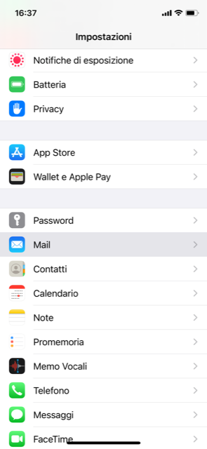
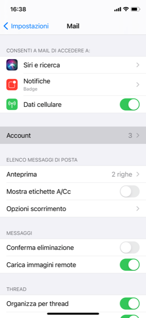
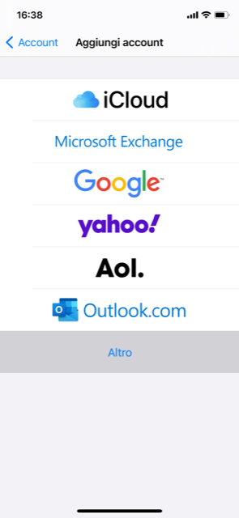
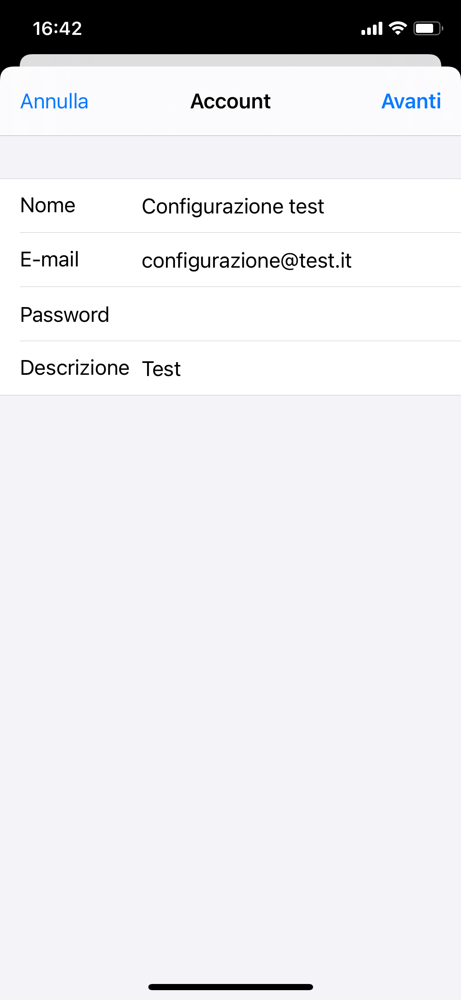
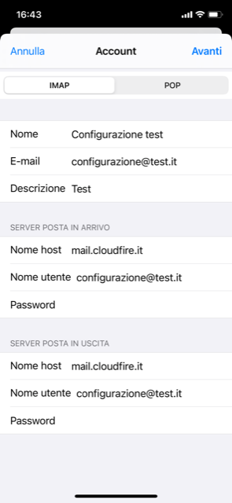
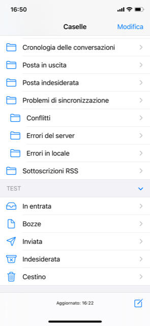

Come configurare le vostre nuove caselle di posta IMAP su dispositivi mobili iOS.

1. Clicca su **Impostazioni**.
2. Vai alla voce **Email**.
3. Clicca su **Account.** Ti si aprirà una pagina con le caselle mail già configurate sul tuo dispositivo.
4. Clicca su **Aggiungi account**.
5. Seleziona **Altro**.
6. Prosegui su **Aggiungi account Mail**.
7. Compila i campi con i tuoi dati. Esempio:
8. Prosegui e compila i campi in ordine. Esempio:
9. La voce **Nome utente** va compilata inserendo il proprio indirizzo mail, mentre la **password** è quella impostata per la casella mail in questione.
10. Clicca su **Avanti**.
11. Se apri l’App Email del tuo dispositivo potrai notare che la casella è stata configurata correttamente.