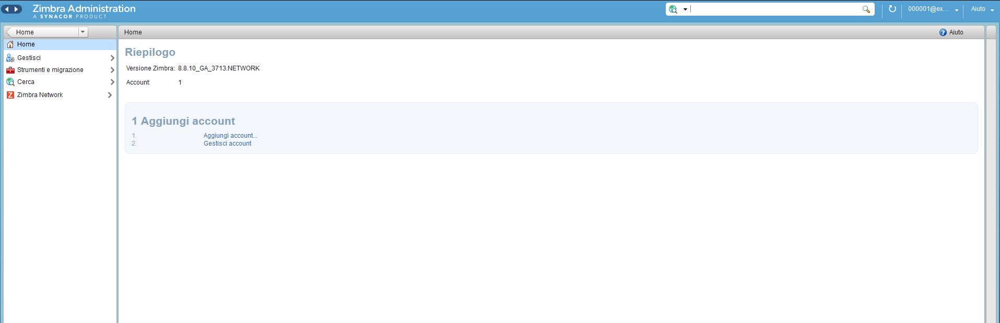
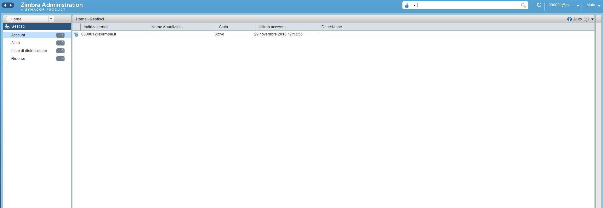
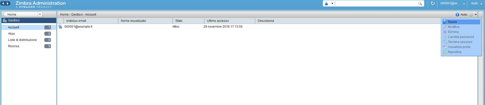
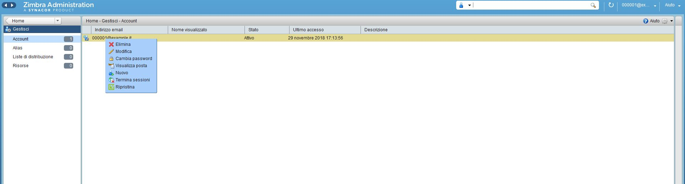
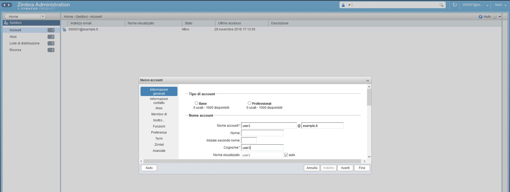
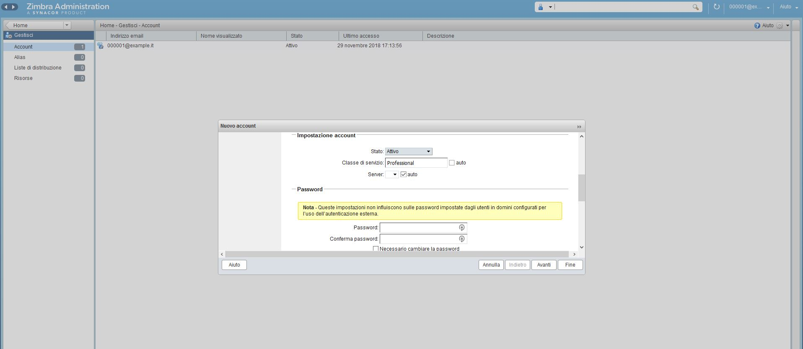
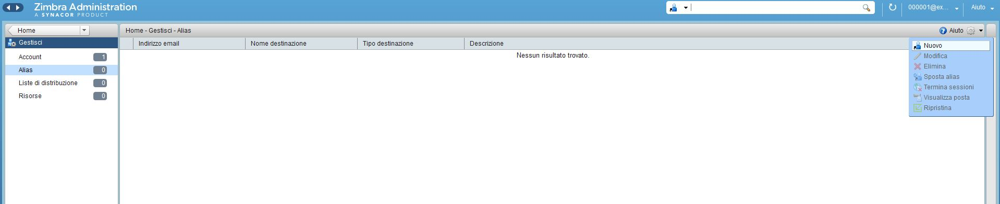
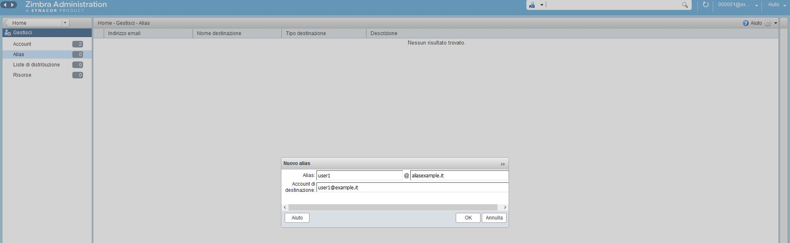
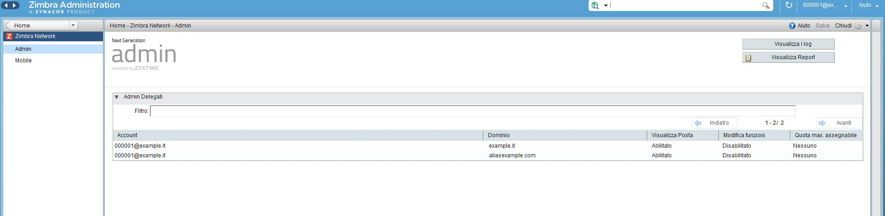
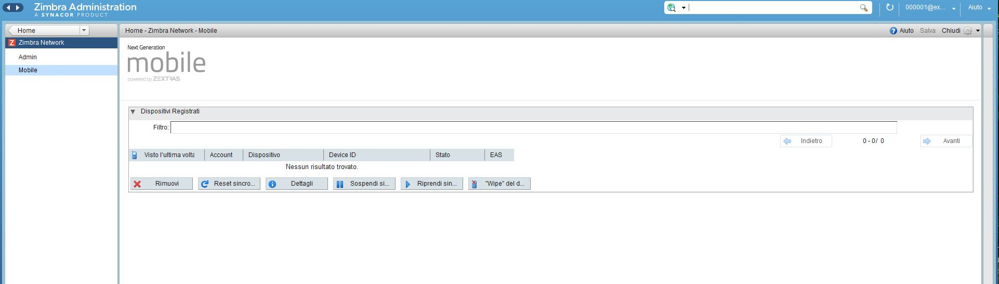

# Istruzioni per l’amministrazione e gestione account mail.

- Pannello principale che segue il login su [mailadmin.cloudfire.it](http://mailadmin.cloudfire.it).

- In “Gestisci” vi è la lista utenti, la possibilità di crearne e gestirli.

  

- In alto a destra vi è l’ingranaggio contenente le opzioni di interazione con gli account…

 

- …Lo stesso ottenibile con click destro su un account esistente.

  

- Nella sezione nuovo account effettuare la selezione del tipo “**Base**” o “**Professional**”.
- Riempire i campi principali: nome utente, dominio e password.

- Il radio button che avete selezionato si disattiverà con il riempimento dei campi, ma la scelta sarà memorizzata nel campo “**Classe di servizio**”. 

- Concludere cliccando fine: eventuali modifiche alle altre impostazioni possono comportare il disallineamento del profilo selezionato quindi sono fortemente sconsigliate.
- Nella sezione Alias il menu è analogo a quello degli account.

- L’alias deve puntare a un dominio alias registrato sul server come il dominio principale.
- I primi due campi nella sezione “nuovo alias” definiscono l’utente relativo al dominio alias che punterà all’utente esistente (terzo campo).

 

- In “Zimbra Network” ci sono 2 moduli.
- Sotto “Admin” vi è la lista degli account amministrativi in relazione ai domini.
- La possibilità di visualizzare alcuni Log e i report mensili.

- Sotto “**Mobile**” vi è la lista dei dispositivi con il profilo “Professional” registrati con la possibilità di agire sulla sincronizzazione degli stessi; provvedere alla rimozione del dispositivo e infine la funzionalità “***wipe***” per l’eliminazione dei dati di posta dal dispositivo remoto.

- Sotto “**Strumenti e migrazione**” si trova la sezione “Download” con le procedure quidate per la migrazione della posta.