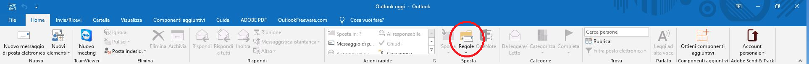
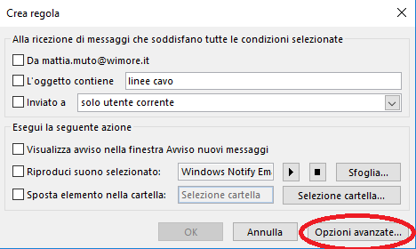
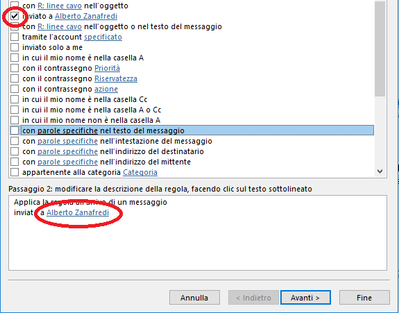
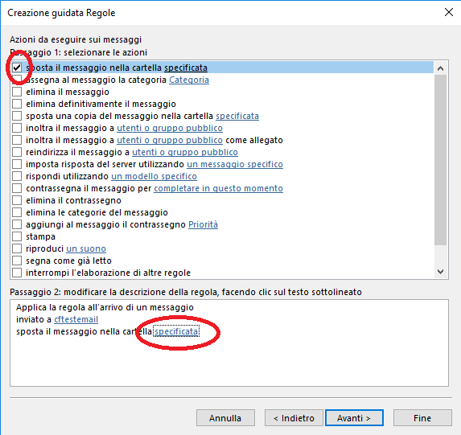

- Aprire il proprio Outlook, selezionare il proprio account personale (account inserito nella distribution List), selezionare "posta in arrivo" e cliccare su **"Regole"**

- All'apertura della finestra cliccare su "**Opzioni avanzate"**  

- Nella schermata seguente spuntare di fianco a "**inviato a**" e poi cliccare sul proprio account nello specchietto sottostante:

- Nella schermata seguente fare doppio click sull'account della Distribution List, togliere il proprio account di fianco al pulsante "A" e cliccare su OK. Tornando alla schermata precedente cliccare su avanti.
- Nella schermata seguente spuntare di fianco a "**sposta il messaggio nella cartella specificata**" e poi cliccare su "**specificata**" nello specchietto sottostante.

- Qui selezionare la cartella dove volete che vengano memorizzate le mail indirizzate alla Distribution List, oppure crearne una nuova.
- Nella schermata seguente selezionare eventuali altre opzioni a vostra discrezione.
- Cliccare su fine e la procedura è terminata.