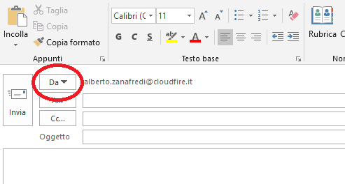
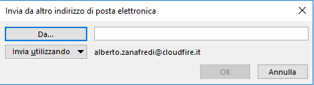

Se il vostro account è inserito in una Distribution List è possibile inviare mail che verranno recapitate al destinatario con mittente l'indirizzo mail della Distribution List.

Come prima cosa dovete verificare o richiedere al vostro amministratore se il vostro account email è abilitato a mandare le mail con l'inidirizzo della Distribution List.

Una volta verificato quanto sopra, creare una nuova email.

Cliccare sul pulsante "**Da...**"

  

All'apparizione del menù a tendina selezionare la voce "**Altro indirizzo di posta elettronica**"

Da questa schermata cliccare sul pulsante "**Da...**" e selezionare l'account di riferimento della Distribution List. Verificare che di fianco al tasto "**Invia utilizzando**" sia specificato un account inserito nella Distribution List con i permessi specificati nella seconda riga di questa guida.

Cliccare su OK.

D'ora in avanti ad ogni mail che vorrete inviare potrete avere l'indirizzo della Distribution list disponibile tra le scelte dei mittenti.